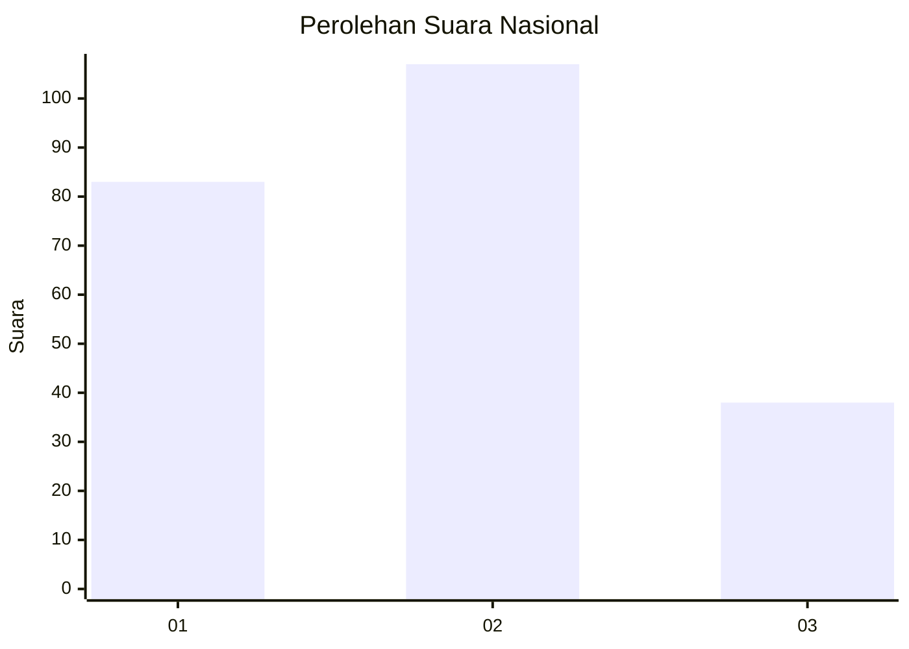
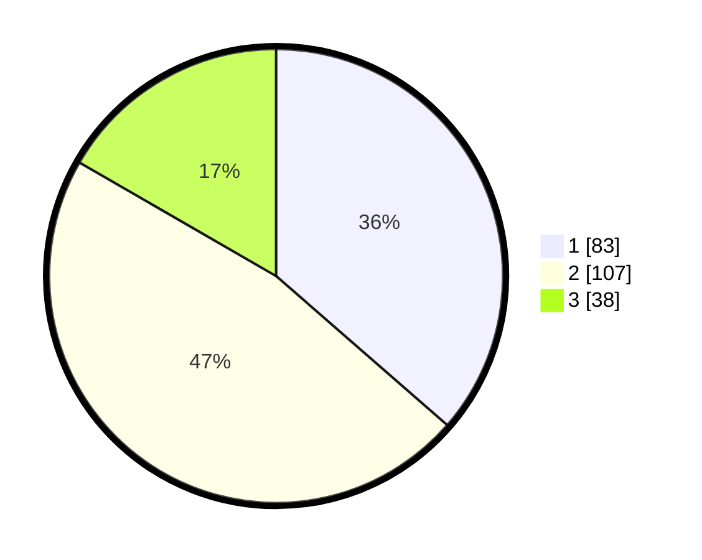

# Hasil

## Grafik

## Tabel

| No. | Nama Paslon    | Suara | Suara (raw) | Persentase |
|:--- |:-------------- | -----:| -----------:| ----------:|
| 1   | ANIES MUHAIMIN | 83    | [83][p-1]   | 36,40      |
| 2   | PRABOWO GIBRAN | 107   | [107][p-2]  | 46,93      |
| 3   | GANJAR MAHFUD  | 38    | [38][p-3]   | 16,67      |

[p-1]: https://github.com/gigit-pemilu/pemilu-2024/blob/main/pilpres/hitung-suara/sub/31-dki-jakarta/sub/01-kep-seribu/sub/01-kepulauan-seribu-utara/sub/1001-pulau-panggang/sub/001-tps/sub/paslon-1.txt
[p-2]: https://github.com/gigit-pemilu/pemilu-2024/blob/main/pilpres/hitung-suara/sub/31-dki-jakarta/sub/01-kep-seribu/sub/01-kepulauan-seribu-utara/sub/1001-pulau-panggang/sub/001-tps/sub/paslon-2.txt
[p-3]: https://github.com/gigit-pemilu/pemilu-2024/blob/main/pilpres/hitung-suara/sub/31-dki-jakarta/sub/01-kep-seribu/sub/01-kepulauan-seribu-utara/sub/1001-pulau-panggang/sub/001-tps/sub/paslon-3.txt

## Foto C Plano

https://sirekap-obj-formc.kpu.go.id/2851/pemilu/ppwp/31/01/01/10/01/3101011001001-20240214-205639--4f9bafd8-1602-4579-9588-bf8bf3d6c285.jpg

https://sirekap-obj-formc.kpu.go.id/2851/pemilu/ppwp/31/01/01/10/01/3101011001001-20240216-135709--fbcf92f8-6da6-48f9-806c-abb1ba17b013.jpg

https://sirekap-obj-formc.kpu.go.id/2851/pemilu/ppwp/31/01/01/10/01/3101011001001-20240214-205701--8d3291c9-f10b-4737-8459-138e013a85a8.jpg

## Metadata

| Key        | Value               |
| ---------- | ------------------- |
| Time Stamp | 2024-02-20 14:00:00 |

## DATA PEMILIH TETAP

Jumlah pemilih dalam DPT: **292**.
 * L: **147**.
 * P: **145**.

## DATA PENGGUNA HAK PILIH

Jumlah pengguna hak pilih dalam DPT: **232**.
 * L: **107**.
 * P: **125**.

Jumlah pengguna hak pilih dalam DPTb: **1**.
 * L: **0**.
 * P: **1**.

Jumlah pengguna hak pilih dalam DPK: **0**.
 * L: **0**.
 * P: **0**.

Jumlah pengguna hak pilih: **233**.
 * L: **107**.
 * P: **126**.

## JUMLAH SUARA SAH DAN TIDAK SAH

JUMLAH SELURUH SUARA SAH: **228**.

JUMLAH SUARA TIDAK SAH: **5**.

JUMLAH SELURUH SUARA SAH DAN SUARA TIDAK SAH: **233**.

