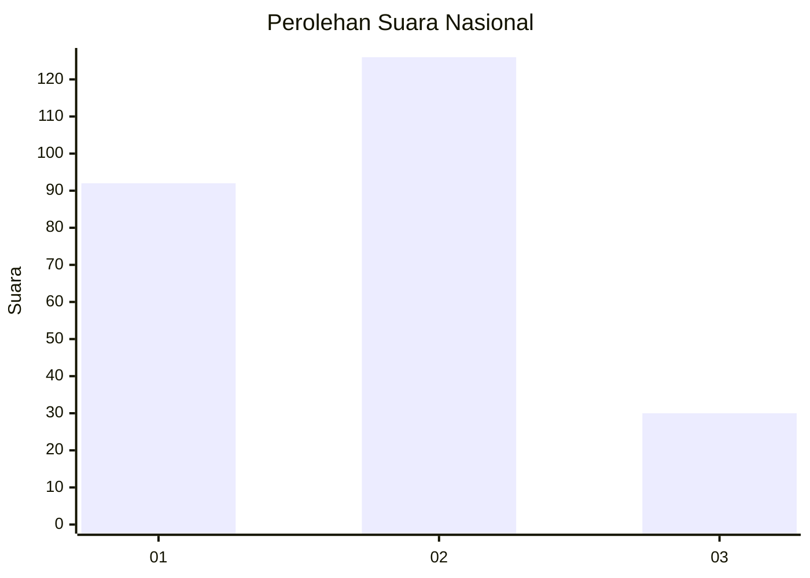
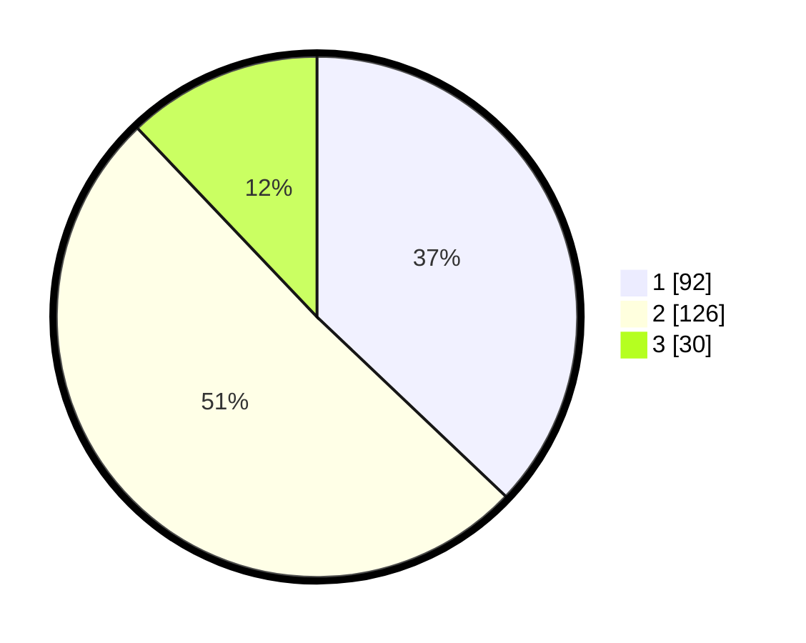

# Hasil

## Grafik

## Tabel

| No. | Nama Paslon    | Suara | Suara (raw) | Persentase |
|:--- |:-------------- | -----:| -----------:| ----------:|
| 1   | ANIES MUHAIMIN | 92    | [92][p-1]   | 37,10      |
| 2   | PRABOWO GIBRAN | 126   | [126][p-2]  | 50,81      |
| 3   | GANJAR MAHFUD  | 30    | [30][p-3]   | 12,10      |

[p-1]: https://github.com/gigit-pemilu/pemilu-2024/blob/main/pilpres/hitung-suara/sub/31-dki-jakarta/sub/01-kep-seribu/sub/01-kepulauan-seribu-utara/sub/1001-pulau-panggang/sub/002-tps/sub/paslon-1.txt
[p-2]: https://github.com/gigit-pemilu/pemilu-2024/blob/main/pilpres/hitung-suara/sub/31-dki-jakarta/sub/01-kep-seribu/sub/01-kepulauan-seribu-utara/sub/1001-pulau-panggang/sub/002-tps/sub/paslon-2.txt
[p-3]: https://github.com/gigit-pemilu/pemilu-2024/blob/main/pilpres/hitung-suara/sub/31-dki-jakarta/sub/01-kep-seribu/sub/01-kepulauan-seribu-utara/sub/1001-pulau-panggang/sub/002-tps/sub/paslon-3.txt

## Foto C Plano

https://sirekap-obj-formc.kpu.go.id/bb29/pemilu/ppwp/31/01/01/10/01/3101011001002-20240216-115245--8ad6a162-c238-4435-bca4-a828b24642d3.jpg

https://sirekap-obj-formc.kpu.go.id/bb29/pemilu/ppwp/31/01/01/10/01/3101011001002-20240216-115248--21a1e8d6-e24d-4197-844d-ef0d8a348308.jpg

https://sirekap-obj-formc.kpu.go.id/bb29/pemilu/ppwp/31/01/01/10/01/3101011001002-20240216-115246--513688af-64c3-4da7-a81c-6af4401c52e7.jpg

## Metadata

| Key        | Value               |
| ---------- | ------------------- |
| Time Stamp | 2024-02-16 12:51:22 |

## DATA PEMILIH TETAP

Jumlah pemilih dalam DPT: **285**.
 * L: **144**.
 * P: **141**.

## DATA PENGGUNA HAK PILIH

Jumlah pengguna hak pilih dalam DPT: **251**.
 * L: **122**.
 * P: **129**.

Jumlah pengguna hak pilih dalam DPTb: **0**.
 * L: **0**.
 * P: **0**.

Jumlah pengguna hak pilih dalam DPK: **4**.
 * L: **2**.
 * P: **2**.

Jumlah pengguna hak pilih: **255**.
 * L: **124**.
 * P: **131**.

## JUMLAH SUARA SAH DAN TIDAK SAH

JUMLAH SELURUH SUARA SAH: **248**.

JUMLAH SUARA TIDAK SAH: **7**.

JUMLAH SELURUH SUARA SAH DAN SUARA TIDAK SAH: **255**.

