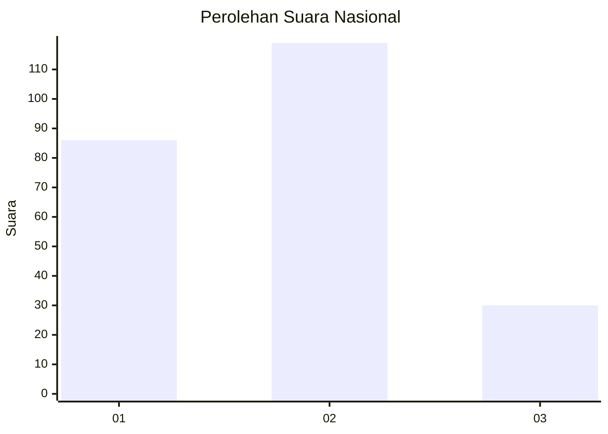
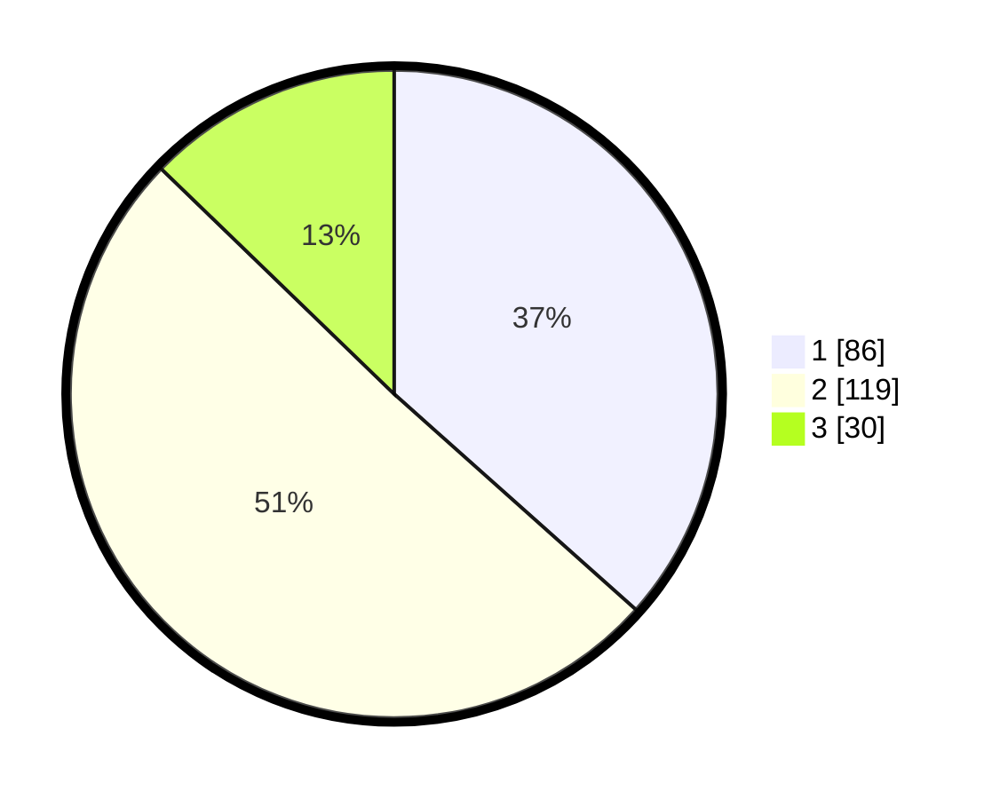

# Hasil

## Grafik

## Tabel

| No. | Nama Paslon    | Suara | Suara (raw) | Persentase |
|:--- |:-------------- | -----:| -----------:| ----------:|
| 1   | ANIES MUHAIMIN | 86    | [86][p-1]   | 36,60      |
| 2   | PRABOWO GIBRAN | 119   | [119][p-2]  | 50,64      |
| 3   | GANJAR MAHFUD  | 30    | [30][p-3]   | 12,77      |

[p-1]: https://github.com/gigit-pemilu/pemilu-2024/blob/main/pilpres/hitung-suara/sub/31-dki-jakarta/sub/01-kep-seribu/sub/01-kepulauan-seribu-utara/sub/1001-pulau-panggang/sub/003-tps/sub/paslon-1.txt
[p-2]: https://github.com/gigit-pemilu/pemilu-2024/blob/main/pilpres/hitung-suara/sub/31-dki-jakarta/sub/01-kep-seribu/sub/01-kepulauan-seribu-utara/sub/1001-pulau-panggang/sub/003-tps/sub/paslon-2.txt
[p-3]: https://github.com/gigit-pemilu/pemilu-2024/blob/main/pilpres/hitung-suara/sub/31-dki-jakarta/sub/01-kep-seribu/sub/01-kepulauan-seribu-utara/sub/1001-pulau-panggang/sub/003-tps/sub/paslon-3.txt

## Foto C Plano

https://sirekap-obj-formc.kpu.go.id/8de9/pemilu/ppwp/31/01/01/10/01/3101011001003-20240215-002006--faf26c88-f35d-4375-a5ad-99cc9c11b54f.jpg

https://sirekap-obj-formc.kpu.go.id/8de9/pemilu/ppwp/31/01/01/10/01/3101011001003-20240216-133822--5e1c2280-3a86-47c5-a2d9-5b89cc312eed.jpg

https://sirekap-obj-formc.kpu.go.id/8de9/pemilu/ppwp/31/01/01/10/01/3101011001003-20240216-133822--9cea8c5b-63ee-4254-9af9-ba2121e48d82.jpg

## Metadata

| Key        | Value               |
| ---------- | ------------------- |
| Time Stamp | 2024-02-21 16:00:00 |

## DATA PEMILIH TETAP

Jumlah pemilih dalam DPT: **282**.
 * L: **137**.
 * P: **145**.

## DATA PENGGUNA HAK PILIH

Jumlah pengguna hak pilih dalam DPT: **237**.
 * L: **116**.
 * P: **121**.

Jumlah pengguna hak pilih dalam DPTb: **1**.
 * L: **0**.
 * P: **1**.

Jumlah pengguna hak pilih dalam DPK: **0**.
 * L: **0**.
 * P: **0**.

Jumlah pengguna hak pilih: **238**.
 * L: **116**.
 * P: **122**.

## JUMLAH SUARA SAH DAN TIDAK SAH

JUMLAH SELURUH SUARA SAH: **235**.

JUMLAH SUARA TIDAK SAH: **3**.

JUMLAH SELURUH SUARA SAH DAN SUARA TIDAK SAH: **238**.

