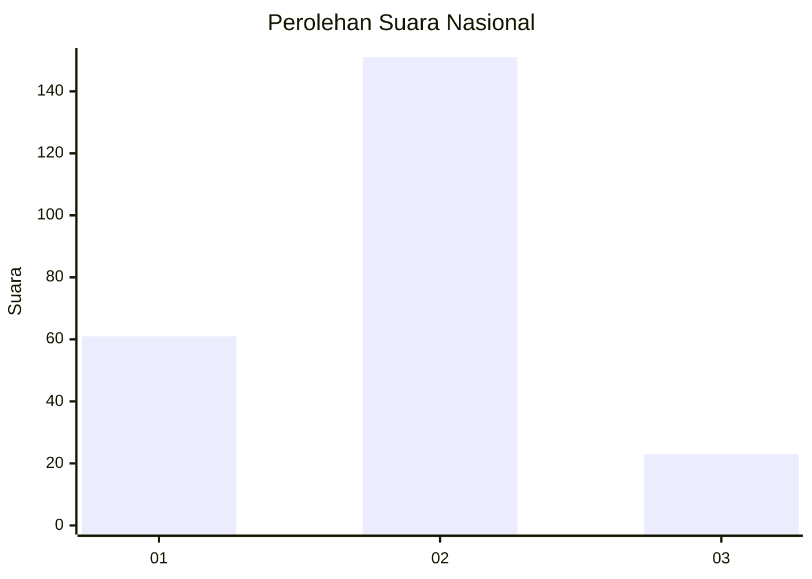
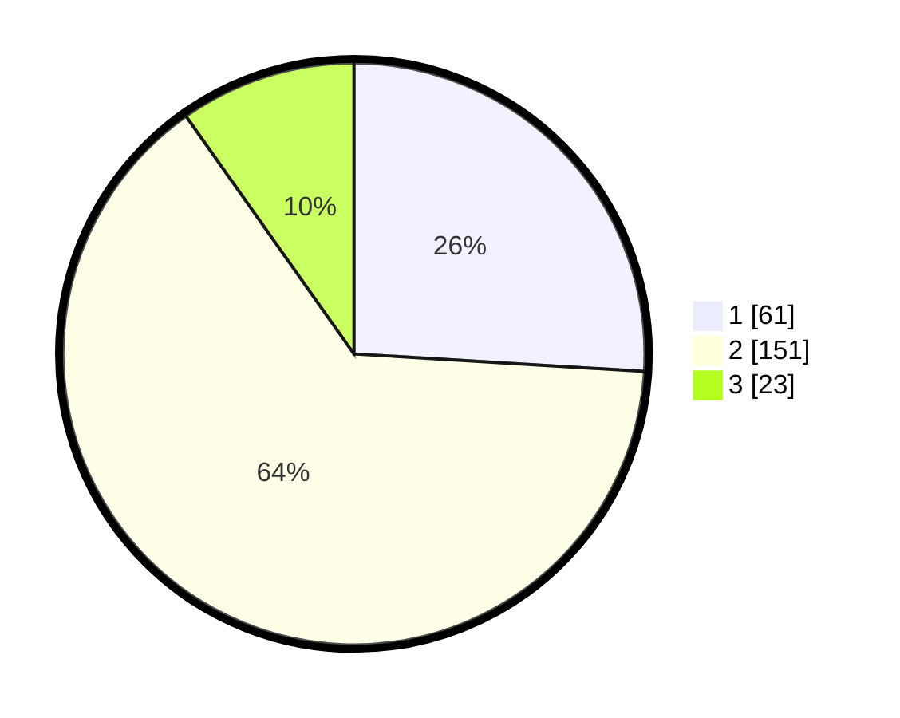

# Hasil

## Grafik

## Tabel

| No. | Nama Paslon    | Suara | Suara (raw) | Persentase |
|:--- |:-------------- | -----:| -----------:| ----------:|
| 1   | ANIES MUHAIMIN | 61    | [61][p-1]   | 25,96      |
| 2   | PRABOWO GIBRAN | 151   | [151][p-2]  | 64,26      |
| 3   | GANJAR MAHFUD  | 23    | [23][p-3]   | 9,79       |

[p-1]: https://github.com/gigit-pemilu/pemilu-2024/blob/main/pilpres/hitung-suara/sub/31-dki-jakarta/sub/01-kep-seribu/sub/01-kepulauan-seribu-utara/sub/1001-pulau-panggang/sub/004-tps/sub/paslon-1.txt
[p-2]: https://github.com/gigit-pemilu/pemilu-2024/blob/main/pilpres/hitung-suara/sub/31-dki-jakarta/sub/01-kep-seribu/sub/01-kepulauan-seribu-utara/sub/1001-pulau-panggang/sub/004-tps/sub/paslon-2.txt
[p-3]: https://github.com/gigit-pemilu/pemilu-2024/blob/main/pilpres/hitung-suara/sub/31-dki-jakarta/sub/01-kep-seribu/sub/01-kepulauan-seribu-utara/sub/1001-pulau-panggang/sub/004-tps/sub/paslon-3.txt

## Foto C Plano

https://sirekap-obj-formc.kpu.go.id/7928/pemilu/ppwp/31/01/01/10/01/3101011001004-20240217-163948--d37dd646-ecc8-4450-950a-b8d668b2defb.jpg

https://sirekap-obj-formc.kpu.go.id/7928/pemilu/ppwp/31/01/01/10/01/3101011001004-20240217-163950--c6b9786a-0c34-478d-9e31-a486010471a4.jpg

https://sirekap-obj-formc.kpu.go.id/7928/pemilu/ppwp/31/01/01/10/01/3101011001004-20240217-163949--13496c31-3a75-4bd9-bdda-f8b0448742b4.jpg

## Metadata

| Key        | Value               |
| ---------- | ------------------- |
| Time Stamp | 2024-02-20 14:00:00 |

## DATA PEMILIH TETAP

Jumlah pemilih dalam DPT: **287**.
 * L: **147**.
 * P: **140**.

## DATA PENGGUNA HAK PILIH

Jumlah pengguna hak pilih dalam DPT: **287**.
 * L: **147**.
 * P: **140**.

Jumlah pengguna hak pilih dalam DPTb: **2**.
 * L: **2**.
 * P: **0**.

Jumlah pengguna hak pilih dalam DPK: **11**.
 * L: **9**.
 * P: **2**.

Jumlah pengguna hak pilih: **300**.
 * L: **158**.
 * P: **142**.

## JUMLAH SUARA SAH DAN TIDAK SAH

JUMLAH SELURUH SUARA SAH: **235**.

JUMLAH SUARA TIDAK SAH: **6**.

JUMLAH SELURUH SUARA SAH DAN SUARA TIDAK SAH: **241**.

