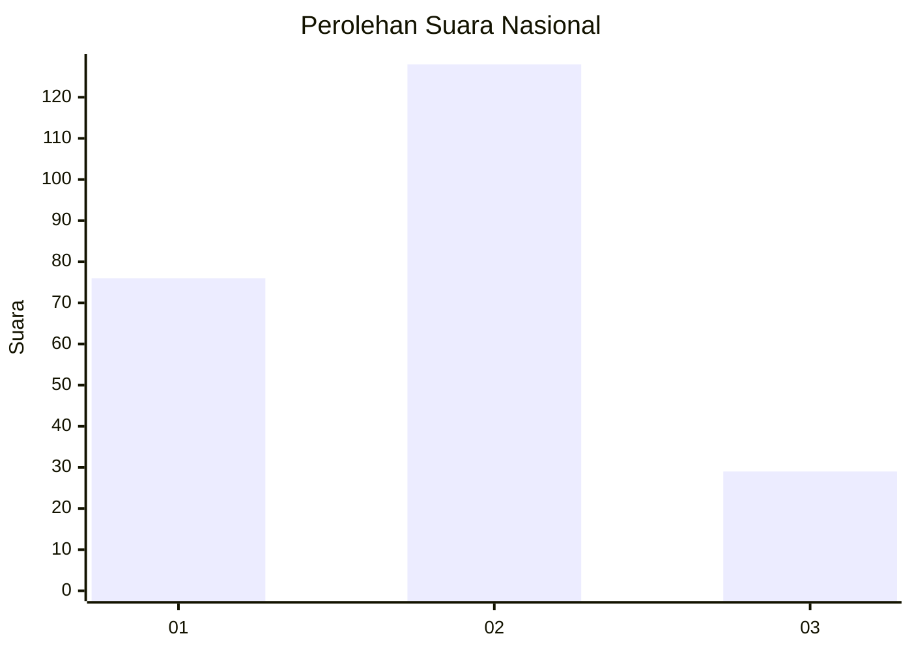
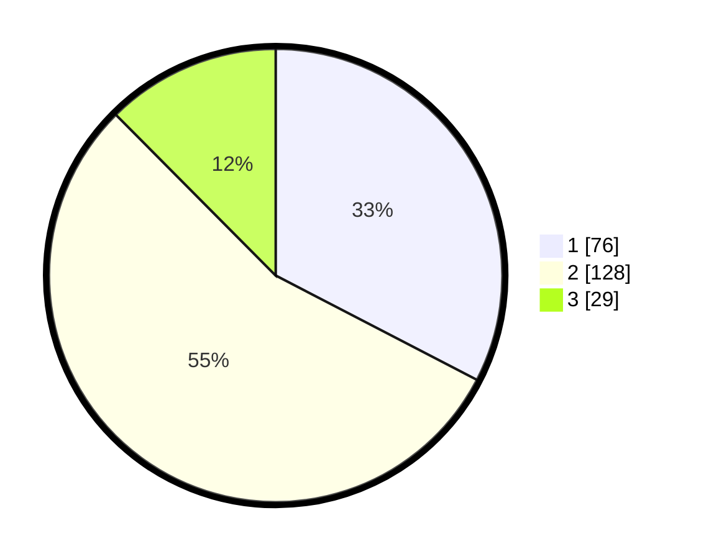

# Hasil

## Grafik

## Tabel

| No. | Nama Paslon    | Suara | Suara (raw) | Persentase |
|:--- |:-------------- | -----:| -----------:| ----------:|
| 1   | ANIES MUHAIMIN | 76    | [76][p-1]   | 32,62      |
| 2   | PRABOWO GIBRAN | 128   | [128][p-2]  | 54,94      |
| 3   | GANJAR MAHFUD  | 29    | [29][p-3]   | 12,45      |

[p-1]: https://github.com/gigit-pemilu/pemilu-2024/blob/main/pilpres/hitung-suara/sub/31-dki-jakarta/sub/01-kep-seribu/sub/01-kepulauan-seribu-utara/sub/1001-pulau-panggang/sub/005-tps/sub/paslon-1.txt
[p-2]: https://github.com/gigit-pemilu/pemilu-2024/blob/main/pilpres/hitung-suara/sub/31-dki-jakarta/sub/01-kep-seribu/sub/01-kepulauan-seribu-utara/sub/1001-pulau-panggang/sub/005-tps/sub/paslon-2.txt
[p-3]: https://github.com/gigit-pemilu/pemilu-2024/blob/main/pilpres/hitung-suara/sub/31-dki-jakarta/sub/01-kep-seribu/sub/01-kepulauan-seribu-utara/sub/1001-pulau-panggang/sub/005-tps/sub/paslon-3.txt

## Foto C Plano

https://sirekap-obj-formc.kpu.go.id/955c/pemilu/ppwp/31/01/01/10/01/3101011001005-20240214-200809--4027949d-5a6c-4cf8-8e07-4894b8e1e039.jpg

https://sirekap-obj-formc.kpu.go.id/955c/pemilu/ppwp/31/01/01/10/01/3101011001005-20240214-200945--555bde25-2953-4d29-a86c-029bd5a70fdf.jpg

https://sirekap-obj-formc.kpu.go.id/955c/pemilu/ppwp/31/01/01/10/01/3101011001005-20240214-201054--e234e8d4-2c99-4de2-8f7f-b67f7e7bb7c4.jpg

## Metadata

| Key        | Value               |
| ---------- | ------------------- |
| Time Stamp | 2024-02-15 00:41:44 |

## DATA PEMILIH TETAP

Jumlah pemilih dalam DPT: **288**.
 * L: **144**.
 * P: **144**.

## DATA PENGGUNA HAK PILIH

Jumlah pengguna hak pilih dalam DPT: **223**.
 * L: **110**.
 * P: **113**.

Jumlah pengguna hak pilih dalam DPTb: **12**.
 * L: **11**.
 * P: **1**.

Jumlah pengguna hak pilih dalam DPK: **0**.
 * L: **0**.
 * P: **0**.

Jumlah pengguna hak pilih: **235**.
 * L: **121**.
 * P: **114**.

## JUMLAH SUARA SAH DAN TIDAK SAH

JUMLAH SELURUH SUARA SAH: **233**.

JUMLAH SUARA TIDAK SAH: **2**.

JUMLAH SELURUH SUARA SAH DAN SUARA TIDAK SAH: **235**.

