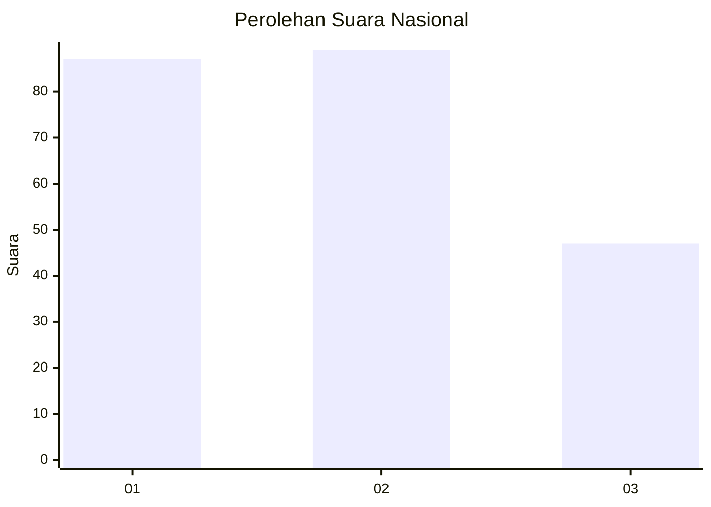
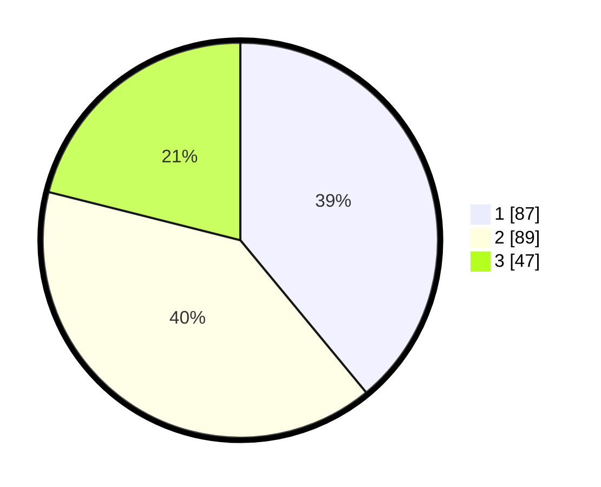

# Hasil

## Grafik

## Tabel

| No.    | Nama Paslon    | Suara | Suara (raw) | Persentase |
|:------ |:-------------- | -----:| -----------:| ----------:|
| 100025 | ANIES MUHAIMIN | 87    | [87][p-1]   | 39,01      |
| 100026 | PRABOWO GIBRAN | 89    | [89][p-2]   | 39,91      |
| 100027 | GANJAR MAHFUD  | 47    | [47][p-3]   | 21,08      |

[p-1]: https://github.com/gigit-pemilu/pemilu-2024/blob/main/pilpres/hitung-suara/sub/31-dki-jakarta/sub/01-kep-seribu/sub/01-kepulauan-seribu-utara/sub/1001-pulau-panggang/sub/007-tps/sub/paslon-1.txt
[p-2]: https://github.com/gigit-pemilu/pemilu-2024/blob/main/pilpres/hitung-suara/sub/31-dki-jakarta/sub/01-kep-seribu/sub/01-kepulauan-seribu-utara/sub/1001-pulau-panggang/sub/007-tps/sub/paslon-2.txt
[p-3]: https://github.com/gigit-pemilu/pemilu-2024/blob/main/pilpres/hitung-suara/sub/31-dki-jakarta/sub/01-kep-seribu/sub/01-kepulauan-seribu-utara/sub/1001-pulau-panggang/sub/007-tps/sub/paslon-3.txt

## Foto C Plano

https://sirekap-obj-formc.kpu.go.id/e65b/pemilu/ppwp/31/01/01/10/01/3101011001007-20240216-150608--4155b424-9031-42f8-9821-b921e2a6cee0.jpg

https://sirekap-obj-formc.kpu.go.id/e65b/pemilu/ppwp/31/01/01/10/01/3101011001007-20240216-150609--58923116-ea70-477b-b123-05da24147756.jpg

https://sirekap-obj-formc.kpu.go.id/e65b/pemilu/ppwp/31/01/01/10/01/3101011001007-20240216-150608--45ac0017-c2dc-403b-abe8-bed8fd474c23.jpg

## Metadata

| Key        | Value               |
| ---------- | ------------------- |
| Time Stamp | 2024-02-16 16:25:10 |

## DATA PEMILIH TETAP

Jumlah pemilih dalam DPT: **287**.
 * L: **144**.
 * P: **143**.

## DATA PENGGUNA HAK PILIH

Jumlah pengguna hak pilih dalam DPT: **229**.
 * L: **114**.
 * P: **115**.

Jumlah pengguna hak pilih dalam DPTb: **0**.
 * L: **0**.
 * P: **0**.

Jumlah pengguna hak pilih dalam DPK: **2**.
 * L: **0**.
 * P: **2**.

Jumlah pengguna hak pilih: **231**.
 * L: **114**.
 * P: **117**.

## JUMLAH SUARA SAH DAN TIDAK SAH

JUMLAH SELURUH SUARA SAH: **223**.

JUMLAH SUARA TIDAK SAH: **8**.

JUMLAH SELURUH SUARA SAH DAN SUARA TIDAK SAH: **231**.

