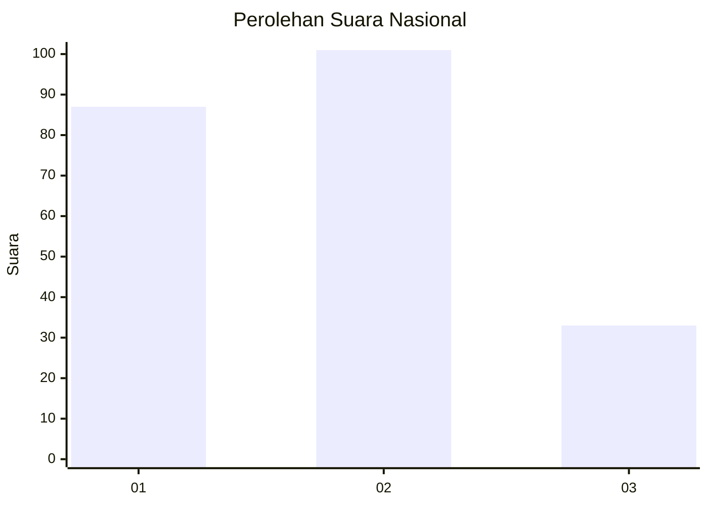
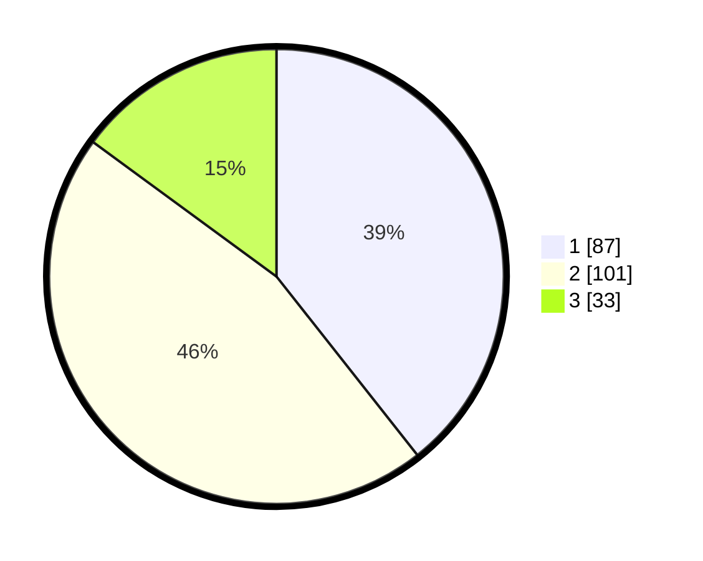

# Hasil

## Grafik

## Tabel

| No.    | Nama Paslon    | Suara | Suara (raw) | Persentase |
|:------ |:-------------- | -----:| -----------:| ----------:|
| 100025 | ANIES MUHAIMIN | 87    | [87][p-1]   | 39,37      |
| 100026 | PRABOWO GIBRAN | 101   | [101][p-2]  | 45,70      |
| 100027 | GANJAR MAHFUD  | 33    | [33][p-3]   | 14,93      |

[p-1]: https://github.com/gigit-pemilu/pemilu-2024/blob/main/pilpres/hitung-suara/sub/31-dki-jakarta/sub/01-kep-seribu/sub/01-kepulauan-seribu-utara/sub/1001-pulau-panggang/sub/010-tps/sub/paslon-1.txt
[p-2]: https://github.com/gigit-pemilu/pemilu-2024/blob/main/pilpres/hitung-suara/sub/31-dki-jakarta/sub/01-kep-seribu/sub/01-kepulauan-seribu-utara/sub/1001-pulau-panggang/sub/010-tps/sub/paslon-2.txt
[p-3]: https://github.com/gigit-pemilu/pemilu-2024/blob/main/pilpres/hitung-suara/sub/31-dki-jakarta/sub/01-kep-seribu/sub/01-kepulauan-seribu-utara/sub/1001-pulau-panggang/sub/010-tps/sub/paslon-3.txt

## Foto C Plano

https://sirekap-obj-formc.kpu.go.id/477b/pemilu/ppwp/31/01/01/10/01/3101011001010-20240215-005153--68cc1101-644d-4f5f-a2fc-92eaeeef5832.jpg

https://sirekap-obj-formc.kpu.go.id/477b/pemilu/ppwp/31/01/01/10/01/3101011001010-20240215-005600--9a6c3735-9647-4007-aaf1-c287c4c93be6.jpg

https://sirekap-obj-formc.kpu.go.id/477b/pemilu/ppwp/31/01/01/10/01/3101011001010-20240216-132554--bc57ee12-d1fc-46f5-8d02-c67a127634f1.jpg

## Metadata

| Key        | Value               |
| ---------- | ------------------- |
| Time Stamp | 2024-02-16 22:01:00 |

## DATA PEMILIH TETAP

Jumlah pemilih dalam DPT: **292**.
 * L: **151**.
 * P: **141**.

## DATA PENGGUNA HAK PILIH

Jumlah pengguna hak pilih dalam DPT: **222**.
 * L: **105**.
 * P: **117**.

Jumlah pengguna hak pilih dalam DPTb: **0**.
 * L: **0**.
 * P: **0**.

Jumlah pengguna hak pilih dalam DPK: **2**.
 * L: **1**.
 * P: **1**.

Jumlah pengguna hak pilih: **224**.
 * L: **106**.
 * P: **118**.

## JUMLAH SUARA SAH DAN TIDAK SAH

JUMLAH SELURUH SUARA SAH: **221**.

JUMLAH SUARA TIDAK SAH: **3**.

JUMLAH SELURUH SUARA SAH DAN SUARA TIDAK SAH: **224**.

