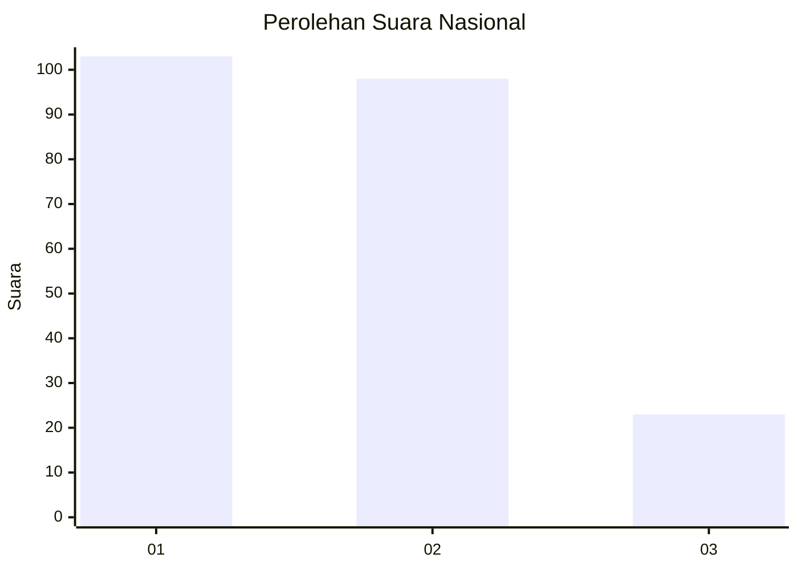
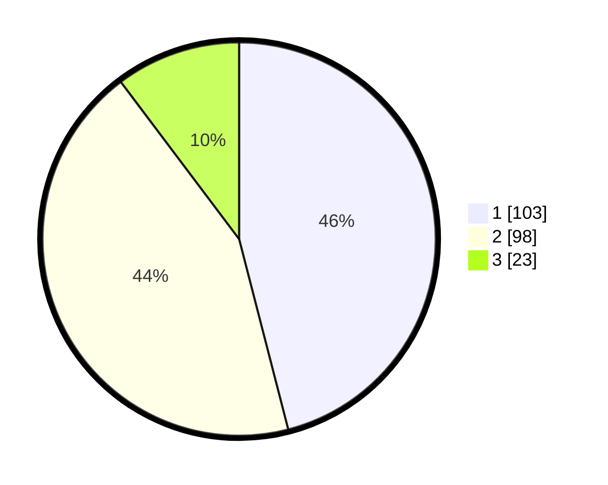

# Hasil

## Grafik

## Tabel

| No.    | Nama Paslon    | Suara | Suara (raw) | Persentase |
|:------ |:-------------- | -----:| -----------:| ----------:|
| 100025 | ANIES MUHAIMIN | 103   | [103][p-1]  | 45,98      |
| 100026 | PRABOWO GIBRAN | 98    | [98][p-2]   | 43,75      |
| 100027 | GANJAR MAHFUD  | 23    | [23][p-3]   | 10,27      |

[p-1]: https://github.com/gigit-pemilu/pemilu-2024/blob/main/pilpres/hitung-suara/sub/31-dki-jakarta/sub/01-kep-seribu/sub/01-kepulauan-seribu-utara/sub/1001-pulau-panggang/sub/011-tps/sub/paslon-1.txt
[p-2]: https://github.com/gigit-pemilu/pemilu-2024/blob/main/pilpres/hitung-suara/sub/31-dki-jakarta/sub/01-kep-seribu/sub/01-kepulauan-seribu-utara/sub/1001-pulau-panggang/sub/011-tps/sub/paslon-2.txt
[p-3]: https://github.com/gigit-pemilu/pemilu-2024/blob/main/pilpres/hitung-suara/sub/31-dki-jakarta/sub/01-kep-seribu/sub/01-kepulauan-seribu-utara/sub/1001-pulau-panggang/sub/011-tps/sub/paslon-3.txt

## Foto C Plano

https://sirekap-obj-formc.kpu.go.id/2fc1/pemilu/ppwp/31/01/01/10/01/3101011001011-20240218-142453--eb05f7d1-ed1e-43f4-a533-d7cb5fba7a9f.jpg

https://sirekap-obj-formc.kpu.go.id/2fc1/pemilu/ppwp/31/01/01/10/01/3101011001011-20240218-142454--5deb8ef2-3493-41d6-baa1-8fb84d67ee77.jpg

https://sirekap-obj-formc.kpu.go.id/2fc1/pemilu/ppwp/31/01/01/10/01/3101011001011-20240218-101847--158583d4-4284-4b36-93fd-1359d9c730ef.jpg

## Metadata

| Key        | Value               |
| ---------- | ------------------- |
| Time Stamp | 2024-02-20 15:00:00 |

## DATA PEMILIH TETAP

Jumlah pemilih dalam DPT: **288**.
 * L: **149**.
 * P: **139**.

## DATA PENGGUNA HAK PILIH

Jumlah pengguna hak pilih dalam DPT: **227**.
 * L: **117**.
 * P: **110**.

Jumlah pengguna hak pilih dalam DPTb: **1**.
 * L: **0**.
 * P: **1**.

Jumlah pengguna hak pilih dalam DPK: **1**.
 * L: **1**.
 * P: **0**.

Jumlah pengguna hak pilih: **229**.
 * L: **118**.
 * P: **111**.

## JUMLAH SUARA SAH DAN TIDAK SAH

JUMLAH SELURUH SUARA SAH: **224**.

JUMLAH SUARA TIDAK SAH: **5**.

JUMLAH SELURUH SUARA SAH DAN SUARA TIDAK SAH: **229**.

