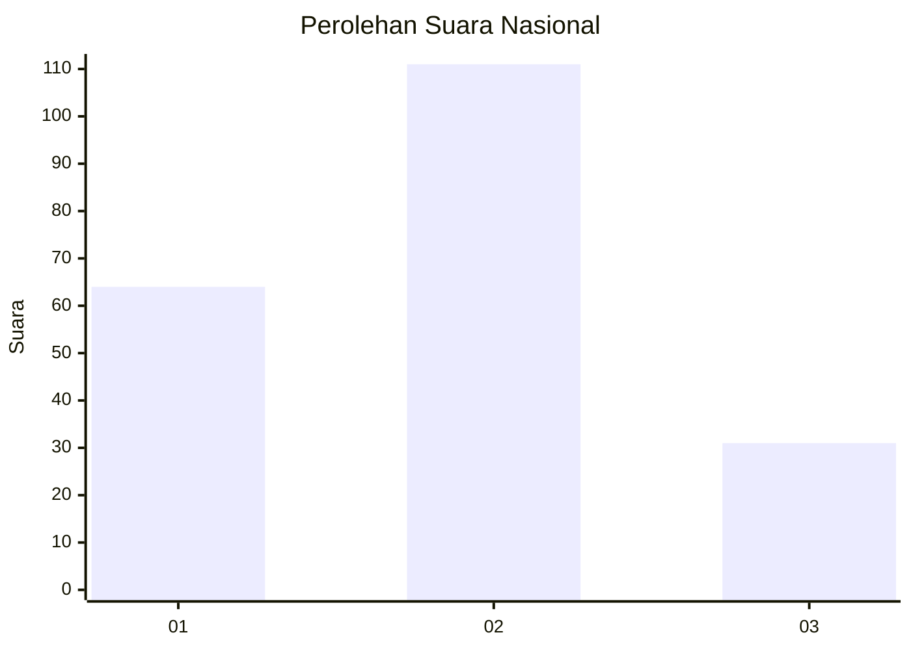
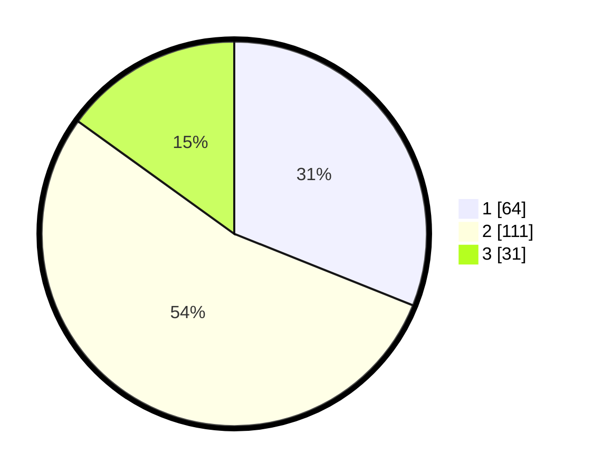

# Hasil

## Grafik

## Tabel

| No.    | Nama Paslon    | Suara | Suara (raw) | Persentase |
|:------ |:-------------- | -----:| -----------:| ----------:|
| 100025 | ANIES MUHAIMIN | 64    | [64][p-1]   | 31,07      |
| 100026 | PRABOWO GIBRAN | 111   | [111][p-2]  | 53,88      |
| 100027 | GANJAR MAHFUD  | 31    | [31][p-3]   | 15,05      |

[p-1]: https://github.com/gigit-pemilu/pemilu-2024/blob/main/pilpres/hitung-suara/sub/31-dki-jakarta/sub/01-kep-seribu/sub/01-kepulauan-seribu-utara/sub/1001-pulau-panggang/sub/013-tps/sub/paslon-1.txt
[p-2]: https://github.com/gigit-pemilu/pemilu-2024/blob/main/pilpres/hitung-suara/sub/31-dki-jakarta/sub/01-kep-seribu/sub/01-kepulauan-seribu-utara/sub/1001-pulau-panggang/sub/013-tps/sub/paslon-2.txt
[p-3]: https://github.com/gigit-pemilu/pemilu-2024/blob/main/pilpres/hitung-suara/sub/31-dki-jakarta/sub/01-kep-seribu/sub/01-kepulauan-seribu-utara/sub/1001-pulau-panggang/sub/013-tps/sub/paslon-3.txt

## Foto C Plano

https://sirekap-obj-formc.kpu.go.id/a3db/pemilu/ppwp/31/01/01/10/01/3101011001013-20240216-131603--b37e4c63-1e9a-4e46-9dd9-434d74db377e.jpg

https://sirekap-obj-formc.kpu.go.id/a3db/pemilu/ppwp/31/01/01/10/01/3101011001013-20240216-131604--8a8ede27-6b2c-4af3-b365-6a0ba0d211cc.jpg

https://sirekap-obj-formc.kpu.go.id/a3db/pemilu/ppwp/31/01/01/10/01/3101011001013-20240216-131603--17038bf2-17f8-45c5-a2b4-cda8915ad6dc.jpg

## Metadata

| Key        | Value               |
| ---------- | ------------------- |
| Time Stamp | 2024-02-20 15:00:00 |

## DATA PEMILIH TETAP

Jumlah pemilih dalam DPT: **292**.
 * L: **138**.
 * P: **154**.

## DATA PENGGUNA HAK PILIH

Jumlah pengguna hak pilih dalam DPT: **201**.
 * L: **92**.
 * P: **109**.

Jumlah pengguna hak pilih dalam DPTb: **9**.
 * L: **9**.
 * P: **0**.

Jumlah pengguna hak pilih dalam DPK: **0**.
 * L: **0**.
 * P: **0**.

Jumlah pengguna hak pilih: **210**.
 * L: **101**.
 * P: **109**.

## JUMLAH SUARA SAH DAN TIDAK SAH

JUMLAH SELURUH SUARA SAH: **206**.

JUMLAH SUARA TIDAK SAH: **4**.

JUMLAH SELURUH SUARA SAH DAN SUARA TIDAK SAH: **210**.

