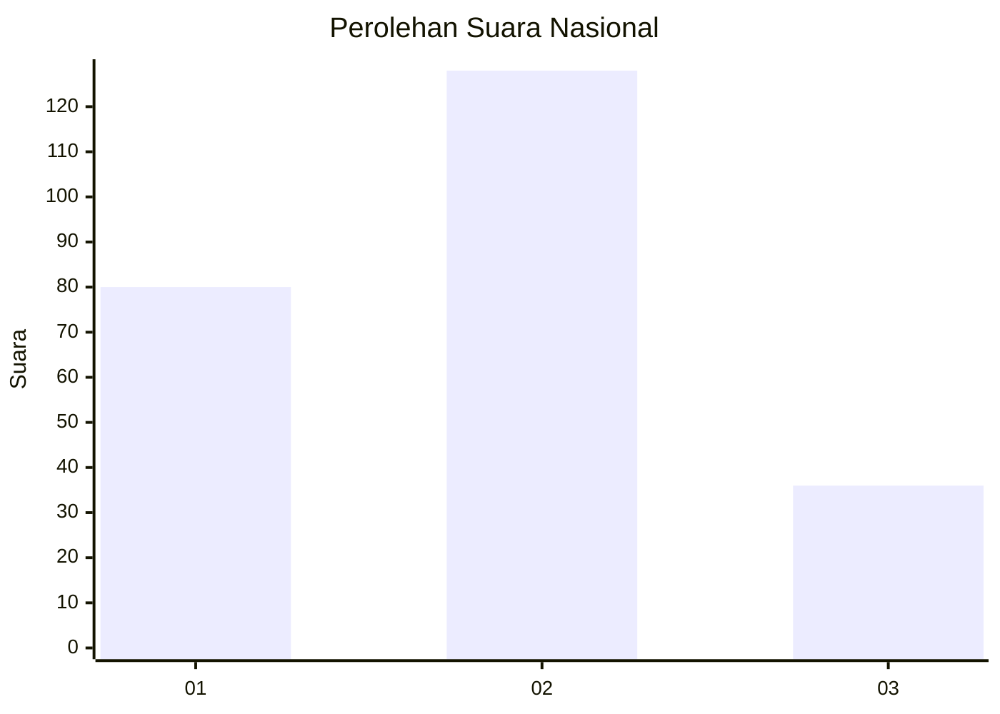
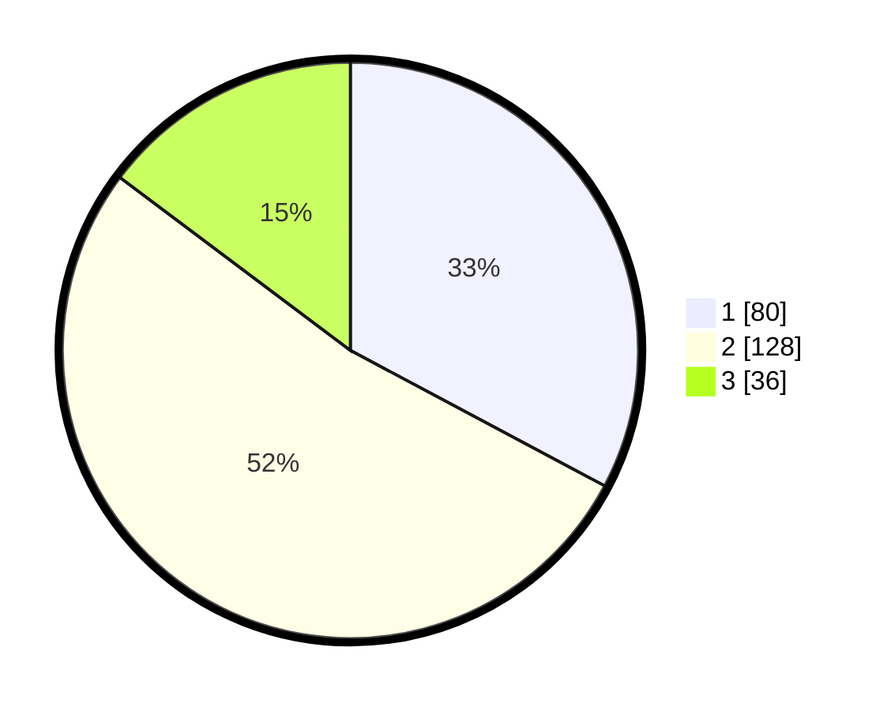

# Hasil

## Grafik

## Tabel

| No.    | Nama Paslon    | Suara | Suara (raw) | Persentase |
|:------ |:-------------- | -----:| -----------:| ----------:|
| 100025 | ANIES MUHAIMIN | 80    | [80][p-1]   | 32,79      |
| 100026 | PRABOWO GIBRAN | 128   | [128][p-2]  | 52,46      |
| 100027 | GANJAR MAHFUD  | 36    | [36][p-3]   | 14,75      |

[p-1]: https://github.com/gigit-pemilu/pemilu-2024/blob/main/pilpres/hitung-suara/sub/31-dki-jakarta/sub/01-kep-seribu/sub/01-kepulauan-seribu-utara/sub/1001-pulau-panggang/sub/015-tps/sub/paslon-1.txt
[p-2]: https://github.com/gigit-pemilu/pemilu-2024/blob/main/pilpres/hitung-suara/sub/31-dki-jakarta/sub/01-kep-seribu/sub/01-kepulauan-seribu-utara/sub/1001-pulau-panggang/sub/015-tps/sub/paslon-2.txt
[p-3]: https://github.com/gigit-pemilu/pemilu-2024/blob/main/pilpres/hitung-suara/sub/31-dki-jakarta/sub/01-kep-seribu/sub/01-kepulauan-seribu-utara/sub/1001-pulau-panggang/sub/015-tps/sub/paslon-3.txt

## Foto C Plano

https://sirekap-obj-formc.kpu.go.id/87e6/pemilu/ppwp/31/01/01/10/01/3101011001015-20240214-193823--f70ca984-d09e-4ab2-a1c0-22ea27f9064e.jpg

https://sirekap-obj-formc.kpu.go.id/87e6/pemilu/ppwp/31/01/01/10/01/3101011001015-20240216-122754--ba9bbfd0-22bd-4f9b-8104-dfc0d7468300.jpg

https://sirekap-obj-formc.kpu.go.id/87e6/pemilu/ppwp/31/01/01/10/01/3101011001015-20240214-194620--2cfe6869-ed3c-4de8-83ed-f117e670a93e.jpg

## Metadata

| Key        | Value               |
| ---------- | ------------------- |
| Time Stamp | 2024-02-16 16:25:10 |

## DATA PEMILIH TETAP

Jumlah pemilih dalam DPT: **293**.
 * L: **144**.
 * P: **149**.

## DATA PENGGUNA HAK PILIH

Jumlah pengguna hak pilih dalam DPT: **246**.
 * L: **121**.
 * P: **125**.

Jumlah pengguna hak pilih dalam DPTb: **1**.
 * L: **0**.
 * P: **1**.

Jumlah pengguna hak pilih dalam DPK: **2**.
 * L: **1**.
 * P: **1**.

Jumlah pengguna hak pilih: **249**.
 * L: **122**.
 * P: **127**.

## JUMLAH SUARA SAH DAN TIDAK SAH

JUMLAH SELURUH SUARA SAH: **244**.

JUMLAH SUARA TIDAK SAH: **5**.

JUMLAH SELURUH SUARA SAH DAN SUARA TIDAK SAH: **249**.

