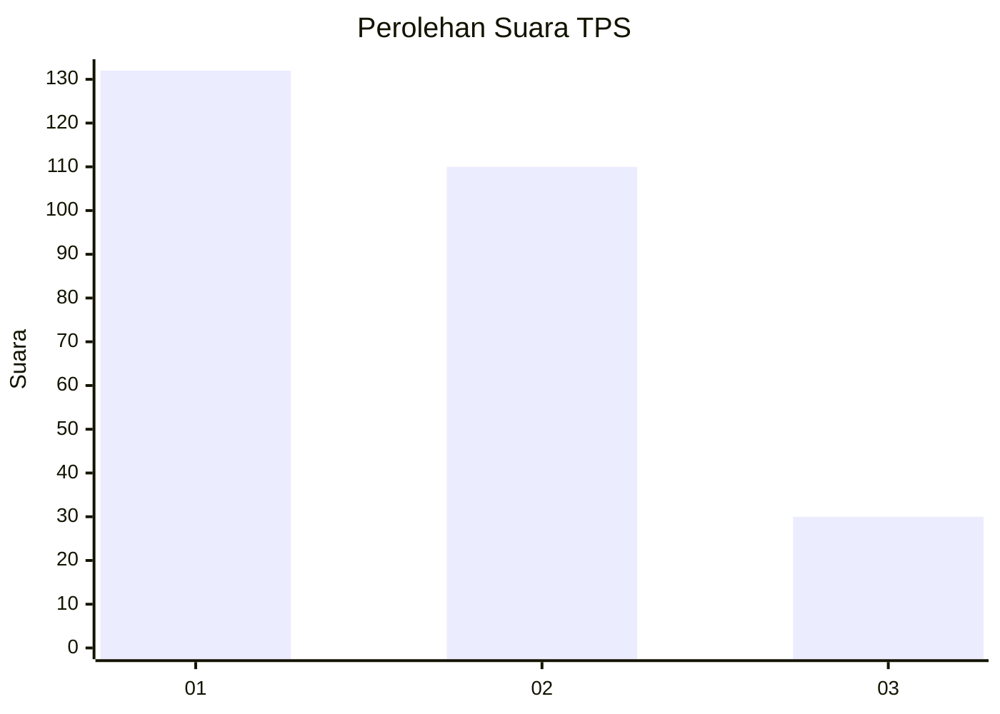
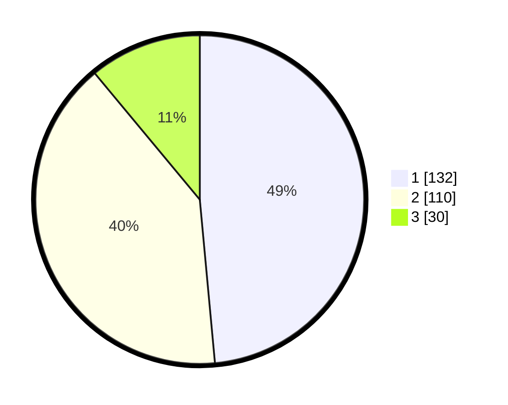

# Hasil

## Grafik

## Tabel

| No. | Nama Paslon    | Suara | Suara (raw) | Persentase |
|:--- |:-------------- | -----:| -----------:| ----------:|
| 1   | ANIES MUHAIMIN | 132   | [132][p-1]  | 48,53      |
| 2   | PRABOWO GIBRAN | 110   | [110][p-2]  | 40,44      |
| 3   | GANJAR MAHFUD  | 30    | [30][p-3]   | 11,03      |

[p-1]: https://github.com/gigit-pemilu/pemilu-2024-31-dki-jakarta/blob/main/pilpres/hitung-suara/sub/31-dki-jakarta/sub/01-kep-seribu/sub/01-kepulauan-seribu-utara/sub/1002-pulau-kelapa/sub/005-tps/sub/paslon-1.txt
[p-2]: https://github.com/gigit-pemilu/pemilu-2024-31-dki-jakarta/blob/main/pilpres/hitung-suara/sub/31-dki-jakarta/sub/01-kep-seribu/sub/01-kepulauan-seribu-utara/sub/1002-pulau-kelapa/sub/005-tps/sub/paslon-2.txt
[p-3]: https://github.com/gigit-pemilu/pemilu-2024-31-dki-jakarta/blob/main/pilpres/hitung-suara/sub/31-dki-jakarta/sub/01-kep-seribu/sub/01-kepulauan-seribu-utara/sub/1002-pulau-kelapa/sub/005-tps/sub/paslon-3.txt

## Foto C Plano

https://sirekap-obj-formc.kpu.go.id/df21/pemilu/ppwp/31/01/01/10/02/3101011002005-20240218-111123--51e017b0-0a87-45cb-8c0a-13a6f0487eed.jpg

https://sirekap-obj-formc.kpu.go.id/df21/pemilu/ppwp/31/01/01/10/02/3101011002005-20240218-111125--f3ce3f71-1822-48f6-829b-e82bcdd3ef56.jpg

https://sirekap-obj-formc.kpu.go.id/df21/pemilu/ppwp/31/01/01/10/02/3101011002005-20240218-111124--9715537b-7d6f-4dc6-b1a0-4a887e11b7c8.jpg

## Metadata

| Key        | Value               |
| ---------- | ------------------- |
| Time Stamp | 2024-02-19 18:00:00 |

## DATA PEMILIH TETAP

Jumlah pemilih dalam DPT: **289**.
 * L: **147**.
 * P: **142**.

## DATA PENGGUNA HAK PILIH

Jumlah pengguna hak pilih dalam DPT: **242**.
 * L: **115**.
 * P: **127**.

Jumlah pengguna hak pilih dalam DPTb: **32**.
 * L: **31**.
 * P: **1**.

Jumlah pengguna hak pilih dalam DPK: **1**.
 * L: **0**.
 * P: **1**.

Jumlah pengguna hak pilih: **275**.
 * L: **146**.
 * P: **129**.

## JUMLAH SUARA SAH DAN TIDAK SAH

JUMLAH SELURUH SUARA SAH: **272**.

JUMLAH SUARA TIDAK SAH: **3**.

JUMLAH SELURUH SUARA SAH DAN SUARA TIDAK SAH: **275**.

