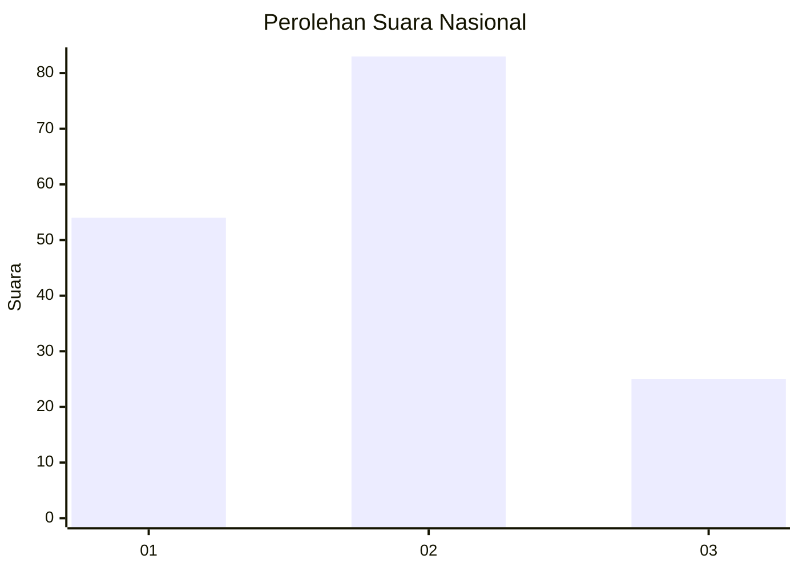
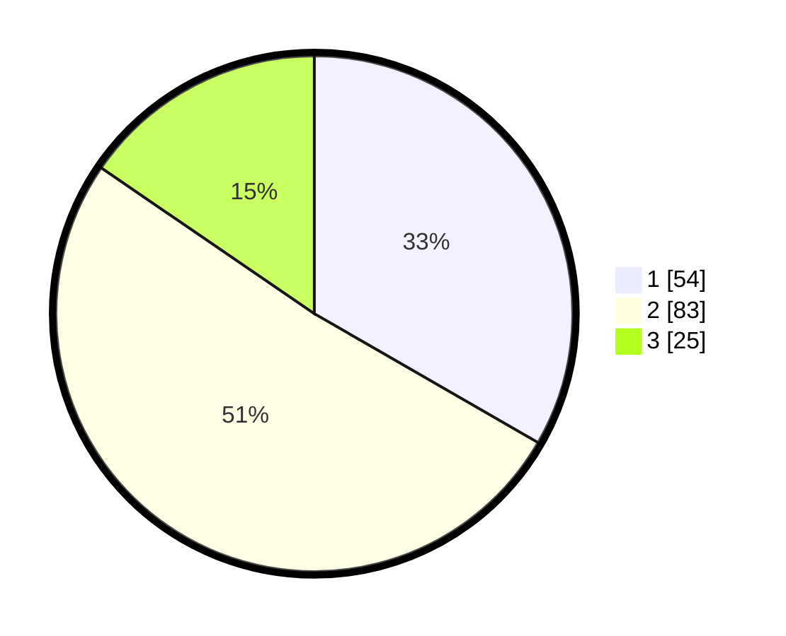

# Hasil

## Grafik

## Tabel

| No.    | Nama Paslon    | Suara | Suara (raw) | Persentase |
|:------ |:-------------- | -----:| -----------:| ----------:|
| 100025 | ANIES MUHAIMIN | 54    | [54][p-1]   | 33,33      |
| 100026 | PRABOWO GIBRAN | 83    | [83][p-2]   | 51,23      |
| 100027 | GANJAR MAHFUD  | 25    | [25][p-3]   | 15,43      |

[p-1]: https://github.com/gigit-pemilu/pemilu-2024/blob/main/pilpres/hitung-suara/sub/31-dki-jakarta/sub/71-jakarta-pusat/sub/01-gambir/sub/1001-gambir/sub/002-tps/sub/paslon-1.txt
[p-2]: https://github.com/gigit-pemilu/pemilu-2024/blob/main/pilpres/hitung-suara/sub/31-dki-jakarta/sub/71-jakarta-pusat/sub/01-gambir/sub/1001-gambir/sub/002-tps/sub/paslon-2.txt
[p-3]: https://github.com/gigit-pemilu/pemilu-2024/blob/main/pilpres/hitung-suara/sub/31-dki-jakarta/sub/71-jakarta-pusat/sub/01-gambir/sub/1001-gambir/sub/002-tps/sub/paslon-3.txt

## Foto C Plano

https://sirekap-obj-formc.kpu.go.id/f5c9/pemilu/ppwp/31/71/01/10/01/3171011001002-20240215-212716--a03ceb06-821e-4605-8020-708162b632ad.jpg

https://sirekap-obj-formc.kpu.go.id/f5c9/pemilu/ppwp/31/71/01/10/01/3171011001002-20240215-212718--af528007-82bb-4c5a-9592-d46f76f50d7b.jpg

https://sirekap-obj-formc.kpu.go.id/f5c9/pemilu/ppwp/31/71/01/10/01/3171011001002-20240215-212717--88d2e3eb-87e9-465a-9777-3218b19904c2.jpg

## Metadata

| Key        | Value               |
| ---------- | ------------------- |
| Time Stamp | 2024-02-15 22:00:27 |

## DATA PEMILIH TETAP

Jumlah pemilih dalam DPT: **218**.
 * L: **96**.
 * P: **122**.

## DATA PENGGUNA HAK PILIH

Jumlah pengguna hak pilih dalam DPT: **135**.
 * L: **48**.
 * P: **87**.

Jumlah pengguna hak pilih dalam DPTb: **15**.
 * L: **6**.
 * P: **9**.

Jumlah pengguna hak pilih dalam DPK: **14**.
 * L: **5**.
 * P: **9**.

Jumlah pengguna hak pilih: **164**.
 * L: **59**.
 * P: **105**.

## JUMLAH SUARA SAH DAN TIDAK SAH

JUMLAH SELURUH SUARA SAH: **162**.

JUMLAH SUARA TIDAK SAH: **2**.

JUMLAH SELURUH SUARA SAH DAN SUARA TIDAK SAH: **164**.

