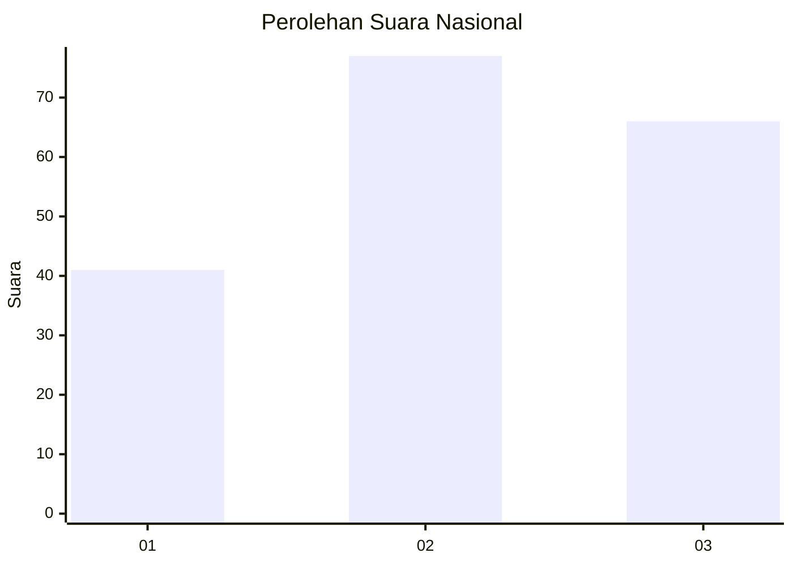
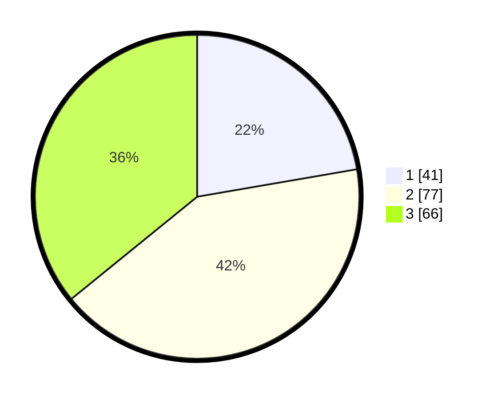

# Hasil

## Grafik

## Tabel

| No.    | Nama Paslon    | Suara | Suara (raw) | Persentase |
|:------ |:-------------- | -----:| -----------:| ----------:|
| 100025 | ANIES MUHAIMIN | 41    | [41][p-1]   | 22,28      |
| 100026 | PRABOWO GIBRAN | 77    | [77][p-2]   | 41,85      |
| 100027 | GANJAR MAHFUD  | 66    | [66][p-3]   | 35,87      |

[p-1]: https://github.com/gigit-pemilu/pemilu-2024/blob/main/pilpres/hitung-suara/sub/31-dki-jakarta/sub/71-jakarta-pusat/sub/01-gambir/sub/1001-gambir/sub/005-tps/sub/paslon-1.txt
[p-2]: https://github.com/gigit-pemilu/pemilu-2024/blob/main/pilpres/hitung-suara/sub/31-dki-jakarta/sub/71-jakarta-pusat/sub/01-gambir/sub/1001-gambir/sub/005-tps/sub/paslon-2.txt
[p-3]: https://github.com/gigit-pemilu/pemilu-2024/blob/main/pilpres/hitung-suara/sub/31-dki-jakarta/sub/71-jakarta-pusat/sub/01-gambir/sub/1001-gambir/sub/005-tps/sub/paslon-3.txt

## Foto C Plano

https://sirekap-obj-formc.kpu.go.id/c717/pemilu/ppwp/31/71/01/10/01/3171011001005-20240215-202655--6a1ac522-a84a-4d57-81bd-c9ff9a7100d9.jpg

https://sirekap-obj-formc.kpu.go.id/c717/pemilu/ppwp/31/71/01/10/01/3171011001005-20240215-000455--97f29b46-f766-464c-a0ed-abbf57ac2c4c.jpg

https://sirekap-obj-formc.kpu.go.id/c717/pemilu/ppwp/31/71/01/10/01/3171011001005-20240215-000540--265f11b7-2174-48ac-b20c-9ee532857031.jpg

## Metadata

| Key        | Value               |
| ---------- | ------------------- |
| Time Stamp | 2024-02-16 16:25:10 |

## DATA PEMILIH TETAP

Jumlah pemilih dalam DPT: **218**.
 * L: **103**.
 * P: **115**.

## DATA PENGGUNA HAK PILIH

Jumlah pengguna hak pilih dalam DPT: **170**.
 * L: **74**.
 * P: **96**.

Jumlah pengguna hak pilih dalam DPTb: **16**.
 * L: **3**.
 * P: **13**.

Jumlah pengguna hak pilih dalam DPK: **4**.
 * L: **2**.
 * P: **2**.

Jumlah pengguna hak pilih: **190**.
 * L: **79**.
 * P: **111**.

## JUMLAH SUARA SAH DAN TIDAK SAH

JUMLAH SELURUH SUARA SAH: **184**.

JUMLAH SUARA TIDAK SAH: **6**.

JUMLAH SELURUH SUARA SAH DAN SUARA TIDAK SAH: **190**.

