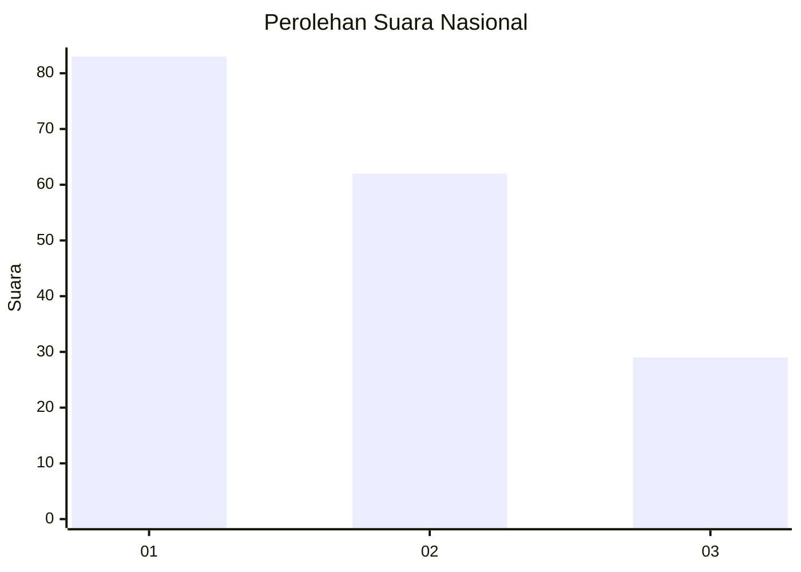
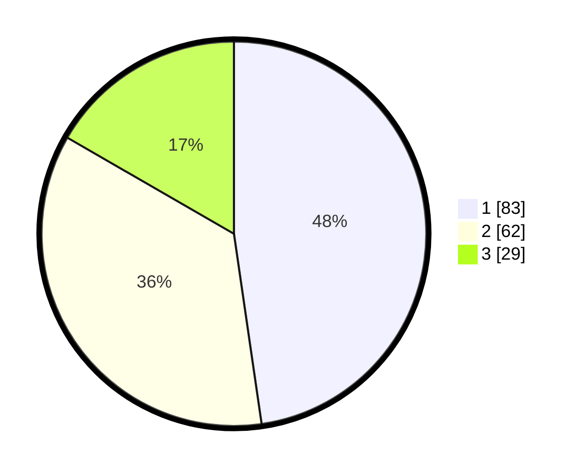

# Hasil

## Grafik

## Tabel

| No.    | Nama Paslon    | Suara | Suara (raw) | Persentase |
|:------ |:-------------- | -----:| -----------:| ----------:|
| 100025 | ANIES MUHAIMIN | 83    | [83][p-1]   | 47,70      |
| 100026 | PRABOWO GIBRAN | 62    | [62][p-2]   | 35,63      |
| 100027 | GANJAR MAHFUD  | 29    | [29][p-3]   | 16,67      |

[p-1]: https://github.com/gigit-pemilu/pemilu-2024/blob/main/pilpres/hitung-suara/sub/31-dki-jakarta/sub/71-jakarta-pusat/sub/01-gambir/sub/1001-gambir/sub/006-tps/sub/paslon-1.txt
[p-2]: https://github.com/gigit-pemilu/pemilu-2024/blob/main/pilpres/hitung-suara/sub/31-dki-jakarta/sub/71-jakarta-pusat/sub/01-gambir/sub/1001-gambir/sub/006-tps/sub/paslon-2.txt
[p-3]: https://github.com/gigit-pemilu/pemilu-2024/blob/main/pilpres/hitung-suara/sub/31-dki-jakarta/sub/71-jakarta-pusat/sub/01-gambir/sub/1001-gambir/sub/006-tps/sub/paslon-3.txt

## Foto C Plano

https://sirekap-obj-formc.kpu.go.id/0db2/pemilu/ppwp/31/71/01/10/01/3171011001006-20240216-142431--386f8c51-03a3-4497-a67a-eb4903bb547b.jpg

https://sirekap-obj-formc.kpu.go.id/0db2/pemilu/ppwp/31/71/01/10/01/3171011001006-20240216-142433--b400256a-bfb9-4a42-a71c-d387f20e0ea7.jpg

https://sirekap-obj-formc.kpu.go.id/0db2/pemilu/ppwp/31/71/01/10/01/3171011001006-20240216-142432--08b8255b-a61f-439b-ae7a-328e12ad3db9.jpg

## Metadata

| Key        | Value               |
| ---------- | ------------------- |
| Time Stamp | 2024-02-16 16:25:10 |

## DATA PEMILIH TETAP

Jumlah pemilih dalam DPT: **243**.
 * L: **133**.
 * P: **110**.

## DATA PENGGUNA HAK PILIH

Jumlah pengguna hak pilih dalam DPT: **163**.
 * L: **87**.
 * P: **76**.

Jumlah pengguna hak pilih dalam DPTb: **14**.
 * L: **6**.
 * P: **8**.

Jumlah pengguna hak pilih dalam DPK: **1**.
 * L: **1**.
 * P: **0**.

Jumlah pengguna hak pilih: **178**.
 * L: **94**.
 * P: **84**.

## JUMLAH SUARA SAH DAN TIDAK SAH

JUMLAH SELURUH SUARA SAH: **174**.

JUMLAH SUARA TIDAK SAH: **4**.

JUMLAH SELURUH SUARA SAH DAN SUARA TIDAK SAH: **178**.

