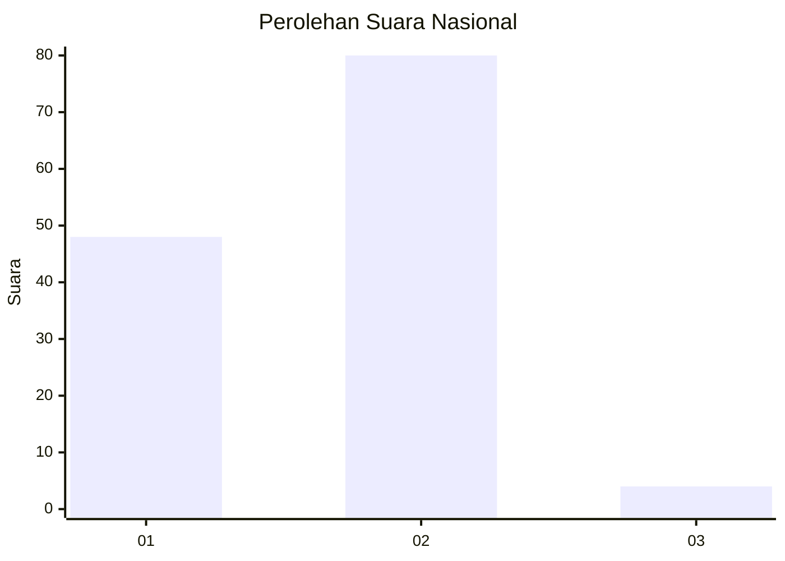
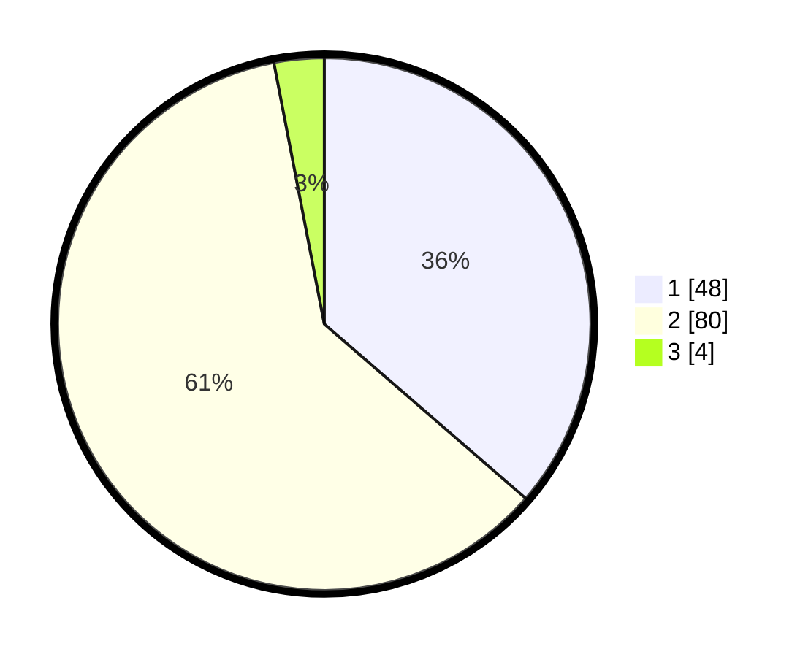

# Hasil

## Grafik

## Tabel

| No.    | Nama Paslon    | Suara | Suara (raw) | Persentase |
|:------ |:-------------- | -----:| -----------:| ----------:|
| 100025 | ANIES MUHAIMIN | 48    | [48][p-1]   | 36,36      |
| 100026 | PRABOWO GIBRAN | 80    | [80][p-2]   | 60,61      |
| 100027 | GANJAR MAHFUD  | 4     | [4][p-3]    | 3,03       |

[p-1]: https://github.com/gigit-pemilu/pemilu-2024/blob/main/pilpres/hitung-suara/sub/31-dki-jakarta/sub/71-jakarta-pusat/sub/01-gambir/sub/1004-petojo-selatan/sub/045-tps/sub/paslon-1.txt
[p-2]: https://github.com/gigit-pemilu/pemilu-2024/blob/main/pilpres/hitung-suara/sub/31-dki-jakarta/sub/71-jakarta-pusat/sub/01-gambir/sub/1004-petojo-selatan/sub/045-tps/sub/paslon-2.txt
[p-3]: https://github.com/gigit-pemilu/pemilu-2024/blob/main/pilpres/hitung-suara/sub/31-dki-jakarta/sub/71-jakarta-pusat/sub/01-gambir/sub/1004-petojo-selatan/sub/045-tps/sub/paslon-3.txt

## Foto C Plano

https://sirekap-obj-formc.kpu.go.id/0d3d/pemilu/ppwp/31/71/01/10/04/3171011004045-20240214-214450--213a31a9-3680-495d-b0ce-b189b0ec1de7.jpg

https://sirekap-obj-formc.kpu.go.id/0d3d/pemilu/ppwp/31/71/01/10/04/3171011004045-20240214-214601--0fba95cd-6a5b-41fe-9f00-a23e74970569.jpg

https://sirekap-obj-formc.kpu.go.id/0d3d/pemilu/ppwp/31/71/01/10/04/3171011004045-20240214-214652--b2f10836-18ce-4c27-ae58-bb51d19e957d.jpg

## Metadata

| Key        | Value               |
| ---------- | ------------------- |
| Time Stamp | 2024-02-15 22:00:27 |

