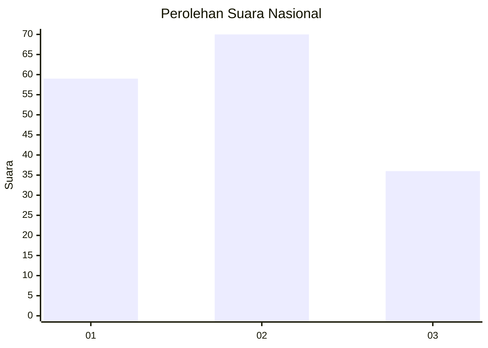
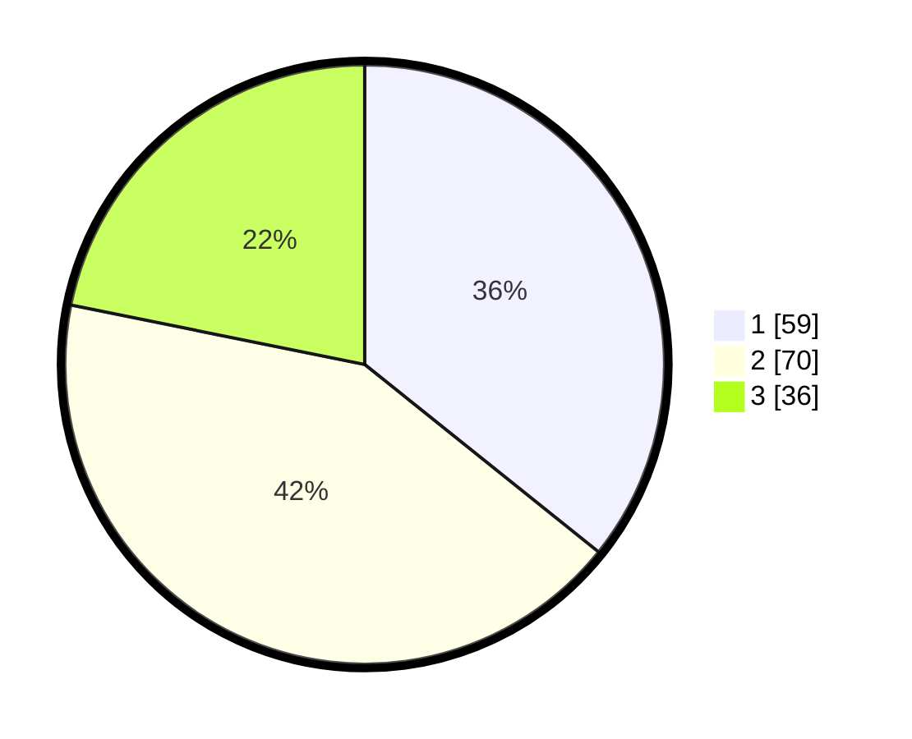

# Hasil

## Grafik

## Tabel

| No.    | Nama Paslon    | Suara | Suara (raw) | Persentase |
|:------ |:-------------- | -----:| -----------:| ----------:|
| 100025 | ANIES MUHAIMIN | 59    | [59][p-1]   | 35,76      |
| 100026 | PRABOWO GIBRAN | 70    | [70][p-2]   | 42,42      |
| 100027 | GANJAR MAHFUD  | 36    | [36][p-3]   | 21,82      |

[p-1]: https://github.com/gigit-pemilu/pemilu-2024/blob/main/pilpres/hitung-suara/sub/31-dki-jakarta/sub/71-jakarta-pusat/sub/01-gambir/sub/1006-duri-pulo/sub/011-tps/sub/paslon-1.txt
[p-2]: https://github.com/gigit-pemilu/pemilu-2024/blob/main/pilpres/hitung-suara/sub/31-dki-jakarta/sub/71-jakarta-pusat/sub/01-gambir/sub/1006-duri-pulo/sub/011-tps/sub/paslon-2.txt
[p-3]: https://github.com/gigit-pemilu/pemilu-2024/blob/main/pilpres/hitung-suara/sub/31-dki-jakarta/sub/71-jakarta-pusat/sub/01-gambir/sub/1006-duri-pulo/sub/011-tps/sub/paslon-3.txt

## Foto C Plano

https://sirekap-obj-formc.kpu.go.id/55f1/pemilu/ppwp/31/71/01/10/06/3171011006011-20240215-003906--f029e106-6e94-4d2c-9843-00eb5578d7ed.jpg

https://sirekap-obj-formc.kpu.go.id/55f1/pemilu/ppwp/31/71/01/10/06/3171011006011-20240214-204842--5b12e1cd-faaa-444e-a29d-97092200a9ec.jpg

https://sirekap-obj-formc.kpu.go.id/55f1/pemilu/ppwp/31/71/01/10/06/3171011006011-20240215-003646--1feab4c5-1019-4a61-8187-324965be7306.jpg

## Metadata

| Key        | Value               |
| ---------- | ------------------- |
| Time Stamp | 2024-02-15 06:00:23 |

