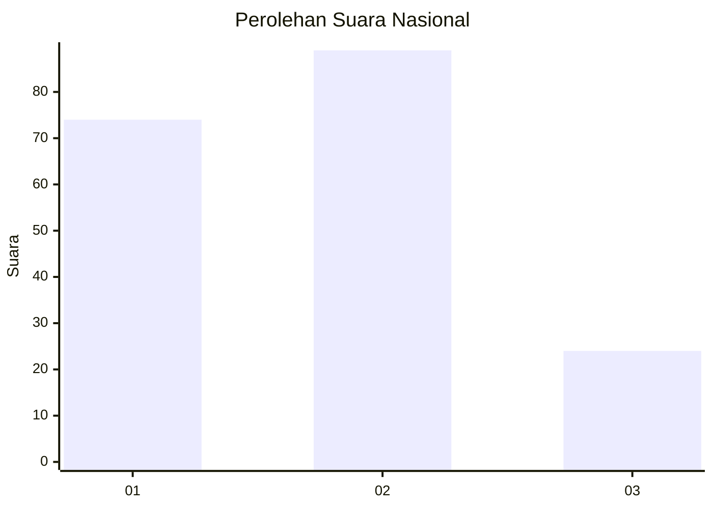
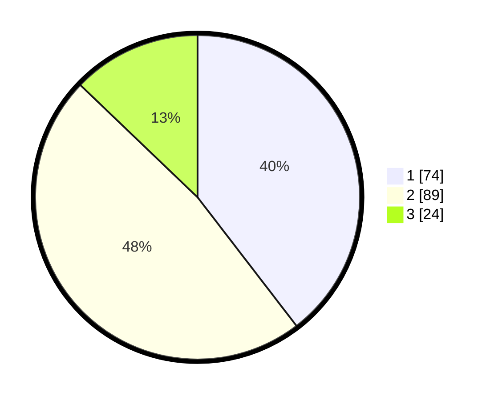

# Hasil

## Grafik

## Tabel

| No.    | Nama Paslon    | Suara | Suara (raw) | Persentase |
|:------ |:-------------- | -----:| -----------:| ----------:|
| 100025 | ANIES MUHAIMIN | 74    | [74][p-1]   | 39,57      |
| 100026 | PRABOWO GIBRAN | 89    | [89][p-2]   | 47,59      |
| 100027 | GANJAR MAHFUD  | 24    | [24][p-3]   | 12,83      |

[p-1]: https://github.com/gigit-pemilu/pemilu-2024/blob/main/pilpres/hitung-suara/sub/31-dki-jakarta/sub/71-jakarta-pusat/sub/01-gambir/sub/1006-duri-pulo/sub/046-tps/sub/paslon-1.txt
[p-2]: https://github.com/gigit-pemilu/pemilu-2024/blob/main/pilpres/hitung-suara/sub/31-dki-jakarta/sub/71-jakarta-pusat/sub/01-gambir/sub/1006-duri-pulo/sub/046-tps/sub/paslon-2.txt
[p-3]: https://github.com/gigit-pemilu/pemilu-2024/blob/main/pilpres/hitung-suara/sub/31-dki-jakarta/sub/71-jakarta-pusat/sub/01-gambir/sub/1006-duri-pulo/sub/046-tps/sub/paslon-3.txt

## Foto C Plano

https://sirekap-obj-formc.kpu.go.id/9625/pemilu/ppwp/31/71/01/10/06/3171011006046-20240214-212628--718ae33a-1a0f-4445-92a6-e4ea82d3fb53.jpg

https://sirekap-obj-formc.kpu.go.id/9625/pemilu/ppwp/31/71/01/10/06/3171011006046-20240214-212721--a8139044-f27c-4188-a91d-da1cac495648.jpg

https://sirekap-obj-formc.kpu.go.id/9625/pemilu/ppwp/31/71/01/10/06/3171011006046-20240214-212837--2f776136-2832-4f8f-8358-1c4eb2d22045.jpg

## Metadata

| Key        | Value               |
| ---------- | ------------------- |
| Time Stamp | 2024-02-15 22:00:27 |

