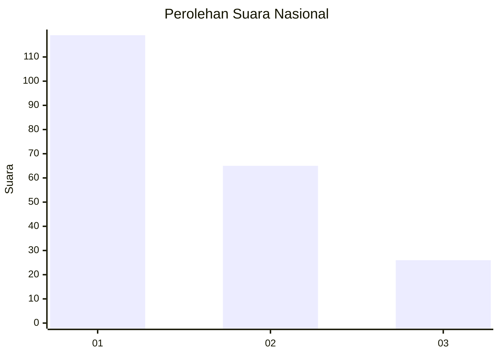
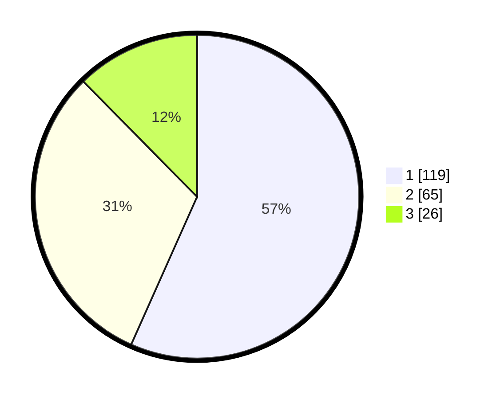

# Hasil

## Grafik

## Tabel

| No.    | Nama Paslon    | Suara | Suara (raw) | Persentase |
|:------ |:-------------- | -----:| -----------:| ----------:|
| 100025 | ANIES MUHAIMIN | 119   | [119][p-1]  | 56,67      |
| 100026 | PRABOWO GIBRAN | 65    | [65][p-2]   | 30,95      |
| 100027 | GANJAR MAHFUD  | 26    | [26][p-3]   | 12,38      |

[p-1]: https://github.com/gigit-pemilu/pemilu-2024/blob/main/pilpres/hitung-suara/sub/31-dki-jakarta/sub/71-jakarta-pusat/sub/01-gambir/sub/1006-duri-pulo/sub/051-tps/sub/paslon-1.txt
[p-2]: https://github.com/gigit-pemilu/pemilu-2024/blob/main/pilpres/hitung-suara/sub/31-dki-jakarta/sub/71-jakarta-pusat/sub/01-gambir/sub/1006-duri-pulo/sub/051-tps/sub/paslon-2.txt
[p-3]: https://github.com/gigit-pemilu/pemilu-2024/blob/main/pilpres/hitung-suara/sub/31-dki-jakarta/sub/71-jakarta-pusat/sub/01-gambir/sub/1006-duri-pulo/sub/051-tps/sub/paslon-3.txt

## Foto C Plano

https://sirekap-obj-formc.kpu.go.id/3254/pemilu/ppwp/31/71/01/10/06/3171011006051-20240214-155759--314f7266-9bb2-477e-b830-aa086587d0e4.jpg

https://sirekap-obj-formc.kpu.go.id/3254/pemilu/ppwp/31/71/01/10/06/3171011006051-20240214-160125--0d2b5540-12b1-44ff-895d-10905e523ef7.jpg

https://sirekap-obj-formc.kpu.go.id/3254/pemilu/ppwp/31/71/01/10/06/3171011006051-20240214-160122--aefa6016-8a52-4596-afc4-d60f544cd388.jpg

## Metadata

| Key        | Value               |
| ---------- | ------------------- |
| Time Stamp | 2024-02-15 00:41:44 |

