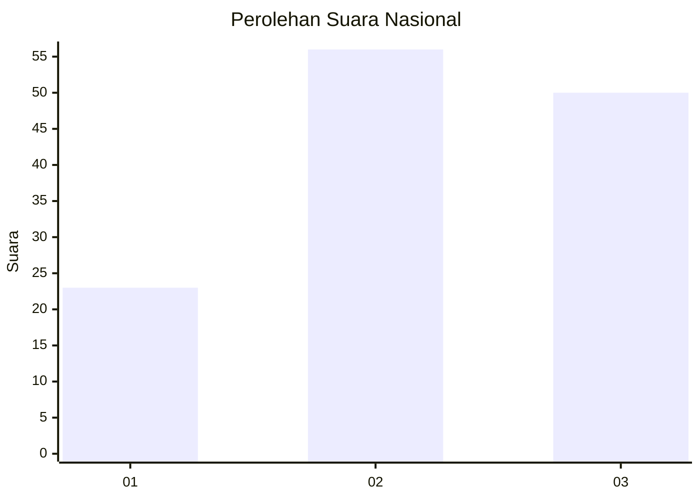
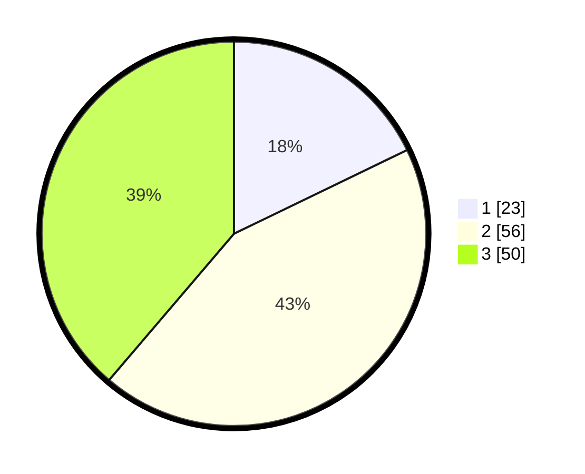

# Hasil

## Grafik

## Tabel

| No.    | Nama Paslon    | Suara | Suara (raw) | Persentase |
|:------ |:-------------- | -----:| -----------:| ----------:|
| 100025 | ANIES MUHAIMIN | 23    | [23][p-1]   | 17,83      |
| 100026 | PRABOWO GIBRAN | 56    | [56][p-2]   | 43,41      |
| 100027 | GANJAR MAHFUD  | 50    | [50][p-3]   | 38,76      |

[p-1]: https://github.com/gigit-pemilu/pemilu-2024/blob/main/pilpres/hitung-suara/sub/31-dki-jakarta/sub/71-jakarta-pusat/sub/02-sawah-besar/sub/1001-pasar-baru/sub/003-tps/sub/paslon-1.txt
[p-2]: https://github.com/gigit-pemilu/pemilu-2024/blob/main/pilpres/hitung-suara/sub/31-dki-jakarta/sub/71-jakarta-pusat/sub/02-sawah-besar/sub/1001-pasar-baru/sub/003-tps/sub/paslon-2.txt
[p-3]: https://github.com/gigit-pemilu/pemilu-2024/blob/main/pilpres/hitung-suara/sub/31-dki-jakarta/sub/71-jakarta-pusat/sub/02-sawah-besar/sub/1001-pasar-baru/sub/003-tps/sub/paslon-3.txt

## Foto C Plano

https://sirekap-obj-formc.kpu.go.id/a2c6/pemilu/ppwp/31/71/02/10/01/3171021001003-20240216-205452--aafca03c-3276-476a-be1a-a49b7f32f4b0.jpg

https://sirekap-obj-formc.kpu.go.id/a2c6/pemilu/ppwp/31/71/02/10/01/3171021001003-20240216-204235--bf1c8ad2-5beb-47ab-bd17-80fd2aa7f194.jpg

## Metadata

| Key        | Value               |
| ---------- | ------------------- |
| Time Stamp | 2024-02-17 10:30:03 |

