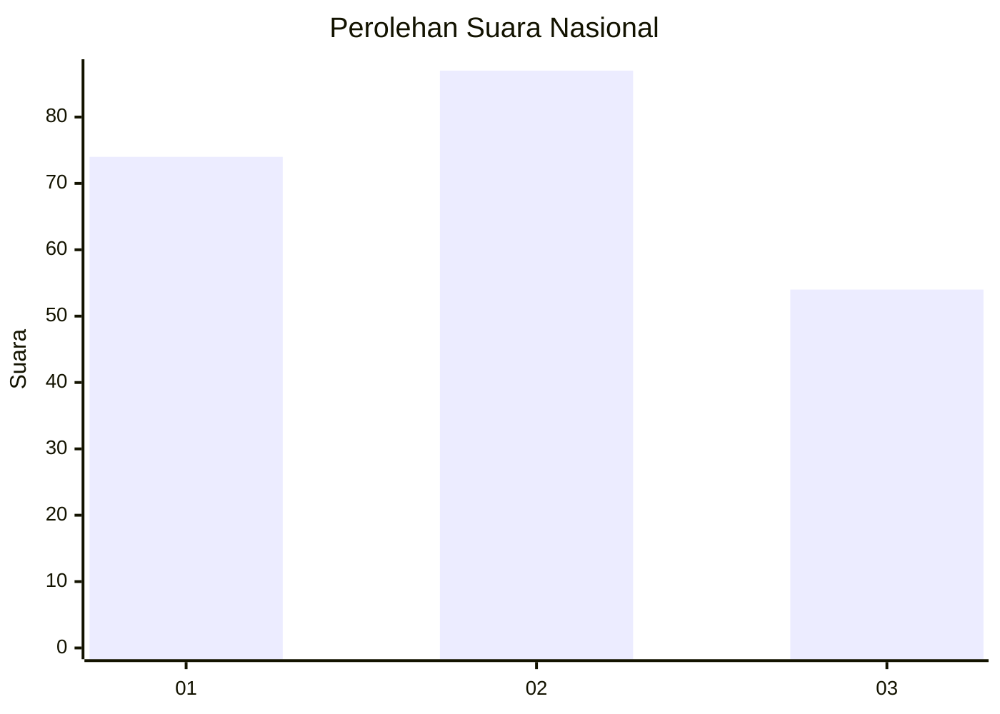
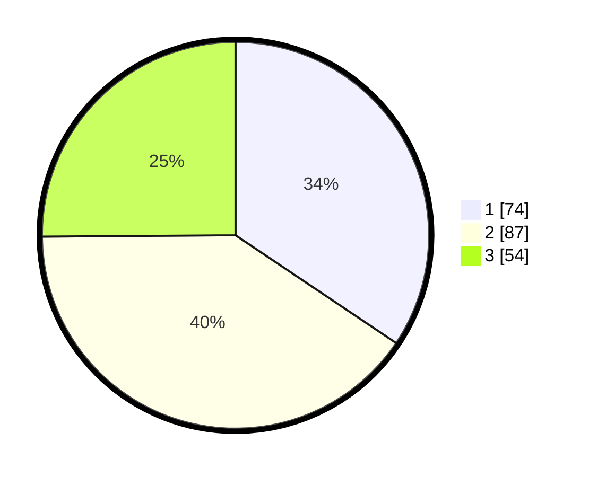

# Hasil

## Grafik

## Tabel

| No.    | Nama Paslon    | Suara | Suara (raw) | Persentase |
|:------ |:-------------- | -----:| -----------:| ----------:|
| 100025 | ANIES MUHAIMIN | 74    | [74][p-1]   | 34,42      |
| 100026 | PRABOWO GIBRAN | 87    | [87][p-2]   | 40,47      |
| 100027 | GANJAR MAHFUD  | 54    | [54][p-3]   | 25,12      |

[p-1]: https://github.com/gigit-pemilu/pemilu-2024/blob/main/pilpres/hitung-suara/sub/31-dki-jakarta/sub/71-jakarta-pusat/sub/02-sawah-besar/sub/1001-pasar-baru/sub/029-tps/sub/paslon-1.txt
[p-2]: https://github.com/gigit-pemilu/pemilu-2024/blob/main/pilpres/hitung-suara/sub/31-dki-jakarta/sub/71-jakarta-pusat/sub/02-sawah-besar/sub/1001-pasar-baru/sub/029-tps/sub/paslon-2.txt
[p-3]: https://github.com/gigit-pemilu/pemilu-2024/blob/main/pilpres/hitung-suara/sub/31-dki-jakarta/sub/71-jakarta-pusat/sub/02-sawah-besar/sub/1001-pasar-baru/sub/029-tps/sub/paslon-3.txt

## Foto C Plano

https://sirekap-obj-formc.kpu.go.id/3904/pemilu/ppwp/31/71/02/10/01/3171021001029-20240214-155311--edc299bf-c71e-4244-8c7e-7ca5e33a9dc1.jpg

https://sirekap-obj-formc.kpu.go.id/3904/pemilu/ppwp/31/71/02/10/01/3171021001029-20240214-230002--3a8d895f-f2d1-4df9-96b0-4165334dc707.jpg

https://sirekap-obj-formc.kpu.go.id/3904/pemilu/ppwp/31/71/02/10/01/3171021001029-20240214-230035--526e4fc1-1db3-4e22-8f81-99375610bf9b.jpg

## Metadata

| Key        | Value               |
| ---------- | ------------------- |
| Time Stamp | 2024-02-15 21:01:18 |

