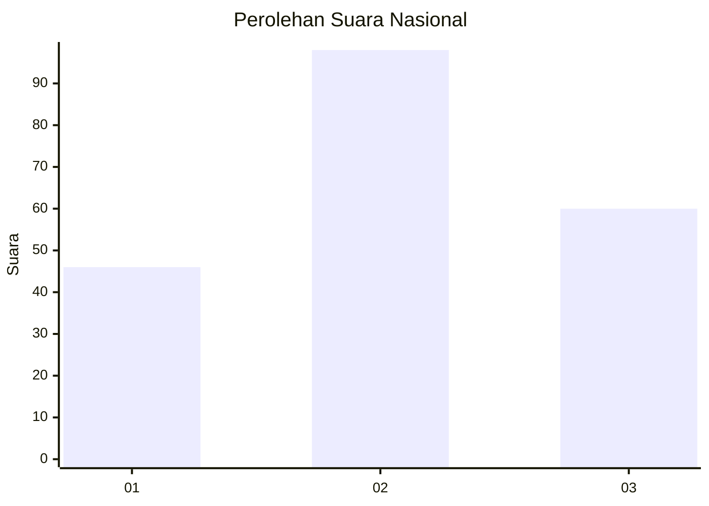
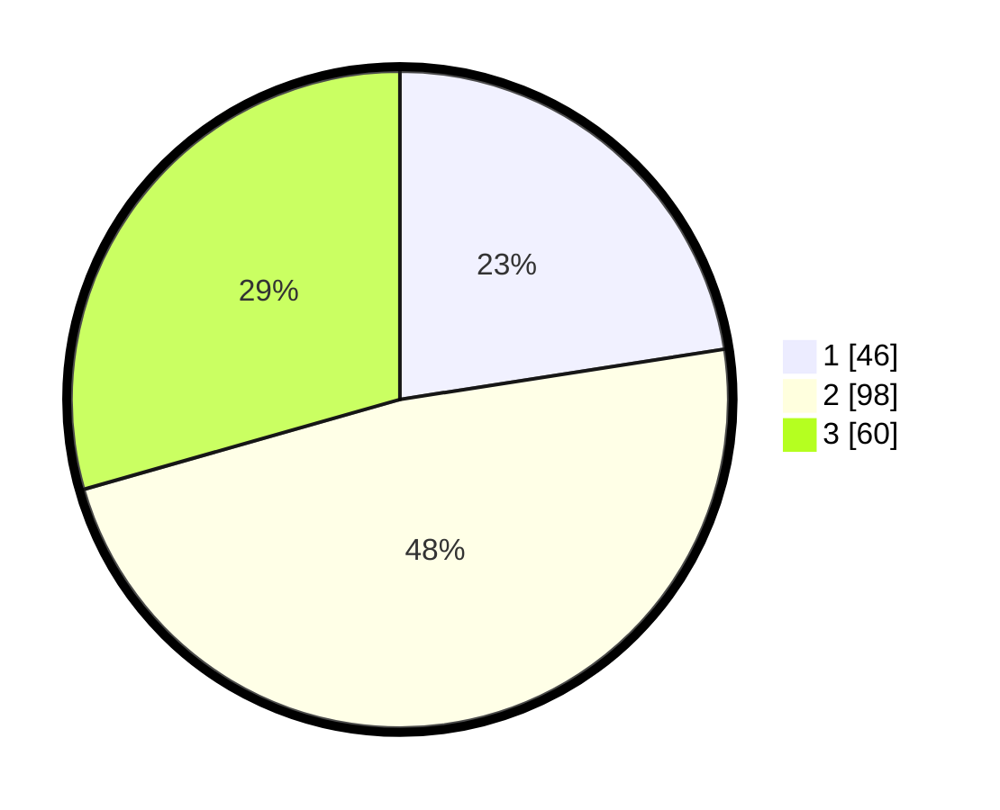

# Hasil

## Grafik

## Tabel

| No.    | Nama Paslon    | Suara | Suara (raw) | Persentase |
|:------ |:-------------- | -----:| -----------:| ----------:|
| 100025 | ANIES MUHAIMIN | 46    | [46][p-1]   | 22,55      |
| 100026 | PRABOWO GIBRAN | 98    | [98][p-2]   | 48,04      |
| 100027 | GANJAR MAHFUD  | 60    | [60][p-3]   | 29,41      |

[p-1]: https://github.com/gigit-pemilu/pemilu-2024/blob/main/pilpres/hitung-suara/sub/31-dki-jakarta/sub/71-jakarta-pusat/sub/02-sawah-besar/sub/1003-kartini/sub/020-tps/sub/paslon-1.txt
[p-2]: https://github.com/gigit-pemilu/pemilu-2024/blob/main/pilpres/hitung-suara/sub/31-dki-jakarta/sub/71-jakarta-pusat/sub/02-sawah-besar/sub/1003-kartini/sub/020-tps/sub/paslon-2.txt
[p-3]: https://github.com/gigit-pemilu/pemilu-2024/blob/main/pilpres/hitung-suara/sub/31-dki-jakarta/sub/71-jakarta-pusat/sub/02-sawah-besar/sub/1003-kartini/sub/020-tps/sub/paslon-3.txt

## Foto C Plano

https://sirekap-obj-formc.kpu.go.id/07b7/pemilu/ppwp/31/71/02/10/03/3171021003020-20240216-221933--9c502c07-cf62-4142-9f47-da10faeb7171.jpg

https://sirekap-obj-formc.kpu.go.id/07b7/pemilu/ppwp/31/71/02/10/03/3171021003020-20240214-212835--36a9d934-e3ec-4612-85b6-b608091780d9.jpg

https://sirekap-obj-formc.kpu.go.id/07b7/pemilu/ppwp/31/71/02/10/03/3171021003020-20240215-021540--665a03a8-0f9d-4ddc-8478-1ce0c1c261f6.jpg

## Metadata

| Key        | Value               |
| ---------- | ------------------- |
| Time Stamp | 2024-02-16 22:30:00 |

