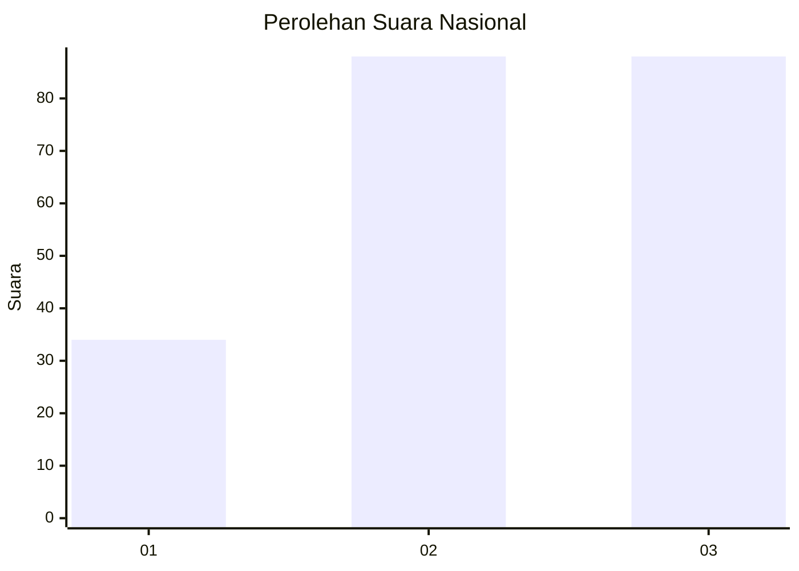
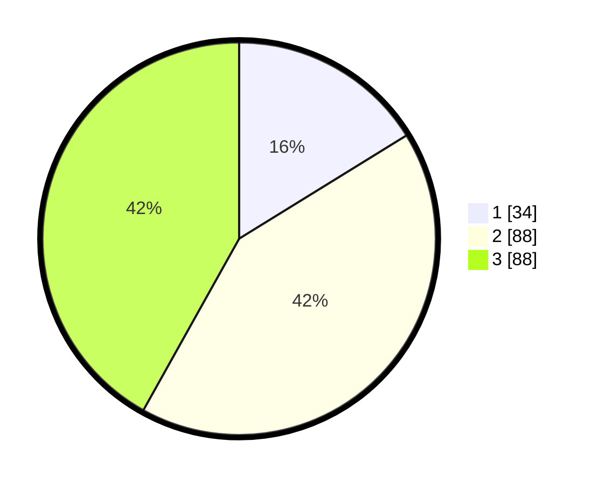

# Hasil

## Grafik

## Tabel

| No.    | Nama Paslon    | Suara | Suara (raw) | Persentase |
|:------ |:-------------- | -----:| -----------:| ----------:|
| 100025 | ANIES MUHAIMIN | 34    | [34][p-1]   | 16,19      |
| 100026 | PRABOWO GIBRAN | 88    | [88][p-2]   | 41,90      |
| 100027 | GANJAR MAHFUD  | 88    | [88][p-3]   | 41,90      |

[p-1]: https://github.com/gigit-pemilu/pemilu-2024/blob/main/pilpres/hitung-suara/sub/31-dki-jakarta/sub/71-jakarta-pusat/sub/02-sawah-besar/sub/1003-kartini/sub/027-tps/sub/paslon-1.txt
[p-2]: https://github.com/gigit-pemilu/pemilu-2024/blob/main/pilpres/hitung-suara/sub/31-dki-jakarta/sub/71-jakarta-pusat/sub/02-sawah-besar/sub/1003-kartini/sub/027-tps/sub/paslon-2.txt
[p-3]: https://github.com/gigit-pemilu/pemilu-2024/blob/main/pilpres/hitung-suara/sub/31-dki-jakarta/sub/71-jakarta-pusat/sub/02-sawah-besar/sub/1003-kartini/sub/027-tps/sub/paslon-3.txt

## Foto C Plano

https://sirekap-obj-formc.kpu.go.id/a69a/pemilu/ppwp/31/71/02/10/03/3171021003027-20240218-203426--b9e353e2-a9a0-4f89-995b-8af4a800fb39.jpg

https://sirekap-obj-formc.kpu.go.id/a69a/pemilu/ppwp/31/71/02/10/03/3171021003027-20240218-135025--1440bcad-b3e5-46c2-bb4b-4b0264c80d2c.jpg

https://sirekap-obj-formc.kpu.go.id/a69a/pemilu/ppwp/31/71/02/10/03/3171021003027-20240218-203608--4a594b8e-3cd2-4f41-b603-405735aa7d6d.jpg

## Metadata

| Key        | Value               |
| ---------- | ------------------- |
| Time Stamp | 2024-02-19 06:16:00 |

