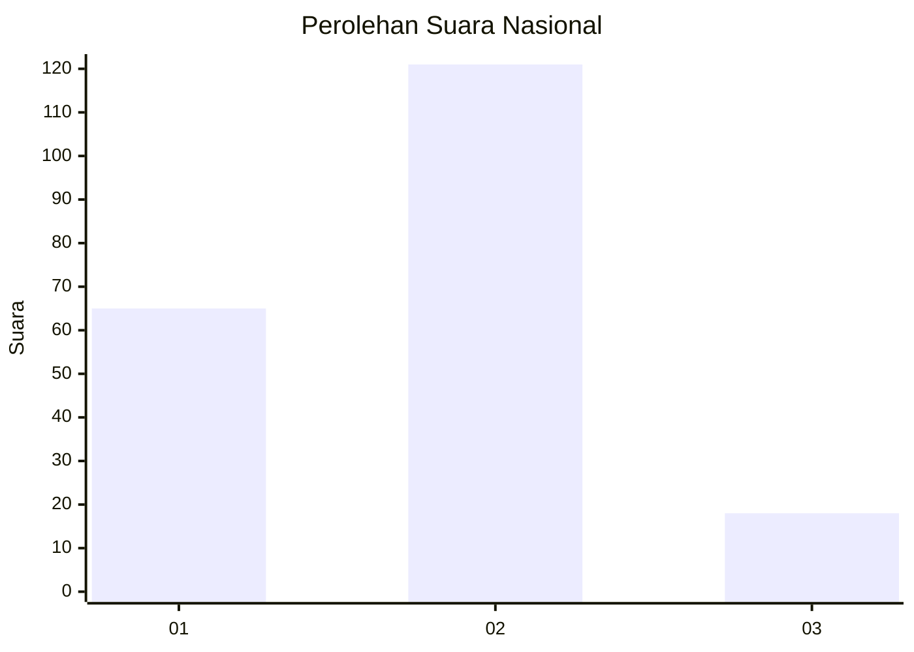
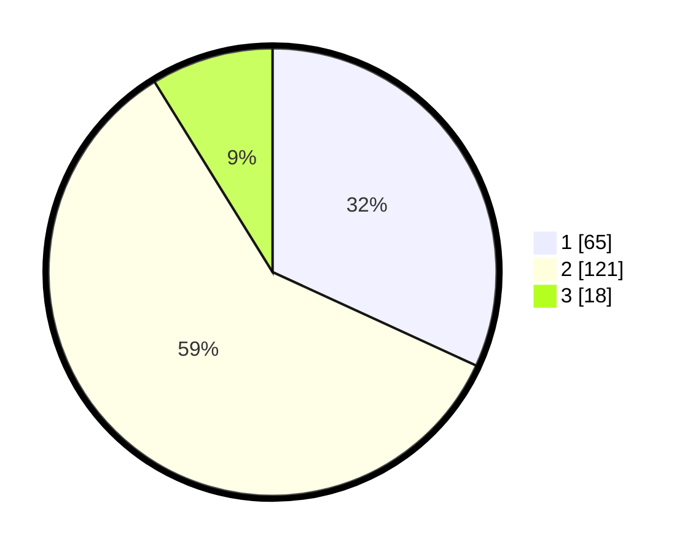

# Hasil

## Grafik

## Tabel

| No.    | Nama Paslon    | Suara | Suara (raw) | Persentase |
|:------ |:-------------- | -----:| -----------:| ----------:|
| 100025 | ANIES MUHAIMIN | 65    | [65][p-1]   | 31,86      |
| 100026 | PRABOWO GIBRAN | 121   | [121][p-2]  | 59,31      |
| 100027 | GANJAR MAHFUD  | 18    | [18][p-3]   | 8,82       |

[p-1]: https://github.com/gigit-pemilu/pemilu-2024/blob/main/pilpres/hitung-suara/sub/31-dki-jakarta/sub/71-jakarta-pusat/sub/02-sawah-besar/sub/1003-kartini/sub/051-tps/sub/paslon-1.txt
[p-2]: https://github.com/gigit-pemilu/pemilu-2024/blob/main/pilpres/hitung-suara/sub/31-dki-jakarta/sub/71-jakarta-pusat/sub/02-sawah-besar/sub/1003-kartini/sub/051-tps/sub/paslon-2.txt
[p-3]: https://github.com/gigit-pemilu/pemilu-2024/blob/main/pilpres/hitung-suara/sub/31-dki-jakarta/sub/71-jakarta-pusat/sub/02-sawah-besar/sub/1003-kartini/sub/051-tps/sub/paslon-3.txt

## Foto C Plano

https://sirekap-obj-formc.kpu.go.id/026f/pemilu/ppwp/31/71/02/10/03/3171021003051-20240217-083007--b642b0ee-e404-4caf-b24d-01d57c64e505.jpg

https://sirekap-obj-formc.kpu.go.id/026f/pemilu/ppwp/31/71/02/10/03/3171021003051-20240217-083239--701ff660-43ed-4d9e-b8b5-34621af9007a.jpg

https://sirekap-obj-formc.kpu.go.id/026f/pemilu/ppwp/31/71/02/10/03/3171021003051-20240217-083404--b4a42f53-40c9-4e40-84a0-8e887d83637e.jpg

## Metadata

| Key        | Value               |
| ---------- | ------------------- |
| Time Stamp | 2024-02-17 10:30:03 |

