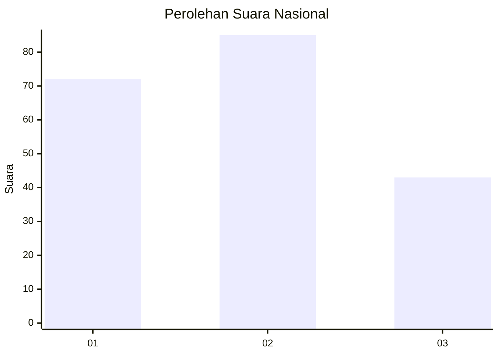
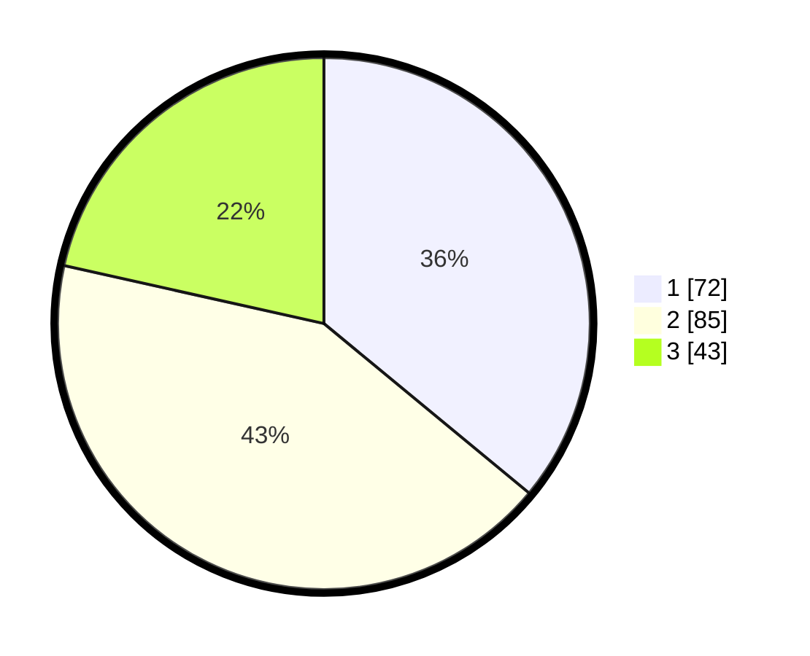

# Hasil

## Grafik

## Tabel

| No.    | Nama Paslon    | Suara | Suara (raw) | Persentase |
|:------ |:-------------- | -----:| -----------:| ----------:|
| 100025 | ANIES MUHAIMIN | 72    | [72][p-1]   | 36,00      |
| 100026 | PRABOWO GIBRAN | 85    | [85][p-2]   | 42,50      |
| 100027 | GANJAR MAHFUD  | 43    | [43][p-3]   | 21,50      |

[p-1]: https://github.com/gigit-pemilu/pemilu-2024/blob/main/pilpres/hitung-suara/sub/31-dki-jakarta/sub/71-jakarta-pusat/sub/02-sawah-besar/sub/1005-mangga-dua-selatan/sub/011-tps/sub/paslon-1.txt
[p-2]: https://github.com/gigit-pemilu/pemilu-2024/blob/main/pilpres/hitung-suara/sub/31-dki-jakarta/sub/71-jakarta-pusat/sub/02-sawah-besar/sub/1005-mangga-dua-selatan/sub/011-tps/sub/paslon-2.txt
[p-3]: https://github.com/gigit-pemilu/pemilu-2024/blob/main/pilpres/hitung-suara/sub/31-dki-jakarta/sub/71-jakarta-pusat/sub/02-sawah-besar/sub/1005-mangga-dua-selatan/sub/011-tps/sub/paslon-3.txt

## Foto C Plano

https://sirekap-obj-formc.kpu.go.id/5200/pemilu/ppwp/31/71/02/10/05/3171021005011-20240214-234058--30b85a63-68ab-4db7-b393-f8d7b60a6546.jpg

https://sirekap-obj-formc.kpu.go.id/5200/pemilu/ppwp/31/71/02/10/05/3171021005011-20240215-002335--e667a161-3c3b-46b6-a378-f4020e61525b.jpg

https://sirekap-obj-formc.kpu.go.id/5200/pemilu/ppwp/31/71/02/10/05/3171021005011-20240215-001946--6ede19f7-bebe-40da-badd-d2c5f793aa8a.jpg

## Metadata

| Key        | Value               |
| ---------- | ------------------- |
| Time Stamp | 2024-02-15 21:01:18 |

