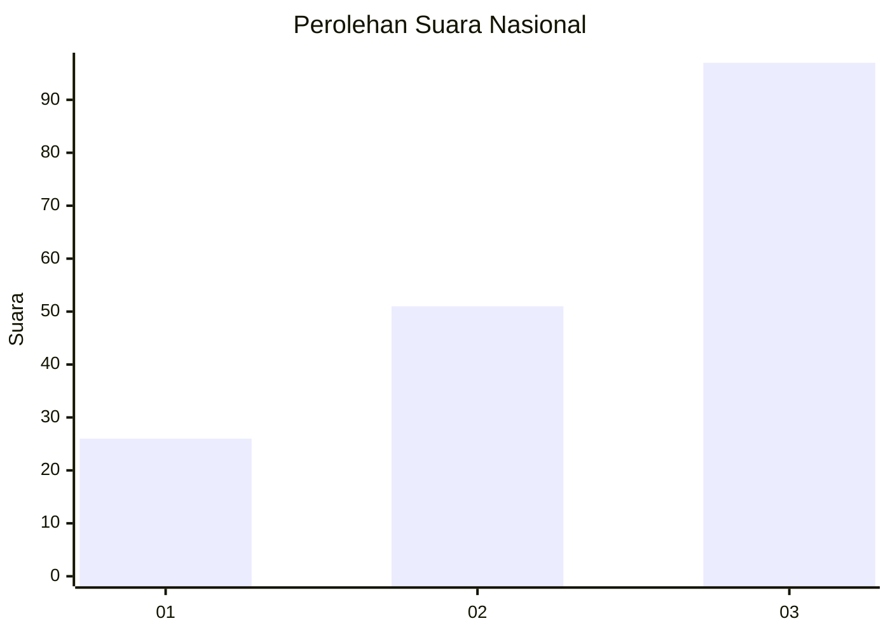
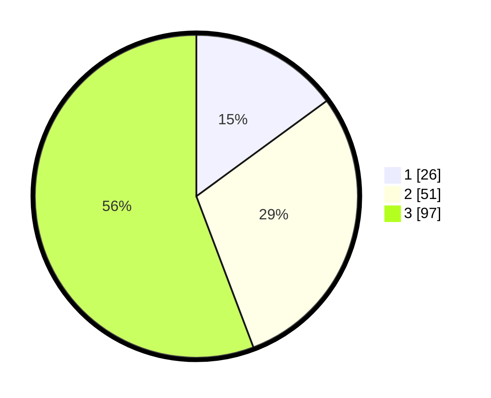

# Hasil

## Grafik

## Tabel

| No.    | Nama Paslon    | Suara | Suara (raw) | Persentase |
|:------ |:-------------- | -----:| -----------:| ----------:|
| 100025 | ANIES MUHAIMIN | 26    | [26][p-1]   | 14,94      |
| 100026 | PRABOWO GIBRAN | 51    | [51][p-2]   | 29,31      |
| 100027 | GANJAR MAHFUD  | 97    | [97][p-3]   | 55,75      |

[p-1]: https://github.com/gigit-pemilu/pemilu-2024/blob/main/pilpres/hitung-suara/sub/31-dki-jakarta/sub/71-jakarta-pusat/sub/02-sawah-besar/sub/1005-mangga-dua-selatan/sub/048-tps/sub/paslon-1.txt
[p-2]: https://github.com/gigit-pemilu/pemilu-2024/blob/main/pilpres/hitung-suara/sub/31-dki-jakarta/sub/71-jakarta-pusat/sub/02-sawah-besar/sub/1005-mangga-dua-selatan/sub/048-tps/sub/paslon-2.txt
[p-3]: https://github.com/gigit-pemilu/pemilu-2024/blob/main/pilpres/hitung-suara/sub/31-dki-jakarta/sub/71-jakarta-pusat/sub/02-sawah-besar/sub/1005-mangga-dua-selatan/sub/048-tps/sub/paslon-3.txt

## Foto C Plano

https://sirekap-obj-formc.kpu.go.id/3cfd/pemilu/ppwp/31/71/02/10/05/3171021005048-20240214-225011--b5d788ec-0162-4c30-90ac-1e4f760f10c3.jpg

https://sirekap-obj-formc.kpu.go.id/3cfd/pemilu/ppwp/31/71/02/10/05/3171021005048-20240214-225122--d98957cf-4eaa-4fe5-8db0-e56c0a5c97c2.jpg

https://sirekap-obj-formc.kpu.go.id/3cfd/pemilu/ppwp/31/71/02/10/05/3171021005048-20240214-225159--b3479ba0-b4c4-4d5e-8457-a3c097df8d27.jpg

## Metadata

| Key        | Value               |
| ---------- | ------------------- |
| Time Stamp | 2024-02-15 21:30:27 |

