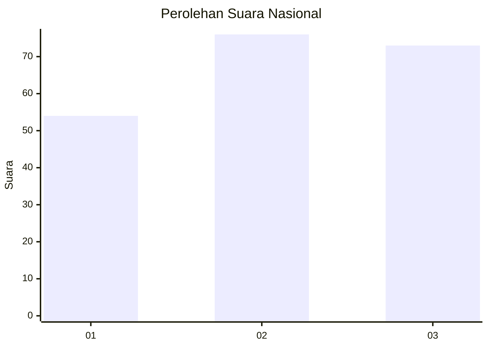
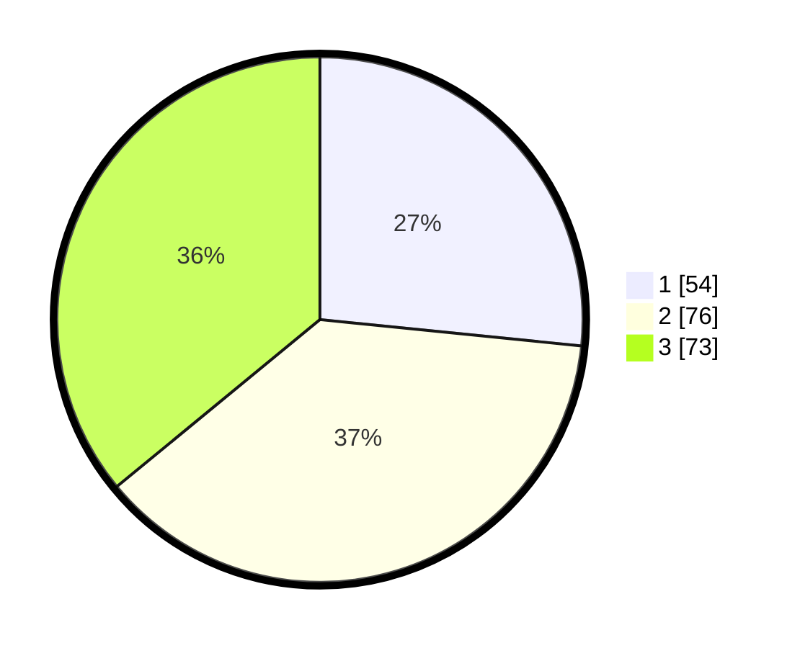

# Hasil

## Grafik

## Tabel

| No.    | Nama Paslon    | Suara | Suara (raw) | Persentase |
|:------ |:-------------- | -----:| -----------:| ----------:|
| 100025 | ANIES MUHAIMIN | 54    | [54][p-1]   | 26,60      |
| 100026 | PRABOWO GIBRAN | 76    | [76][p-2]   | 37,44      |
| 100027 | GANJAR MAHFUD  | 73    | [73][p-3]   | 35,96      |

[p-1]: https://github.com/gigit-pemilu/pemilu-2024/blob/main/pilpres/hitung-suara/sub/31-dki-jakarta/sub/71-jakarta-pusat/sub/02-sawah-besar/sub/1005-mangga-dua-selatan/sub/074-tps/sub/paslon-1.txt
[p-2]: https://github.com/gigit-pemilu/pemilu-2024/blob/main/pilpres/hitung-suara/sub/31-dki-jakarta/sub/71-jakarta-pusat/sub/02-sawah-besar/sub/1005-mangga-dua-selatan/sub/074-tps/sub/paslon-2.txt
[p-3]: https://github.com/gigit-pemilu/pemilu-2024/blob/main/pilpres/hitung-suara/sub/31-dki-jakarta/sub/71-jakarta-pusat/sub/02-sawah-besar/sub/1005-mangga-dua-selatan/sub/074-tps/sub/paslon-3.txt

## Foto C Plano

https://sirekap-obj-formc.kpu.go.id/97d2/pemilu/ppwp/31/71/02/10/05/3171021005074-20240216-134911--8bdeacd6-8573-43ab-a205-feadc47cde64.jpg

https://sirekap-obj-formc.kpu.go.id/97d2/pemilu/ppwp/31/71/02/10/05/3171021005074-20240215-203618--23180abe-5b62-4b23-b5c4-8dc3c0ed6351.jpg

https://sirekap-obj-formc.kpu.go.id/97d2/pemilu/ppwp/31/71/02/10/05/3171021005074-20240215-203715--af7adcc7-b895-4b3e-be20-b8864d8e8e5d.jpg

## Metadata

| Key        | Value               |
| ---------- | ------------------- |
| Time Stamp | 2024-02-16 14:00:34 |

