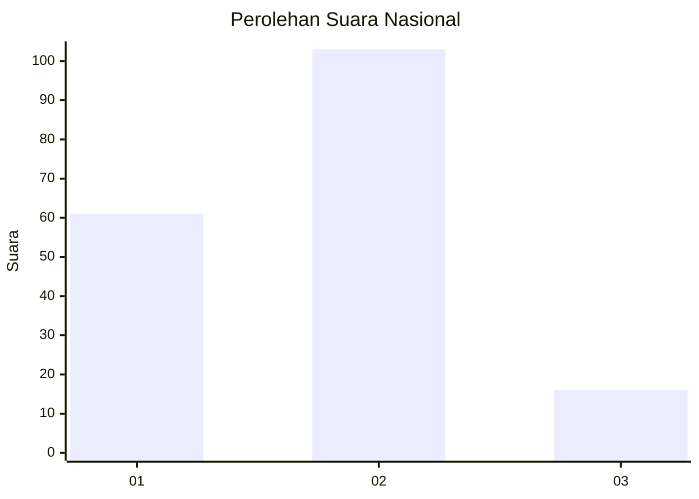
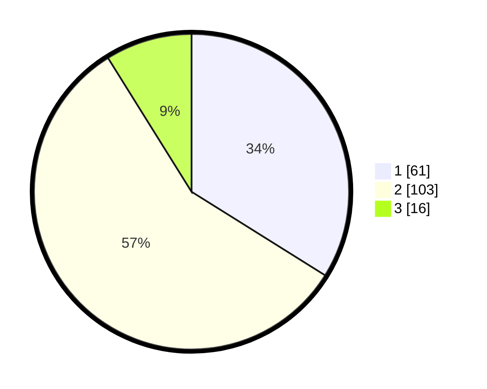

# Hasil

## Grafik

## Tabel

| No.    | Nama Paslon    | Suara | Suara (raw) | Persentase |
|:------ |:-------------- | -----:| -----------:| ----------:|
| 100025 | ANIES MUHAIMIN | 61    | [61][p-1]   | 33,89      |
| 100026 | PRABOWO GIBRAN | 103   | [103][p-2]  | 57,22      |
| 100027 | GANJAR MAHFUD  | 16    | [16][p-3]   | 8,89       |

[p-1]: https://github.com/gigit-pemilu/pemilu-2024/blob/main/pilpres/hitung-suara/sub/31-dki-jakarta/sub/71-jakarta-pusat/sub/03-kemayoran/sub/1002-kebon-kosong/sub/006-tps/sub/paslon-1.txt
[p-2]: https://github.com/gigit-pemilu/pemilu-2024/blob/main/pilpres/hitung-suara/sub/31-dki-jakarta/sub/71-jakarta-pusat/sub/03-kemayoran/sub/1002-kebon-kosong/sub/006-tps/sub/paslon-2.txt
[p-3]: https://github.com/gigit-pemilu/pemilu-2024/blob/main/pilpres/hitung-suara/sub/31-dki-jakarta/sub/71-jakarta-pusat/sub/03-kemayoran/sub/1002-kebon-kosong/sub/006-tps/sub/paslon-3.txt

## Foto C Plano

https://sirekap-obj-formc.kpu.go.id/0e4c/pemilu/ppwp/31/71/03/10/02/3171031002006-20240214-221733--b51c6ef5-312a-4b16-a47a-b17d961022e7.jpg

https://sirekap-obj-formc.kpu.go.id/0e4c/pemilu/ppwp/31/71/03/10/02/3171031002006-20240214-232134--0b4b8de7-2615-4f86-8b2a-dd14a863c6a5.jpg

https://sirekap-obj-formc.kpu.go.id/0e4c/pemilu/ppwp/31/71/03/10/02/3171031002006-20240214-231859--fc3ba521-ef28-4d10-905b-e90db51468b3.jpg

## Metadata

| Key        | Value               |
| ---------- | ------------------- |
| Time Stamp | 2024-02-15 22:30:27 |

