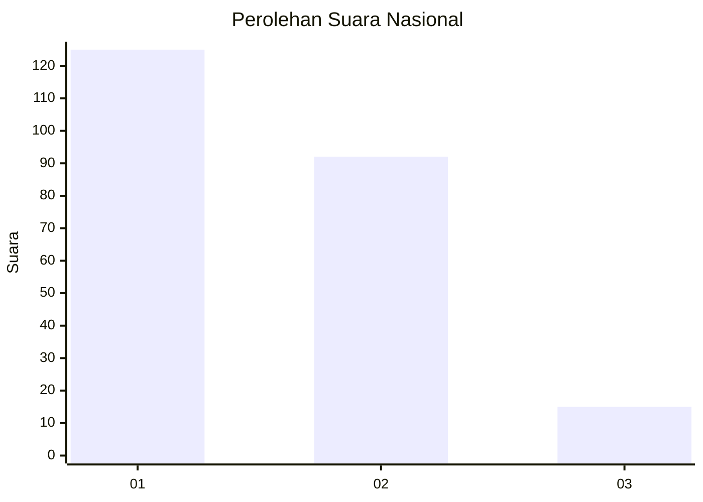
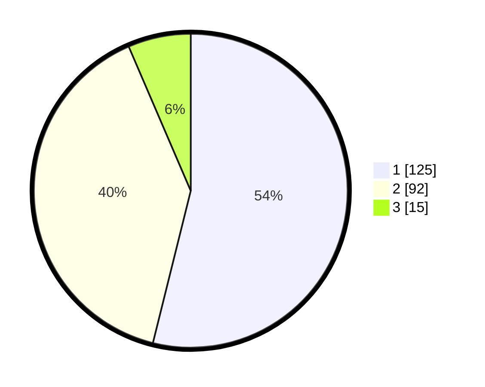

# Hasil

## Grafik

## Tabel

| No.    | Nama Paslon    | Suara | Suara (raw) | Persentase |
|:------ |:-------------- | -----:| -----------:| ----------:|
| 100025 | ANIES MUHAIMIN | 125   | [125][p-1]  | 53,88      |
| 100026 | PRABOWO GIBRAN | 92    | [92][p-2]   | 39,66      |
| 100027 | GANJAR MAHFUD  | 15    | [15][p-3]   | 6,47       |

[p-1]: https://github.com/gigit-pemilu/pemilu-2024/blob/main/pilpres/hitung-suara/sub/31-dki-jakarta/sub/71-jakarta-pusat/sub/03-kemayoran/sub/1002-kebon-kosong/sub/057-tps/sub/paslon-1.txt
[p-2]: https://github.com/gigit-pemilu/pemilu-2024/blob/main/pilpres/hitung-suara/sub/31-dki-jakarta/sub/71-jakarta-pusat/sub/03-kemayoran/sub/1002-kebon-kosong/sub/057-tps/sub/paslon-2.txt
[p-3]: https://github.com/gigit-pemilu/pemilu-2024/blob/main/pilpres/hitung-suara/sub/31-dki-jakarta/sub/71-jakarta-pusat/sub/03-kemayoran/sub/1002-kebon-kosong/sub/057-tps/sub/paslon-3.txt

## Foto C Plano

https://sirekap-obj-formc.kpu.go.id/8314/pemilu/ppwp/31/71/03/10/02/3171031002057-20240214-215218--6b22ad89-9a98-4f8b-8db0-b712e76c26b0.jpg

https://sirekap-obj-formc.kpu.go.id/8314/pemilu/ppwp/31/71/03/10/02/3171031002057-20240215-003745--0cd920b3-f15c-43ba-bdec-b8a7fee37d25.jpg

https://sirekap-obj-formc.kpu.go.id/8314/pemilu/ppwp/31/71/03/10/02/3171031002057-20240216-104711--b5913e47-f962-4278-81df-c3bc63576c86.jpg

## Metadata

| Key        | Value               |
| ---------- | ------------------- |
| Time Stamp | 2024-02-16 11:00:29 |

