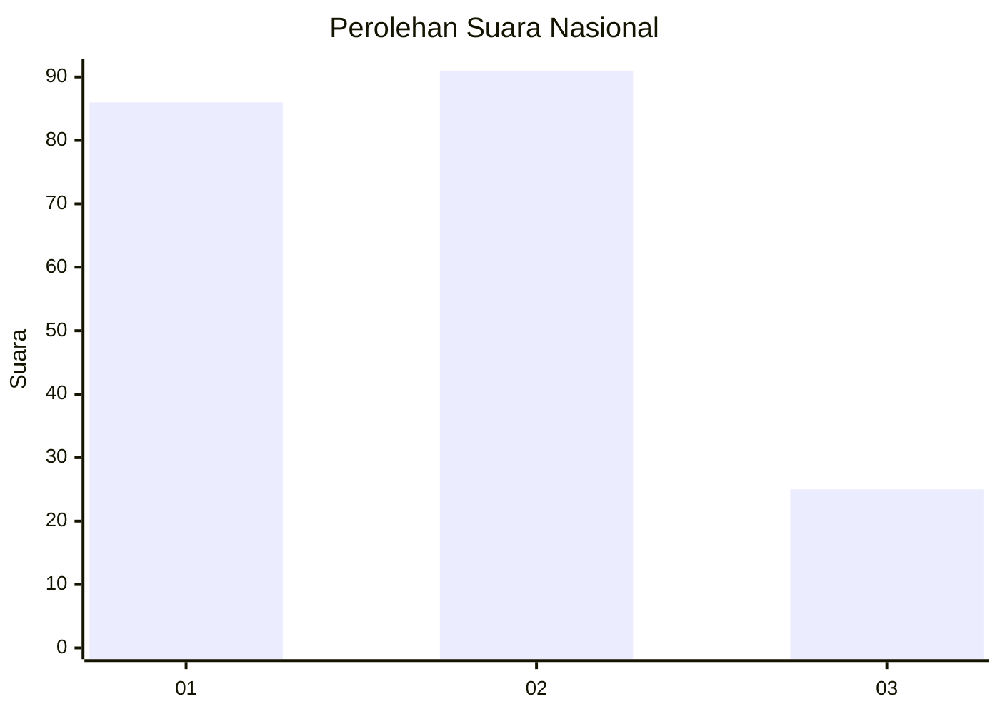
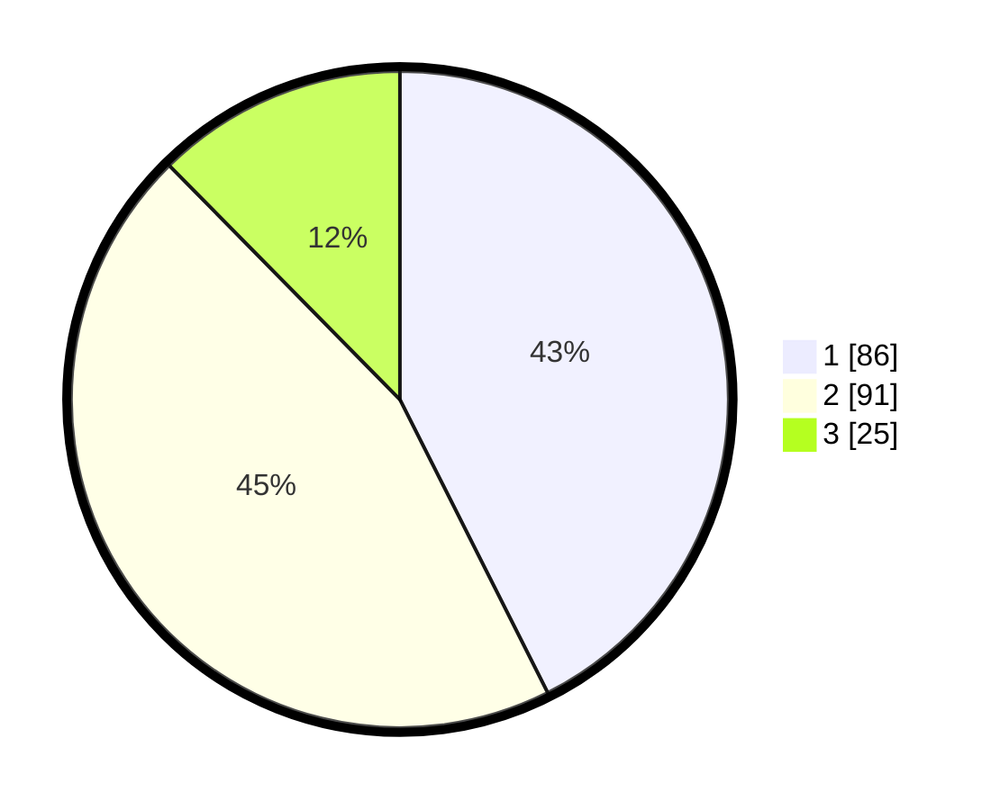

# Hasil

## Grafik

## Tabel

| No.    | Nama Paslon    | Suara | Suara (raw) | Persentase |
|:------ |:-------------- | -----:| -----------:| ----------:|
| 100025 | ANIES MUHAIMIN | 86    | [86][p-1]   | 42,57      |
| 100026 | PRABOWO GIBRAN | 91    | [91][p-2]   | 45,05      |
| 100027 | GANJAR MAHFUD  | 25    | [25][p-3]   | 12,38      |

[p-1]: https://github.com/gigit-pemilu/pemilu-2024/blob/main/pilpres/hitung-suara/sub/31-dki-jakarta/sub/71-jakarta-pusat/sub/03-kemayoran/sub/1002-kebon-kosong/sub/069-tps/sub/paslon-1.txt
[p-2]: https://github.com/gigit-pemilu/pemilu-2024/blob/main/pilpres/hitung-suara/sub/31-dki-jakarta/sub/71-jakarta-pusat/sub/03-kemayoran/sub/1002-kebon-kosong/sub/069-tps/sub/paslon-2.txt
[p-3]: https://github.com/gigit-pemilu/pemilu-2024/blob/main/pilpres/hitung-suara/sub/31-dki-jakarta/sub/71-jakarta-pusat/sub/03-kemayoran/sub/1002-kebon-kosong/sub/069-tps/sub/paslon-3.txt

## Foto C Plano

https://sirekap-obj-formc.kpu.go.id/a5b2/pemilu/ppwp/31/71/03/10/02/3171031002069-20240214-195134--3ef420b2-33b9-4fef-b97f-ac16904c0da4.jpg

https://sirekap-obj-formc.kpu.go.id/a5b2/pemilu/ppwp/31/71/03/10/02/3171031002069-20240214-190434--33fdb524-2653-4df6-abf9-fb0999fdf4d7.jpg

https://sirekap-obj-formc.kpu.go.id/a5b2/pemilu/ppwp/31/71/03/10/02/3171031002069-20240214-191844--f1b67c20-092a-4897-90b1-3cd4955d8775.jpg

## Metadata

| Key        | Value               |
| ---------- | ------------------- |
| Time Stamp | 2024-02-17 11:30:03 |

