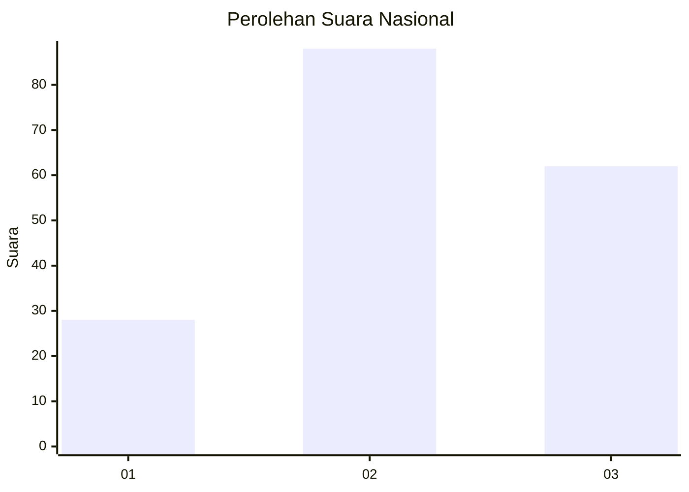
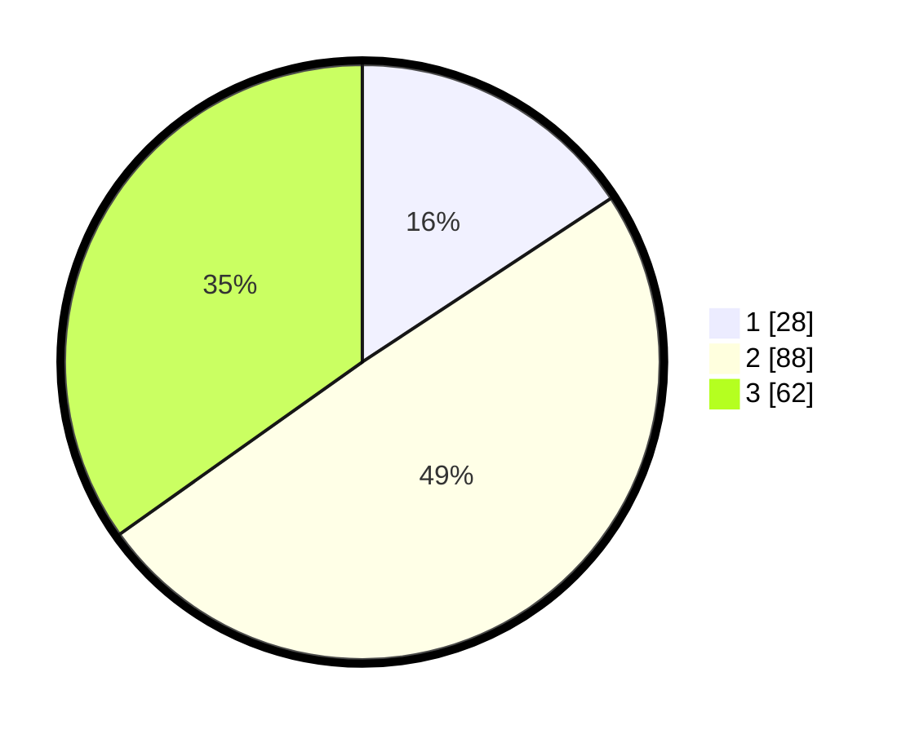

# Hasil

## Grafik

## Tabel

| No.    | Nama Paslon    | Suara | Suara (raw) | Persentase |
|:------ |:-------------- | -----:| -----------:| ----------:|
| 100025 | ANIES MUHAIMIN | 28    | [28][p-1]   | 15,73      |
| 100026 | PRABOWO GIBRAN | 88    | [88][p-2]   | 49,44      |
| 100027 | GANJAR MAHFUD  | 62    | [62][p-3]   | 34,83      |

[p-1]: https://github.com/gigit-pemilu/pemilu-2024/blob/main/pilpres/hitung-suara/sub/31-dki-jakarta/sub/71-jakarta-pusat/sub/03-kemayoran/sub/1002-kebon-kosong/sub/099-tps/sub/paslon-1.txt
[p-2]: https://github.com/gigit-pemilu/pemilu-2024/blob/main/pilpres/hitung-suara/sub/31-dki-jakarta/sub/71-jakarta-pusat/sub/03-kemayoran/sub/1002-kebon-kosong/sub/099-tps/sub/paslon-2.txt
[p-3]: https://github.com/gigit-pemilu/pemilu-2024/blob/main/pilpres/hitung-suara/sub/31-dki-jakarta/sub/71-jakarta-pusat/sub/03-kemayoran/sub/1002-kebon-kosong/sub/099-tps/sub/paslon-3.txt

## Foto C Plano

https://sirekap-obj-formc.kpu.go.id/3eab/pemilu/ppwp/31/71/03/10/02/3171031002099-20240214-214638--cd4b68fb-7ad3-4ec9-bdff-df5d8bdf5815.jpg

https://sirekap-obj-formc.kpu.go.id/3eab/pemilu/ppwp/31/71/03/10/02/3171031002099-20240214-214758--134d969b-0b05-4505-a9a7-c56746c51825.jpg

https://sirekap-obj-formc.kpu.go.id/3eab/pemilu/ppwp/31/71/03/10/02/3171031002099-20240214-214911--02ef9bd2-ce68-4b62-aaa5-b26f1ce0fc1c.jpg

## Metadata

| Key        | Value               |
| ---------- | ------------------- |
| Time Stamp | 2024-02-15 16:00:26 |

