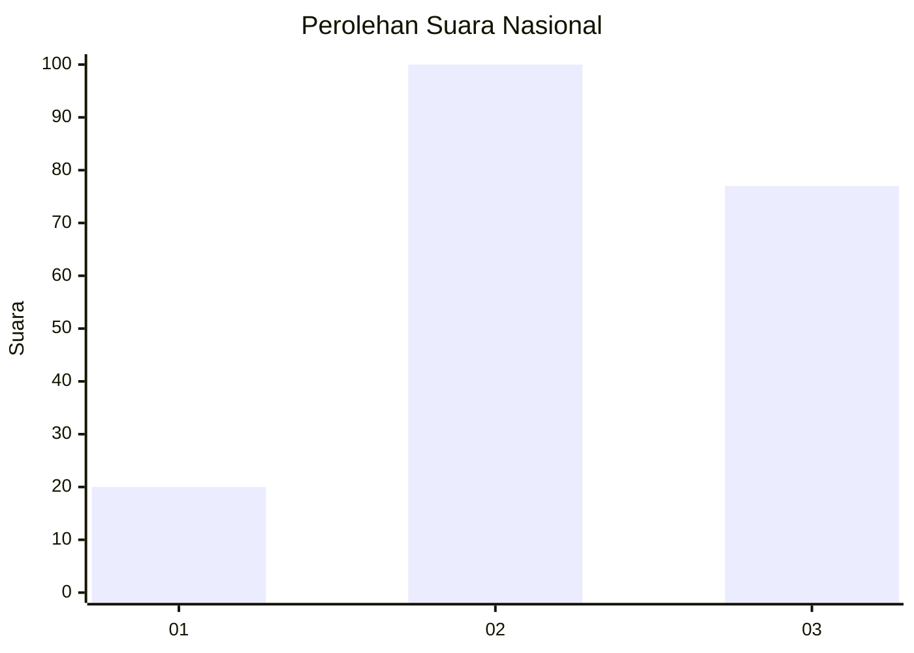
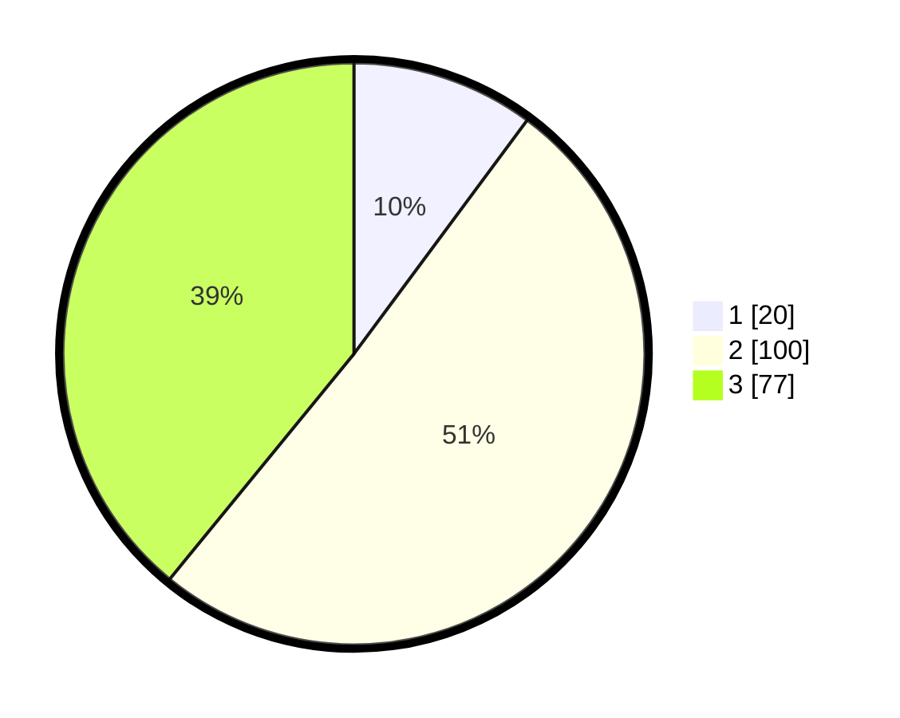

# Hasil

## Grafik

## Tabel

| No.    | Nama Paslon    | Suara | Suara (raw) | Persentase |
|:------ |:-------------- | -----:| -----------:| ----------:|
| 100025 | ANIES MUHAIMIN | 20    | [20][p-1]   | 10,15      |
| 100026 | PRABOWO GIBRAN | 100   | [100][p-2]  | 50,76      |
| 100027 | GANJAR MAHFUD  | 77    | [77][p-3]   | 39,09      |

[p-1]: https://github.com/gigit-pemilu/pemilu-2024/blob/main/pilpres/hitung-suara/sub/31-dki-jakarta/sub/71-jakarta-pusat/sub/03-kemayoran/sub/1002-kebon-kosong/sub/102-tps/sub/paslon-1.txt
[p-2]: https://github.com/gigit-pemilu/pemilu-2024/blob/main/pilpres/hitung-suara/sub/31-dki-jakarta/sub/71-jakarta-pusat/sub/03-kemayoran/sub/1002-kebon-kosong/sub/102-tps/sub/paslon-2.txt
[p-3]: https://github.com/gigit-pemilu/pemilu-2024/blob/main/pilpres/hitung-suara/sub/31-dki-jakarta/sub/71-jakarta-pusat/sub/03-kemayoran/sub/1002-kebon-kosong/sub/102-tps/sub/paslon-3.txt

## Foto C Plano

https://sirekap-obj-formc.kpu.go.id/522e/pemilu/ppwp/31/71/03/10/02/3171031002102-20240216-181305--e4076fdf-1737-4807-8b9d-1bc28a0ad850.jpg

https://sirekap-obj-formc.kpu.go.id/522e/pemilu/ppwp/31/71/03/10/02/3171031002102-20240216-100559--24353e32-fc1e-4199-84de-0c806c7e6f6e.jpg

https://sirekap-obj-formc.kpu.go.id/522e/pemilu/ppwp/31/71/03/10/02/3171031002102-20240216-181221--35eb26cc-9341-40f4-b415-80c8f5ae521c.jpg

## Metadata

| Key        | Value               |
| ---------- | ------------------- |
| Time Stamp | 2024-02-16 21:01:00 |

