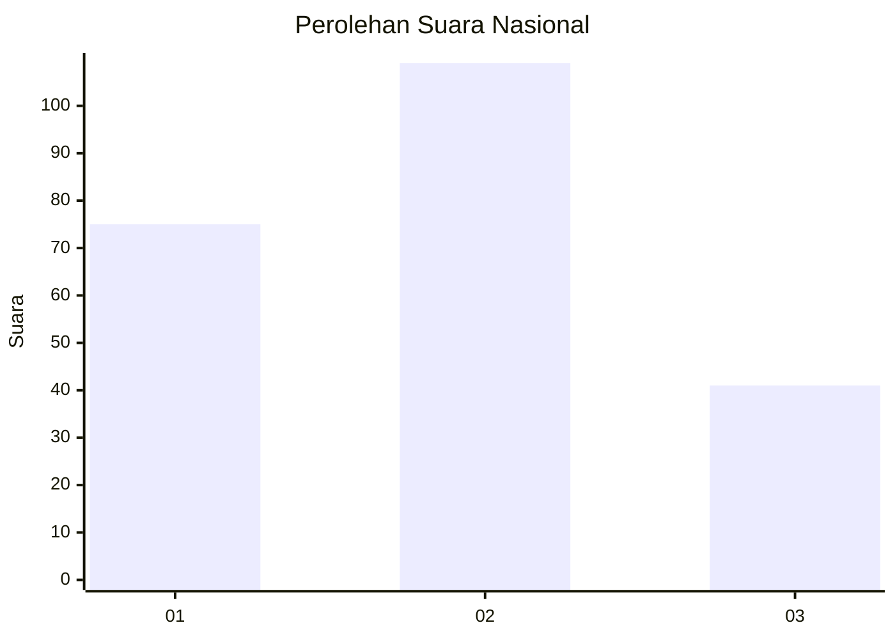
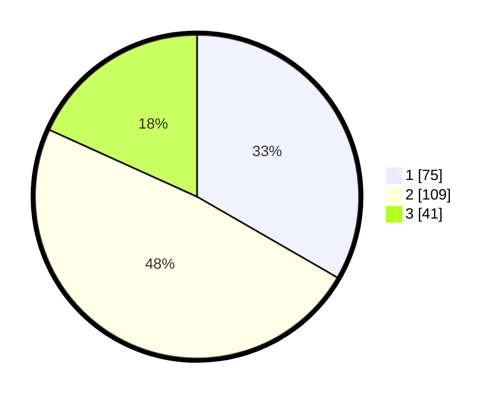

# Hasil

## Grafik

## Tabel

| No.    | Nama Paslon    | Suara | Suara (raw) | Persentase |
|:------ |:-------------- | -----:| -----------:| ----------:|
| 100025 | ANIES MUHAIMIN | 75    | [75][p-1]   | 33,33      |
| 100026 | PRABOWO GIBRAN | 109   | [109][p-2]  | 48,44      |
| 100027 | GANJAR MAHFUD  | 41    | [41][p-3]   | 18,22      |

[p-1]: https://github.com/gigit-pemilu/pemilu-2024/blob/main/pilpres/hitung-suara/sub/31-dki-jakarta/sub/71-jakarta-pusat/sub/03-kemayoran/sub/1003-harapan-mulia/sub/003-tps/sub/paslon-1.txt
[p-2]: https://github.com/gigit-pemilu/pemilu-2024/blob/main/pilpres/hitung-suara/sub/31-dki-jakarta/sub/71-jakarta-pusat/sub/03-kemayoran/sub/1003-harapan-mulia/sub/003-tps/sub/paslon-2.txt
[p-3]: https://github.com/gigit-pemilu/pemilu-2024/blob/main/pilpres/hitung-suara/sub/31-dki-jakarta/sub/71-jakarta-pusat/sub/03-kemayoran/sub/1003-harapan-mulia/sub/003-tps/sub/paslon-3.txt

## Foto C Plano

https://sirekap-obj-formc.kpu.go.id/79fd/pemilu/ppwp/31/71/03/10/03/3171031003003-20240216-203427--ee8f6dd0-1468-4d37-93c4-0e444caaad38.jpg

https://sirekap-obj-formc.kpu.go.id/79fd/pemilu/ppwp/31/71/03/10/03/3171031003003-20240216-203136--aeb64fdc-e885-4a8c-845e-c283d785d602.jpg

https://sirekap-obj-formc.kpu.go.id/79fd/pemilu/ppwp/31/71/03/10/03/3171031003003-20240216-203320--243c7928-b635-4362-8bd1-ea45afd780e5.jpg

## Metadata

| Key        | Value               |
| ---------- | ------------------- |
| Time Stamp | 2024-02-17 10:30:03 |

