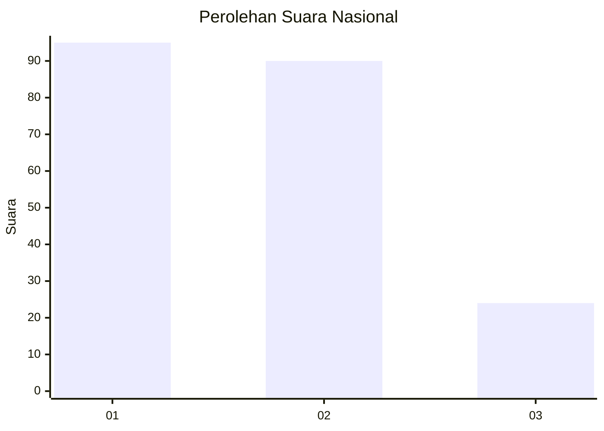
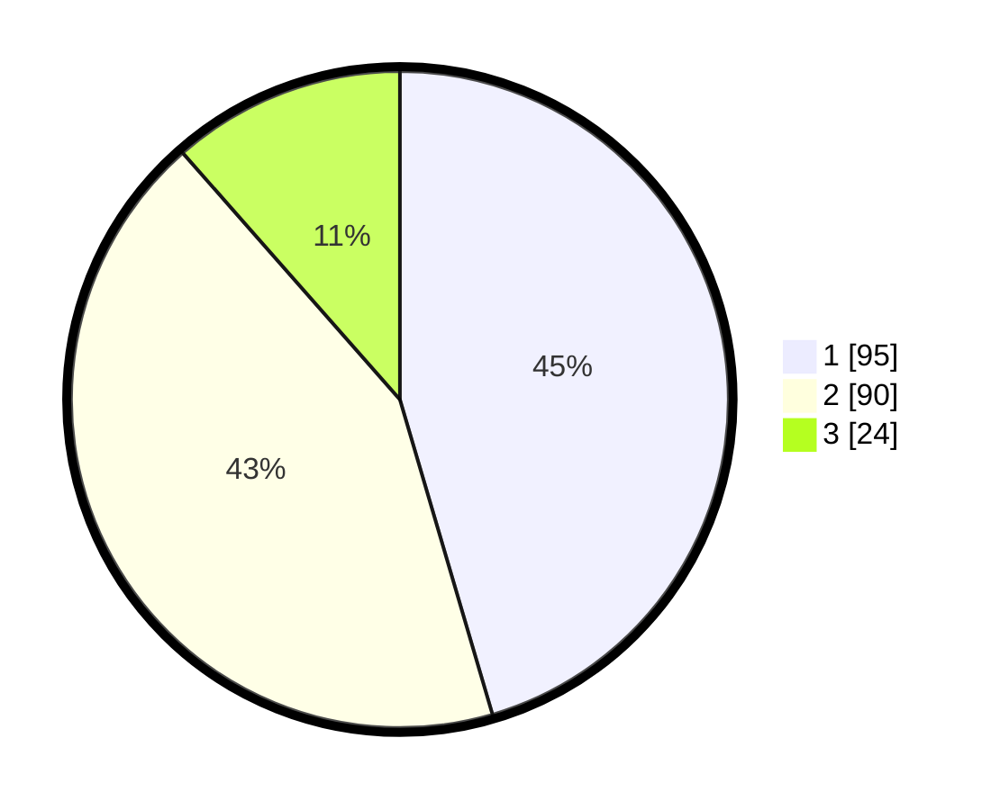

# Hasil

## Grafik

## Tabel

| No.    | Nama Paslon    | Suara | Suara (raw) | Persentase |
|:------ |:-------------- | -----:| -----------:| ----------:|
| 100025 | ANIES MUHAIMIN | 95    | [95][p-1]   | 45,45      |
| 100026 | PRABOWO GIBRAN | 90    | [90][p-2]   | 43,06      |
| 100027 | GANJAR MAHFUD  | 24    | [24][p-3]   | 11,48      |

[p-1]: https://github.com/gigit-pemilu/pemilu-2024/blob/main/pilpres/hitung-suara/sub/31-dki-jakarta/sub/71-jakarta-pusat/sub/03-kemayoran/sub/1003-harapan-mulia/sub/009-tps/sub/paslon-1.txt
[p-2]: https://github.com/gigit-pemilu/pemilu-2024/blob/main/pilpres/hitung-suara/sub/31-dki-jakarta/sub/71-jakarta-pusat/sub/03-kemayoran/sub/1003-harapan-mulia/sub/009-tps/sub/paslon-2.txt
[p-3]: https://github.com/gigit-pemilu/pemilu-2024/blob/main/pilpres/hitung-suara/sub/31-dki-jakarta/sub/71-jakarta-pusat/sub/03-kemayoran/sub/1003-harapan-mulia/sub/009-tps/sub/paslon-3.txt

## Foto C Plano

https://sirekap-obj-formc.kpu.go.id/861f/pemilu/ppwp/31/71/03/10/03/3171031003009-20240214-210835--41dd3b49-1513-4508-a783-2c118da05fa3.jpg

https://sirekap-obj-formc.kpu.go.id/861f/pemilu/ppwp/31/71/03/10/03/3171031003009-20240214-211322--c9c41e8e-314b-42af-acec-3baa384b8b91.jpg

https://sirekap-obj-formc.kpu.go.id/861f/pemilu/ppwp/31/71/03/10/03/3171031003009-20240217-121648--308a33fc-4cf2-48ad-9f39-1ff6c23c1915.jpg

## Metadata

| Key        | Value               |
| ---------- | ------------------- |
| Time Stamp | 2024-02-17 13:37:34 |

