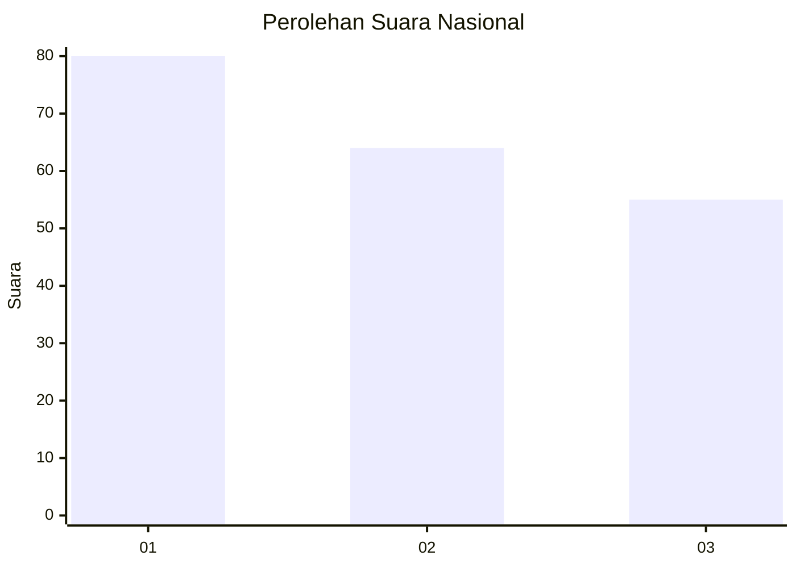
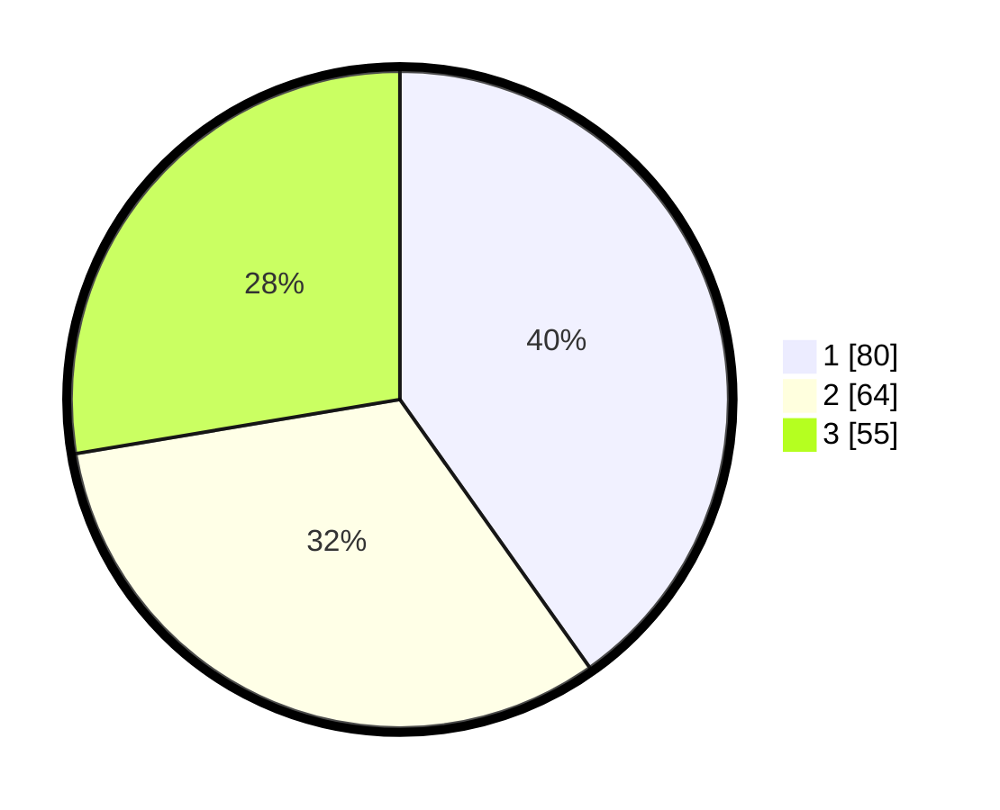

# Hasil

## Grafik

## Tabel

| No.    | Nama Paslon    | Suara | Suara (raw) | Persentase |
|:------ |:-------------- | -----:| -----------:| ----------:|
| 100025 | ANIES MUHAIMIN | 80    | [80][p-1]   | 40,20      |
| 100026 | PRABOWO GIBRAN | 64    | [64][p-2]   | 32,16      |
| 100027 | GANJAR MAHFUD  | 55    | [55][p-3]   | 27,64      |

[p-1]: https://github.com/gigit-pemilu/pemilu-2024/blob/main/pilpres/hitung-suara/sub/31-dki-jakarta/sub/71-jakarta-pusat/sub/03-kemayoran/sub/1003-harapan-mulia/sub/017-tps/sub/paslon-1.txt
[p-2]: https://github.com/gigit-pemilu/pemilu-2024/blob/main/pilpres/hitung-suara/sub/31-dki-jakarta/sub/71-jakarta-pusat/sub/03-kemayoran/sub/1003-harapan-mulia/sub/017-tps/sub/paslon-2.txt
[p-3]: https://github.com/gigit-pemilu/pemilu-2024/blob/main/pilpres/hitung-suara/sub/31-dki-jakarta/sub/71-jakarta-pusat/sub/03-kemayoran/sub/1003-harapan-mulia/sub/017-tps/sub/paslon-3.txt

## Foto C Plano

https://sirekap-obj-formc.kpu.go.id/cb09/pemilu/ppwp/31/71/03/10/03/3171031003017-20240215-133730--bafac9e4-fe0a-46c5-8387-9a768861bddd.jpg

https://sirekap-obj-formc.kpu.go.id/cb09/pemilu/ppwp/31/71/03/10/03/3171031003017-20240214-204928--f111b8b9-bc46-4604-ba91-15b6296ed4a4.jpg

https://sirekap-obj-formc.kpu.go.id/cb09/pemilu/ppwp/31/71/03/10/03/3171031003017-20240214-204110--6fca4187-3428-419f-8614-d5f6e2130d92.jpg

## Metadata

| Key        | Value               |
| ---------- | ------------------- |
| Time Stamp | 2024-02-16 16:25:10 |

