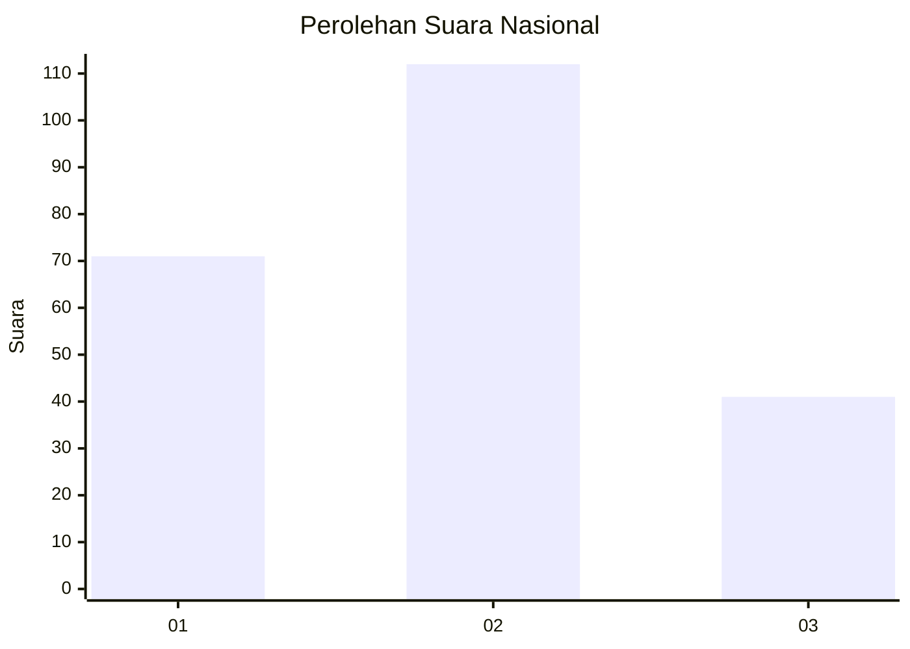
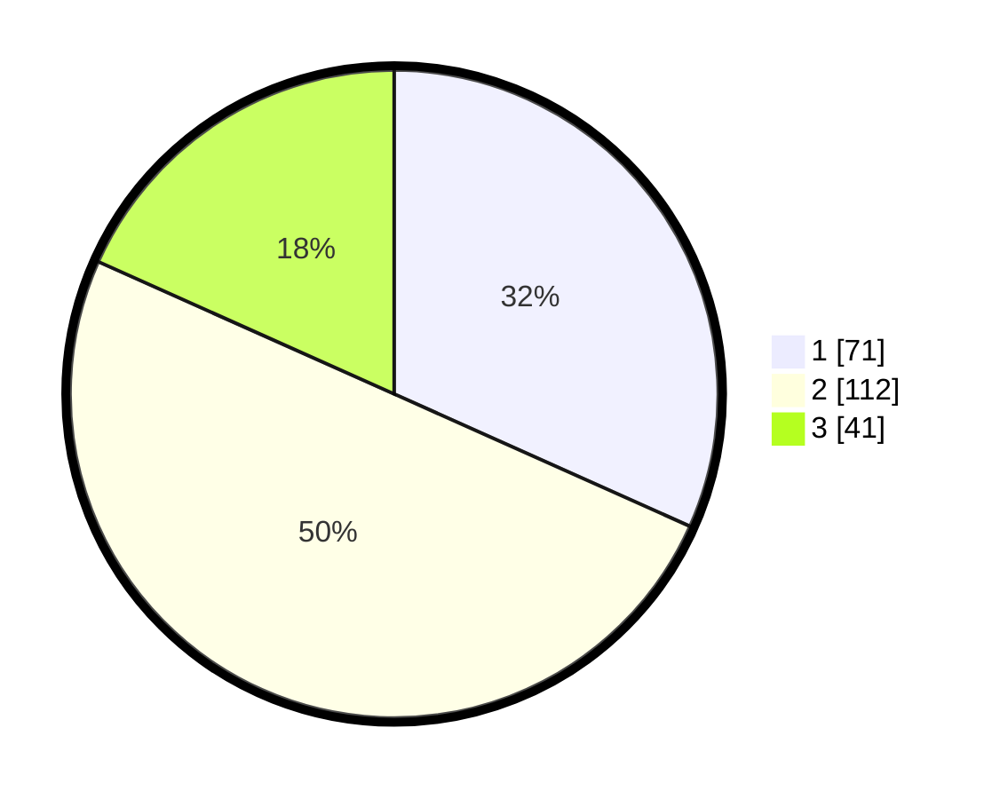

# Hasil

## Grafik

## Tabel

| No.    | Nama Paslon    | Suara | Suara (raw) | Persentase |
|:------ |:-------------- | -----:| -----------:| ----------:|
| 100025 | ANIES MUHAIMIN | 71    | [71][p-1]   | 31,70      |
| 100026 | PRABOWO GIBRAN | 112   | [112][p-2]  | 50,00      |
| 100027 | GANJAR MAHFUD  | 41    | [41][p-3]   | 18,30      |

[p-1]: https://github.com/gigit-pemilu/pemilu-2024/blob/main/pilpres/hitung-suara/sub/31-dki-jakarta/sub/71-jakarta-pusat/sub/03-kemayoran/sub/1003-harapan-mulia/sub/033-tps/sub/paslon-1.txt
[p-2]: https://github.com/gigit-pemilu/pemilu-2024/blob/main/pilpres/hitung-suara/sub/31-dki-jakarta/sub/71-jakarta-pusat/sub/03-kemayoran/sub/1003-harapan-mulia/sub/033-tps/sub/paslon-2.txt
[p-3]: https://github.com/gigit-pemilu/pemilu-2024/blob/main/pilpres/hitung-suara/sub/31-dki-jakarta/sub/71-jakarta-pusat/sub/03-kemayoran/sub/1003-harapan-mulia/sub/033-tps/sub/paslon-3.txt

## Foto C Plano

https://sirekap-obj-formc.kpu.go.id/d107/pemilu/ppwp/31/71/03/10/03/3171031003033-20240216-173150--2fc336fe-2032-4534-8a4a-c57f6cab70db.jpg

https://sirekap-obj-formc.kpu.go.id/d107/pemilu/ppwp/31/71/03/10/03/3171031003033-20240216-192116--338f303a-d7f8-495b-9628-981141bb5cdd.jpg

https://sirekap-obj-formc.kpu.go.id/d107/pemilu/ppwp/31/71/03/10/03/3171031003033-20240216-191043--8f36f593-b752-41e5-9bbd-2a0b05415e44.jpg

## Metadata

| Key        | Value               |
| ---------- | ------------------- |
| Time Stamp | 2024-02-17 10:30:03 |

