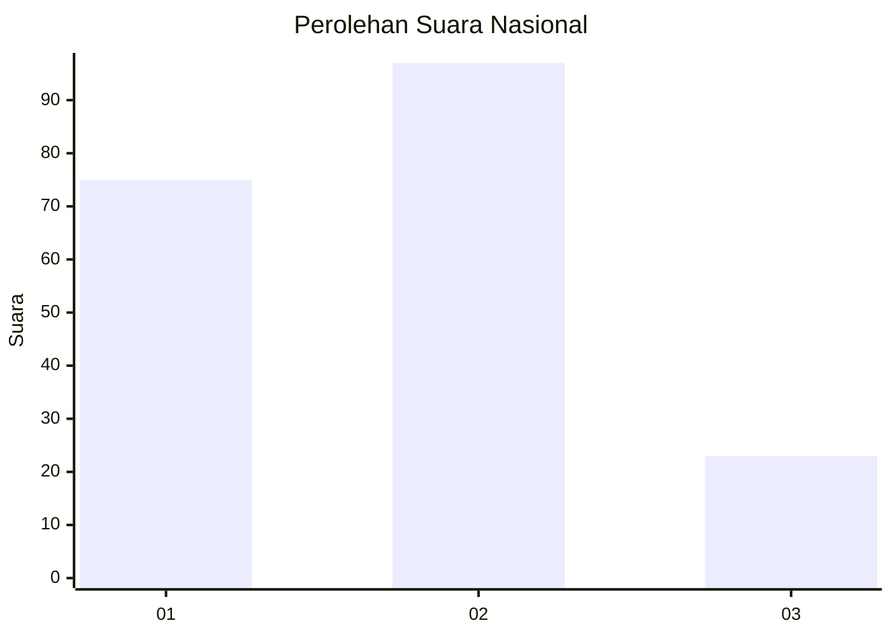
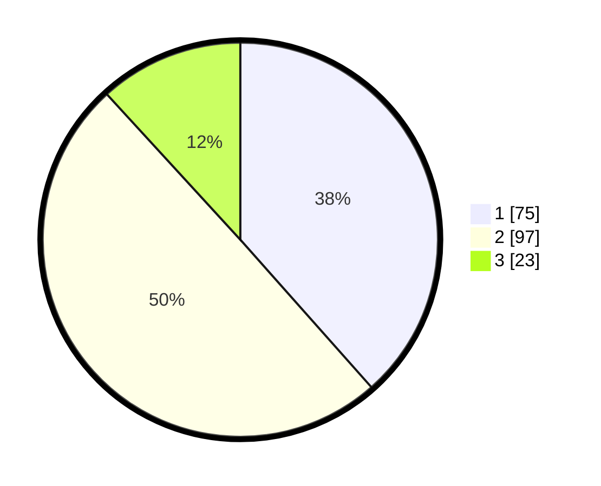

# Hasil

## Grafik

## Tabel

| No.    | Nama Paslon    | Suara | Suara (raw) | Persentase |
|:------ |:-------------- | -----:| -----------:| ----------:|
| 100025 | ANIES MUHAIMIN | 75    | [75][p-1]   | 38,46      |
| 100026 | PRABOWO GIBRAN | 97    | [97][p-2]   | 49,74      |
| 100027 | GANJAR MAHFUD  | 23    | [23][p-3]   | 11,79      |

[p-1]: https://github.com/gigit-pemilu/pemilu-2024/blob/main/pilpres/hitung-suara/sub/31-dki-jakarta/sub/71-jakarta-pusat/sub/03-kemayoran/sub/1003-harapan-mulia/sub/042-tps/sub/paslon-1.txt
[p-2]: https://github.com/gigit-pemilu/pemilu-2024/blob/main/pilpres/hitung-suara/sub/31-dki-jakarta/sub/71-jakarta-pusat/sub/03-kemayoran/sub/1003-harapan-mulia/sub/042-tps/sub/paslon-2.txt
[p-3]: https://github.com/gigit-pemilu/pemilu-2024/blob/main/pilpres/hitung-suara/sub/31-dki-jakarta/sub/71-jakarta-pusat/sub/03-kemayoran/sub/1003-harapan-mulia/sub/042-tps/sub/paslon-3.txt

## Foto C Plano

https://sirekap-obj-formc.kpu.go.id/5d2a/pemilu/ppwp/31/71/03/10/03/3171031003042-20240215-002344--be190ba1-df31-4e9c-84a6-7d7697f83d85.jpg

https://sirekap-obj-formc.kpu.go.id/5d2a/pemilu/ppwp/31/71/03/10/03/3171031003042-20240215-002406--33d1d591-69b6-4ba9-b535-2abb3d53e148.jpg

https://sirekap-obj-formc.kpu.go.id/5d2a/pemilu/ppwp/31/71/03/10/03/3171031003042-20240215-002446--02dab596-6011-4c1d-bb4e-bd1153b0bcc9.jpg

## Metadata

| Key        | Value               |
| ---------- | ------------------- |
| Time Stamp | 2024-02-15 22:30:27 |

