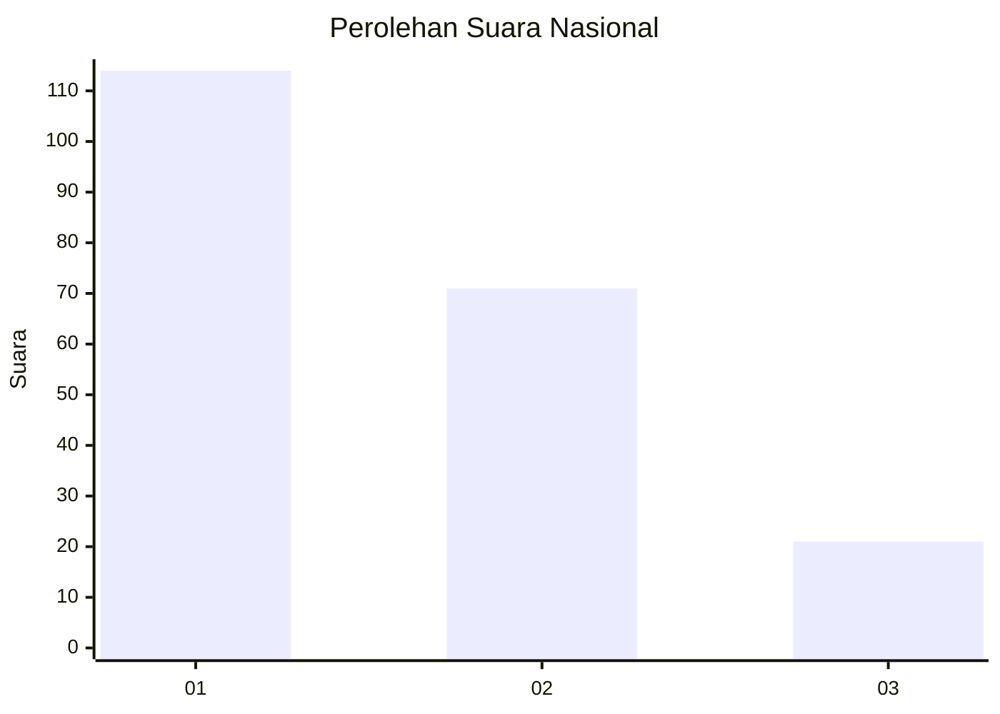
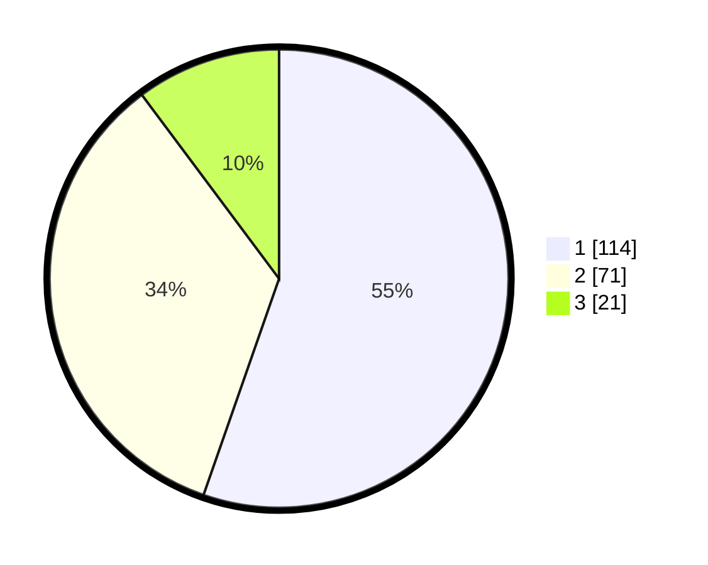

# Hasil

## Grafik

## Tabel

| No.    | Nama Paslon    | Suara | Suara (raw) | Persentase |
|:------ |:-------------- | -----:| -----------:| ----------:|
| 100025 | ANIES MUHAIMIN | 114   | [114][p-1]  | 55,34      |
| 100026 | PRABOWO GIBRAN | 71    | [71][p-2]   | 34,47      |
| 100027 | GANJAR MAHFUD  | 21    | [21][p-3]   | 10,19      |

[p-1]: https://github.com/gigit-pemilu/pemilu-2024/blob/main/pilpres/hitung-suara/sub/31-dki-jakarta/sub/71-jakarta-pusat/sub/03-kemayoran/sub/1003-harapan-mulia/sub/062-tps/sub/paslon-1.txt
[p-2]: https://github.com/gigit-pemilu/pemilu-2024/blob/main/pilpres/hitung-suara/sub/31-dki-jakarta/sub/71-jakarta-pusat/sub/03-kemayoran/sub/1003-harapan-mulia/sub/062-tps/sub/paslon-2.txt
[p-3]: https://github.com/gigit-pemilu/pemilu-2024/blob/main/pilpres/hitung-suara/sub/31-dki-jakarta/sub/71-jakarta-pusat/sub/03-kemayoran/sub/1003-harapan-mulia/sub/062-tps/sub/paslon-3.txt

## Foto C Plano

https://sirekap-obj-formc.kpu.go.id/cc31/pemilu/ppwp/31/71/03/10/03/3171031003062-20240217-124856--0c8e9b64-ab6f-4b9d-8f27-f9c666decd73.jpg

https://sirekap-obj-formc.kpu.go.id/cc31/pemilu/ppwp/31/71/03/10/03/3171031003062-20240217-125002--27183eee-5bc8-4287-bed0-84a1ffd9070b.jpg

https://sirekap-obj-formc.kpu.go.id/cc31/pemilu/ppwp/31/71/03/10/03/3171031003062-20240217-125405--347872dd-cada-4acb-afe4-24a9ea0a6f3c.jpg

## Metadata

| Key        | Value               |
| ---------- | ------------------- |
| Time Stamp | 2024-02-17 17:00:04 |

