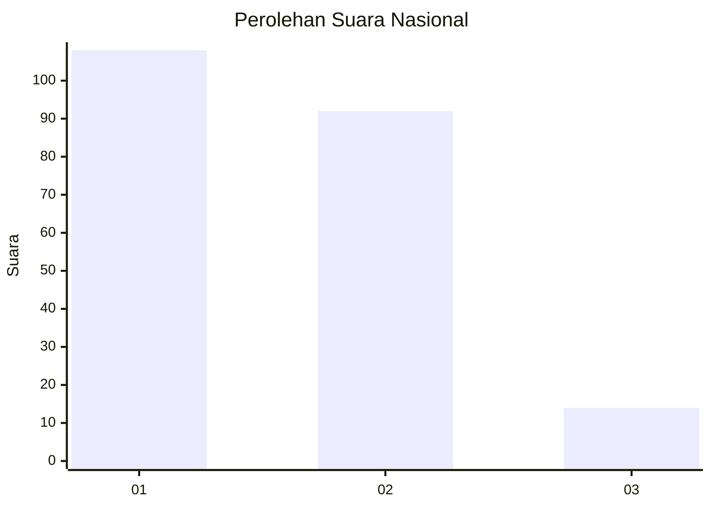
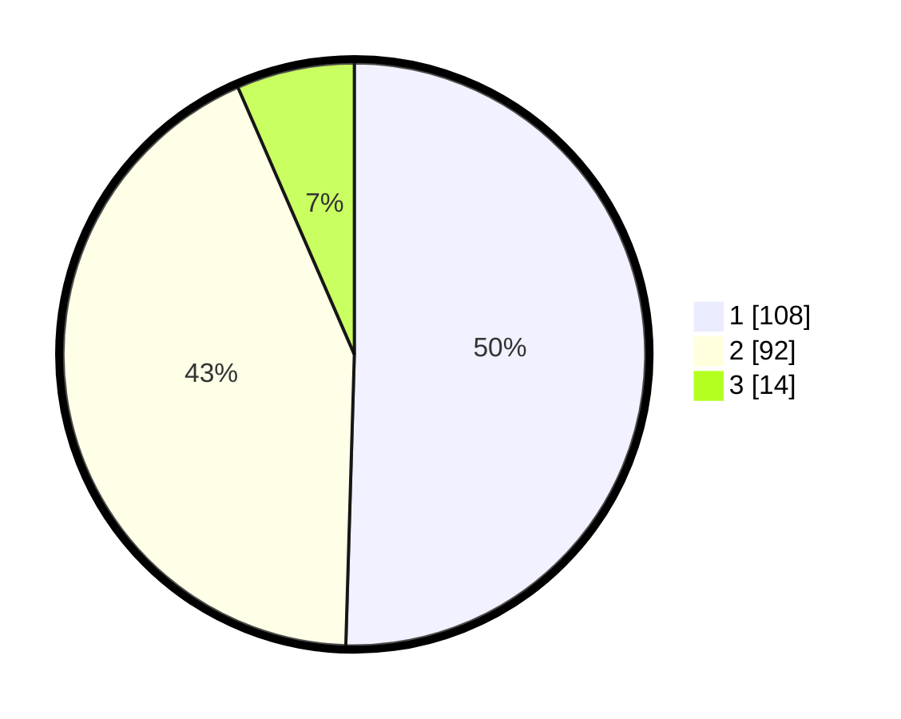

# Hasil

## Grafik

## Tabel

| No.    | Nama Paslon    | Suara | Suara (raw) | Persentase |
|:------ |:-------------- | -----:| -----------:| ----------:|
| 100025 | ANIES MUHAIMIN | 108   | [108][p-1]  | 50,47      |
| 100026 | PRABOWO GIBRAN | 92    | [92][p-2]   | 42,99      |
| 100027 | GANJAR MAHFUD  | 14    | [14][p-3]   | 6,54       |

[p-1]: https://github.com/gigit-pemilu/pemilu-2024/blob/main/pilpres/hitung-suara/sub/31-dki-jakarta/sub/71-jakarta-pusat/sub/03-kemayoran/sub/1003-harapan-mulia/sub/069-tps/sub/paslon-1.txt
[p-2]: https://github.com/gigit-pemilu/pemilu-2024/blob/main/pilpres/hitung-suara/sub/31-dki-jakarta/sub/71-jakarta-pusat/sub/03-kemayoran/sub/1003-harapan-mulia/sub/069-tps/sub/paslon-2.txt
[p-3]: https://github.com/gigit-pemilu/pemilu-2024/blob/main/pilpres/hitung-suara/sub/31-dki-jakarta/sub/71-jakarta-pusat/sub/03-kemayoran/sub/1003-harapan-mulia/sub/069-tps/sub/paslon-3.txt

## Foto C Plano

https://sirekap-obj-formc.kpu.go.id/39c6/pemilu/ppwp/31/71/03/10/03/3171031003069-20240214-195329--055d41cd-579d-4eba-9279-15bdd9d3cb45.jpg

https://sirekap-obj-formc.kpu.go.id/39c6/pemilu/ppwp/31/71/03/10/03/3171031003069-20240214-195523--468d911e-3258-438c-8f73-412a14cc4332.jpg

https://sirekap-obj-formc.kpu.go.id/39c6/pemilu/ppwp/31/71/03/10/03/3171031003069-20240214-195703--3d683401-754b-49f8-92f6-70cb8a72f916.jpg

## Metadata

| Key        | Value               |
| ---------- | ------------------- |
| Time Stamp | 2024-02-15 21:30:27 |

