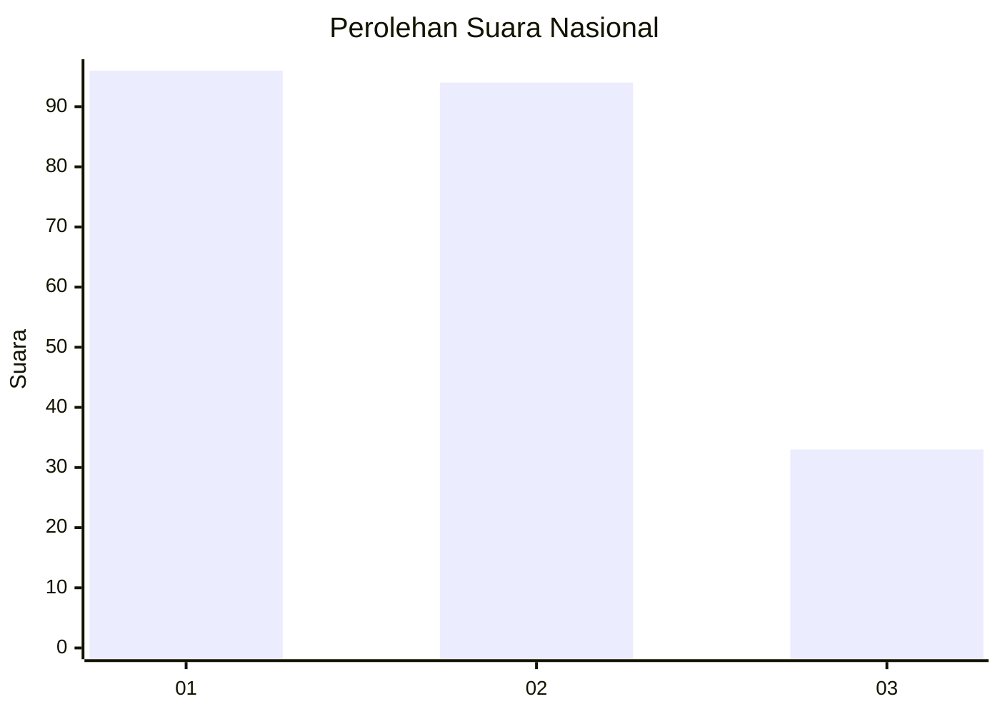
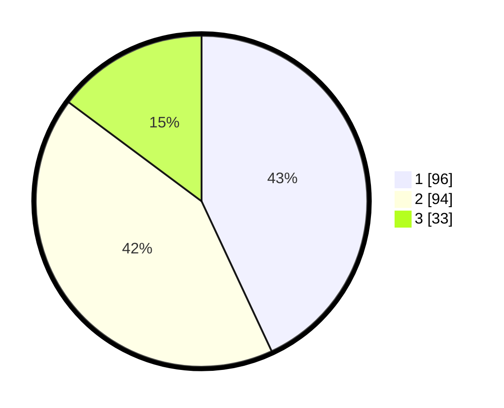

# Hasil

## Grafik

## Tabel

| No.    | Nama Paslon    | Suara | Suara (raw) | Persentase |
|:------ |:-------------- | -----:| -----------:| ----------:|
| 100025 | ANIES MUHAIMIN | 96    | [96][p-1]   | 43,05      |
| 100026 | PRABOWO GIBRAN | 94    | [94][p-2]   | 42,15      |
| 100027 | GANJAR MAHFUD  | 33    | [33][p-3]   | 14,80      |

[p-1]: https://github.com/gigit-pemilu/pemilu-2024/blob/main/pilpres/hitung-suara/sub/31-dki-jakarta/sub/71-jakarta-pusat/sub/03-kemayoran/sub/1003-harapan-mulia/sub/072-tps/sub/paslon-1.txt
[p-2]: https://github.com/gigit-pemilu/pemilu-2024/blob/main/pilpres/hitung-suara/sub/31-dki-jakarta/sub/71-jakarta-pusat/sub/03-kemayoran/sub/1003-harapan-mulia/sub/072-tps/sub/paslon-2.txt
[p-3]: https://github.com/gigit-pemilu/pemilu-2024/blob/main/pilpres/hitung-suara/sub/31-dki-jakarta/sub/71-jakarta-pusat/sub/03-kemayoran/sub/1003-harapan-mulia/sub/072-tps/sub/paslon-3.txt

## Foto C Plano

https://sirekap-obj-formc.kpu.go.id/ed66/pemilu/ppwp/31/71/03/10/03/3171031003072-20240215-010010--54b8e1ad-4302-4257-b307-dfe9623fb456.jpg

https://sirekap-obj-formc.kpu.go.id/ed66/pemilu/ppwp/31/71/03/10/03/3171031003072-20240215-010156--5fe11c62-2663-4e47-bc73-a5a9d6870bcf.jpg

https://sirekap-obj-formc.kpu.go.id/ed66/pemilu/ppwp/31/71/03/10/03/3171031003072-20240215-010336--2c27ba00-24de-42fb-adb1-d9bda3f2653b.jpg

## Metadata

| Key        | Value               |
| ---------- | ------------------- |
| Time Stamp | 2024-02-15 22:30:27 |

