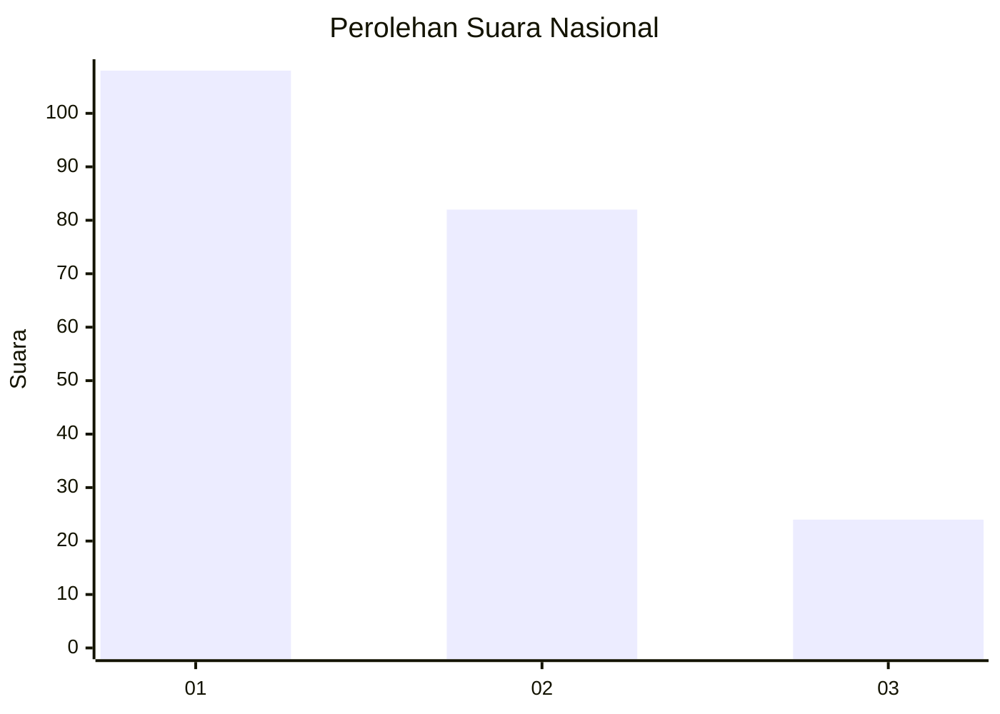
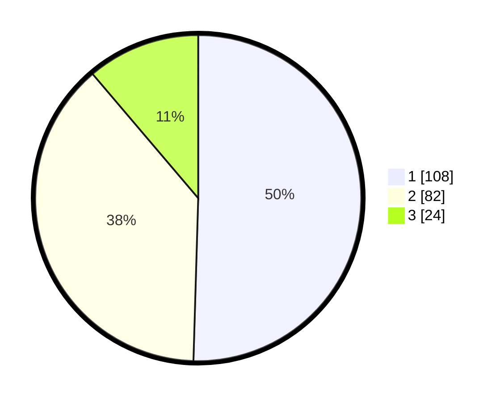

# Hasil

## Grafik

## Tabel

| No.    | Nama Paslon    | Suara | Suara (raw) | Persentase |
|:------ |:-------------- | -----:| -----------:| ----------:|
| 100025 | ANIES MUHAIMIN | 108   | [108][p-1]  | 50,47      |
| 100026 | PRABOWO GIBRAN | 82    | [82][p-2]   | 38,32      |
| 100027 | GANJAR MAHFUD  | 24    | [24][p-3]   | 11,21      |

[p-1]: https://github.com/gigit-pemilu/pemilu-2024/blob/main/pilpres/hitung-suara/sub/31-dki-jakarta/sub/71-jakarta-pusat/sub/03-kemayoran/sub/1004-serdang/sub/001-tps/sub/paslon-1.txt
[p-2]: https://github.com/gigit-pemilu/pemilu-2024/blob/main/pilpres/hitung-suara/sub/31-dki-jakarta/sub/71-jakarta-pusat/sub/03-kemayoran/sub/1004-serdang/sub/001-tps/sub/paslon-2.txt
[p-3]: https://github.com/gigit-pemilu/pemilu-2024/blob/main/pilpres/hitung-suara/sub/31-dki-jakarta/sub/71-jakarta-pusat/sub/03-kemayoran/sub/1004-serdang/sub/001-tps/sub/paslon-3.txt

## Foto C Plano

https://sirekap-obj-formc.kpu.go.id/cb59/pemilu/ppwp/31/71/03/10/04/3171031004001-20240216-202528--21afc727-abc2-4dbf-8fc1-429e9ade947b.jpg

https://sirekap-obj-formc.kpu.go.id/cb59/pemilu/ppwp/31/71/03/10/04/3171031004001-20240214-221812--be6ff775-95d0-4559-90e6-5474c3a985db.jpg

https://sirekap-obj-formc.kpu.go.id/cb59/pemilu/ppwp/31/71/03/10/04/3171031004001-20240214-222038--abc03f0e-ddab-4484-bee3-3eae8b7a9f74.jpg

## Metadata

| Key        | Value               |
| ---------- | ------------------- |
| Time Stamp | 2024-02-16 21:01:00 |

