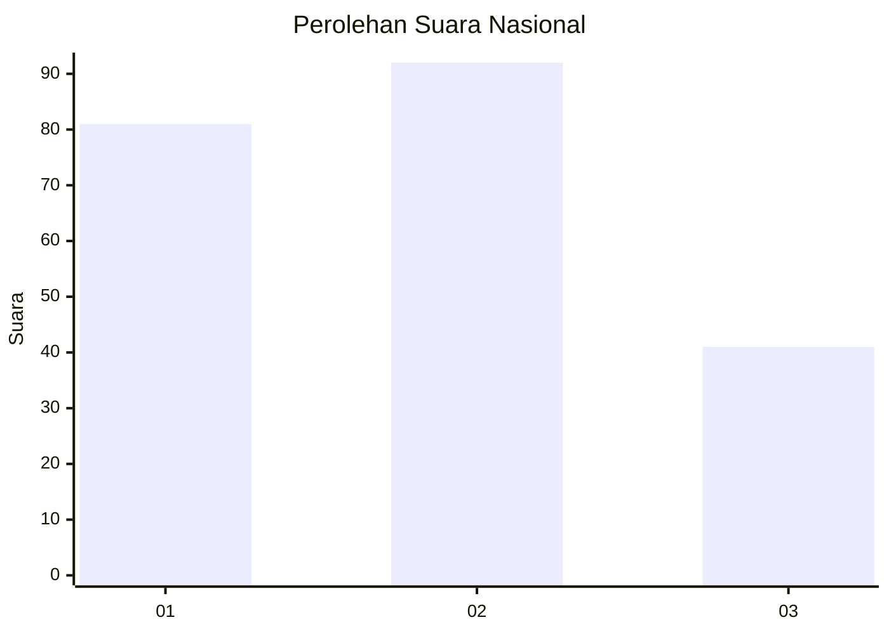
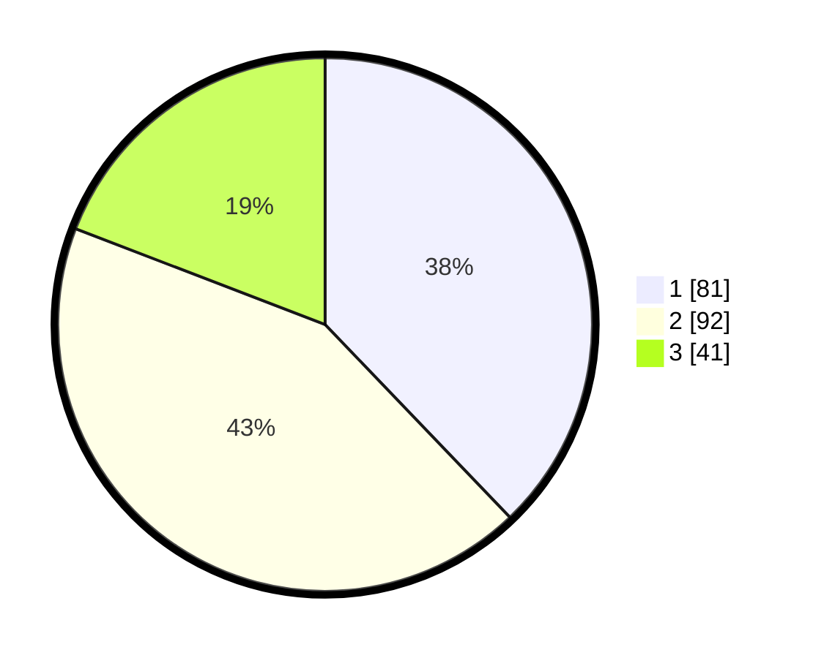

# Hasil

## Grafik

## Tabel

| No.    | Nama Paslon    | Suara | Suara (raw) | Persentase |
|:------ |:-------------- | -----:| -----------:| ----------:|
| 100025 | ANIES MUHAIMIN | 81    | [81][p-1]   | 37,85      |
| 100026 | PRABOWO GIBRAN | 92    | [92][p-2]   | 42,99      |
| 100027 | GANJAR MAHFUD  | 41    | [41][p-3]   | 19,16      |

[p-1]: https://github.com/gigit-pemilu/pemilu-2024/blob/main/pilpres/hitung-suara/sub/31-dki-jakarta/sub/71-jakarta-pusat/sub/03-kemayoran/sub/1004-serdang/sub/014-tps/sub/paslon-1.txt
[p-2]: https://github.com/gigit-pemilu/pemilu-2024/blob/main/pilpres/hitung-suara/sub/31-dki-jakarta/sub/71-jakarta-pusat/sub/03-kemayoran/sub/1004-serdang/sub/014-tps/sub/paslon-2.txt
[p-3]: https://github.com/gigit-pemilu/pemilu-2024/blob/main/pilpres/hitung-suara/sub/31-dki-jakarta/sub/71-jakarta-pusat/sub/03-kemayoran/sub/1004-serdang/sub/014-tps/sub/paslon-3.txt

## Foto C Plano

https://sirekap-obj-formc.kpu.go.id/d96a/pemilu/ppwp/31/71/03/10/04/3171031004014-20240214-205740--71aac7ed-abc6-4143-bc37-1259dd7d0f60.jpg

https://sirekap-obj-formc.kpu.go.id/d96a/pemilu/ppwp/31/71/03/10/04/3171031004014-20240214-214713--bde9fbd7-c1ea-4dbc-b627-2b291edc4071.jpg

https://sirekap-obj-formc.kpu.go.id/d96a/pemilu/ppwp/31/71/03/10/04/3171031004014-20240214-210032--10c05a7e-8638-4868-baf4-4320b1640a51.jpg

## Metadata

| Key        | Value               |
| ---------- | ------------------- |
| Time Stamp | 2024-02-16 12:51:22 |

