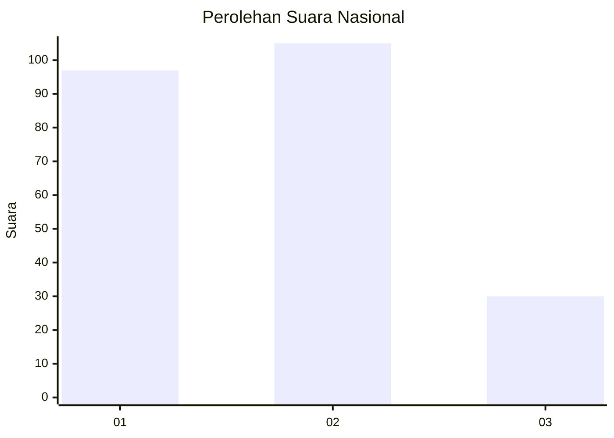
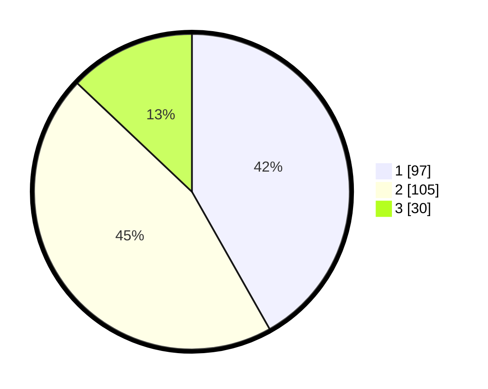

# Hasil

## Grafik

## Tabel

| No.    | Nama Paslon    | Suara | Suara (raw) | Persentase |
|:------ |:-------------- | -----:| -----------:| ----------:|
| 100025 | ANIES MUHAIMIN | 97    | [97][p-1]   | 41,81      |
| 100026 | PRABOWO GIBRAN | 105   | [105][p-2]  | 45,26      |
| 100027 | GANJAR MAHFUD  | 30    | [30][p-3]   | 12,93      |

[p-1]: https://github.com/gigit-pemilu/pemilu-2024/blob/main/pilpres/hitung-suara/sub/31-dki-jakarta/sub/71-jakarta-pusat/sub/03-kemayoran/sub/1004-serdang/sub/025-tps/sub/paslon-1.txt
[p-2]: https://github.com/gigit-pemilu/pemilu-2024/blob/main/pilpres/hitung-suara/sub/31-dki-jakarta/sub/71-jakarta-pusat/sub/03-kemayoran/sub/1004-serdang/sub/025-tps/sub/paslon-2.txt
[p-3]: https://github.com/gigit-pemilu/pemilu-2024/blob/main/pilpres/hitung-suara/sub/31-dki-jakarta/sub/71-jakarta-pusat/sub/03-kemayoran/sub/1004-serdang/sub/025-tps/sub/paslon-3.txt

## Foto C Plano

https://sirekap-obj-formc.kpu.go.id/da7a/pemilu/ppwp/31/71/03/10/04/3171031004025-20240214-223103--b4c31a5c-e7c2-486a-ac38-b92a487e8bff.jpg

https://sirekap-obj-formc.kpu.go.id/da7a/pemilu/ppwp/31/71/03/10/04/3171031004025-20240214-202424--c1fbe0b9-6d2e-4c7c-b6fd-23f630691f37.jpg

https://sirekap-obj-formc.kpu.go.id/da7a/pemilu/ppwp/31/71/03/10/04/3171031004025-20240214-202625--1721a5ef-e312-4da3-b76e-7e137209ead2.jpg

## Metadata

| Key        | Value               |
| ---------- | ------------------- |
| Time Stamp | 2024-02-15 04:00:24 |

