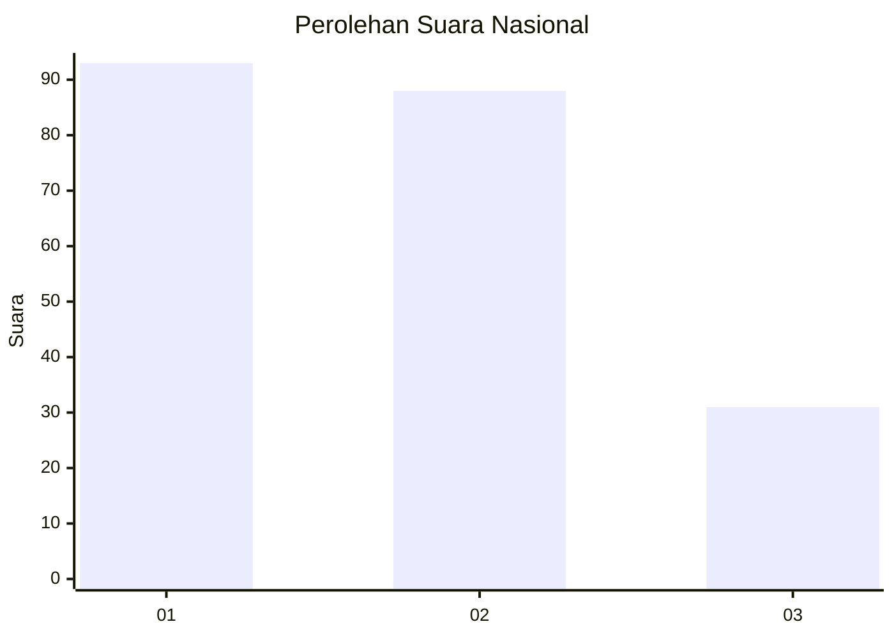
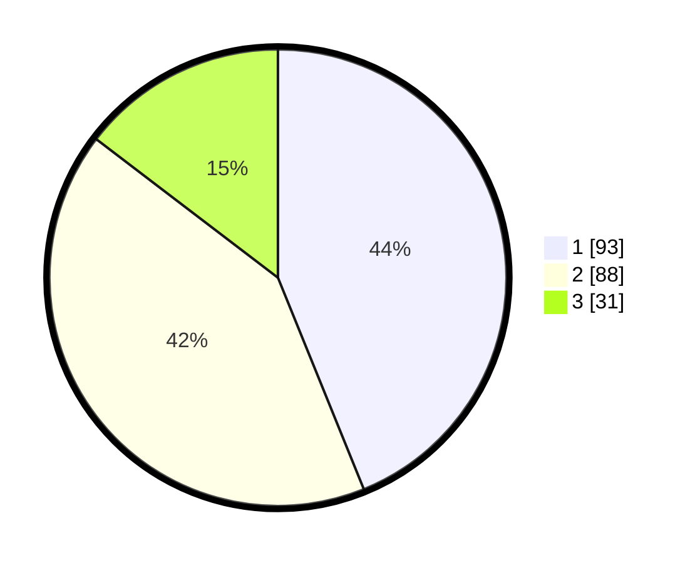

# Hasil

## Grafik

## Tabel

| No.    | Nama Paslon    | Suara | Suara (raw) | Persentase |
|:------ |:-------------- | -----:| -----------:| ----------:|
| 100025 | ANIES MUHAIMIN | 93    | [93][p-1]   | 43,87      |
| 100026 | PRABOWO GIBRAN | 88    | [88][p-2]   | 41,51      |
| 100027 | GANJAR MAHFUD  | 31    | [31][p-3]   | 14,62      |

[p-1]: https://github.com/gigit-pemilu/pemilu-2024/blob/main/pilpres/hitung-suara/sub/31-dki-jakarta/sub/71-jakarta-pusat/sub/03-kemayoran/sub/1004-serdang/sub/087-tps/sub/paslon-1.txt
[p-2]: https://github.com/gigit-pemilu/pemilu-2024/blob/main/pilpres/hitung-suara/sub/31-dki-jakarta/sub/71-jakarta-pusat/sub/03-kemayoran/sub/1004-serdang/sub/087-tps/sub/paslon-2.txt
[p-3]: https://github.com/gigit-pemilu/pemilu-2024/blob/main/pilpres/hitung-suara/sub/31-dki-jakarta/sub/71-jakarta-pusat/sub/03-kemayoran/sub/1004-serdang/sub/087-tps/sub/paslon-3.txt

## Foto C Plano

https://sirekap-obj-formc.kpu.go.id/5813/pemilu/ppwp/31/71/03/10/04/3171031004087-20240215-000349--19cc21cd-d202-4c70-b8c0-9853d2389407.jpg

https://sirekap-obj-formc.kpu.go.id/5813/pemilu/ppwp/31/71/03/10/04/3171031004087-20240215-000605--9d01ea65-7ab8-49ff-9bfe-aafa89fdafde.jpg

https://sirekap-obj-formc.kpu.go.id/5813/pemilu/ppwp/31/71/03/10/04/3171031004087-20240214-211052--f40b9e99-7c6d-4eb1-bc9d-11f4ba39281c.jpg

## Metadata

| Key        | Value               |
| ---------- | ------------------- |
| Time Stamp | 2024-02-15 22:30:27 |

