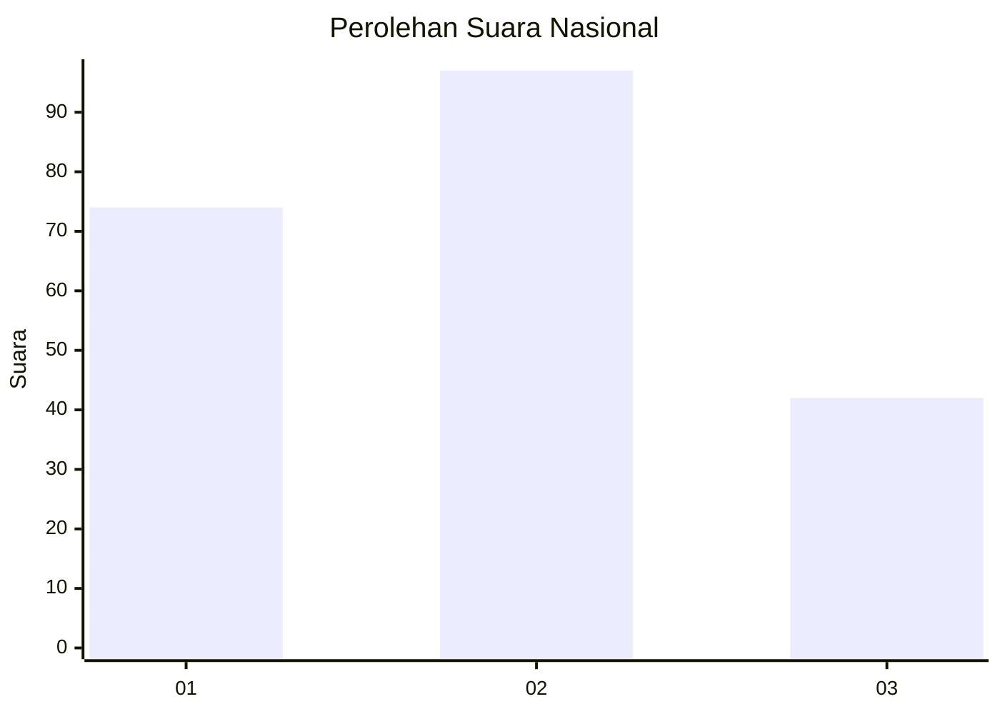
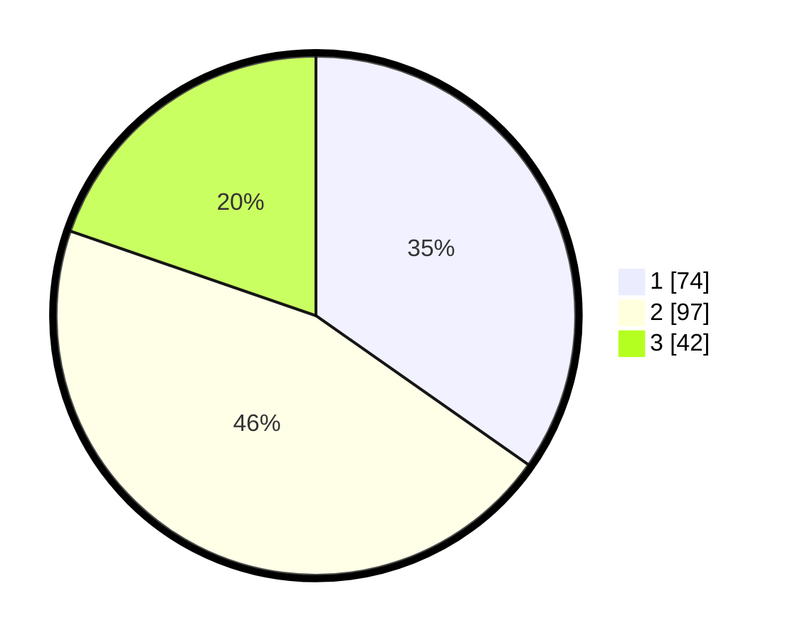

# Hasil

## Grafik

## Tabel

| No.    | Nama Paslon    | Suara | Suara (raw) | Persentase |
|:------ |:-------------- | -----:| -----------:| ----------:|
| 100025 | ANIES MUHAIMIN | 74    | [74][p-1]   | 34,74      |
| 100026 | PRABOWO GIBRAN | 97    | [97][p-2]   | 45,54      |
| 100027 | GANJAR MAHFUD  | 42    | [42][p-3]   | 19,72      |

[p-1]: https://github.com/gigit-pemilu/pemilu-2024/blob/main/pilpres/hitung-suara/sub/31-dki-jakarta/sub/71-jakarta-pusat/sub/03-kemayoran/sub/1005-gunung-sahari-selatan/sub/042-tps/sub/paslon-1.txt
[p-2]: https://github.com/gigit-pemilu/pemilu-2024/blob/main/pilpres/hitung-suara/sub/31-dki-jakarta/sub/71-jakarta-pusat/sub/03-kemayoran/sub/1005-gunung-sahari-selatan/sub/042-tps/sub/paslon-2.txt
[p-3]: https://github.com/gigit-pemilu/pemilu-2024/blob/main/pilpres/hitung-suara/sub/31-dki-jakarta/sub/71-jakarta-pusat/sub/03-kemayoran/sub/1005-gunung-sahari-selatan/sub/042-tps/sub/paslon-3.txt

## Foto C Plano

https://sirekap-obj-formc.kpu.go.id/d357/pemilu/ppwp/31/71/03/10/05/3171031005042-20240214-235634--86dc7d38-1e4a-4b1e-8dfb-ba31108042a6.jpg

https://sirekap-obj-formc.kpu.go.id/d357/pemilu/ppwp/31/71/03/10/05/3171031005042-20240214-235515--5676cbe5-5c5f-43d1-a974-70b4cd261e69.jpg

https://sirekap-obj-formc.kpu.go.id/d357/pemilu/ppwp/31/71/03/10/05/3171031005042-20240214-235912--151b6ae3-eb93-476a-8304-051c260fff89.jpg

## Metadata

| Key        | Value               |
| ---------- | ------------------- |
| Time Stamp | 2024-02-15 22:40:13 |

