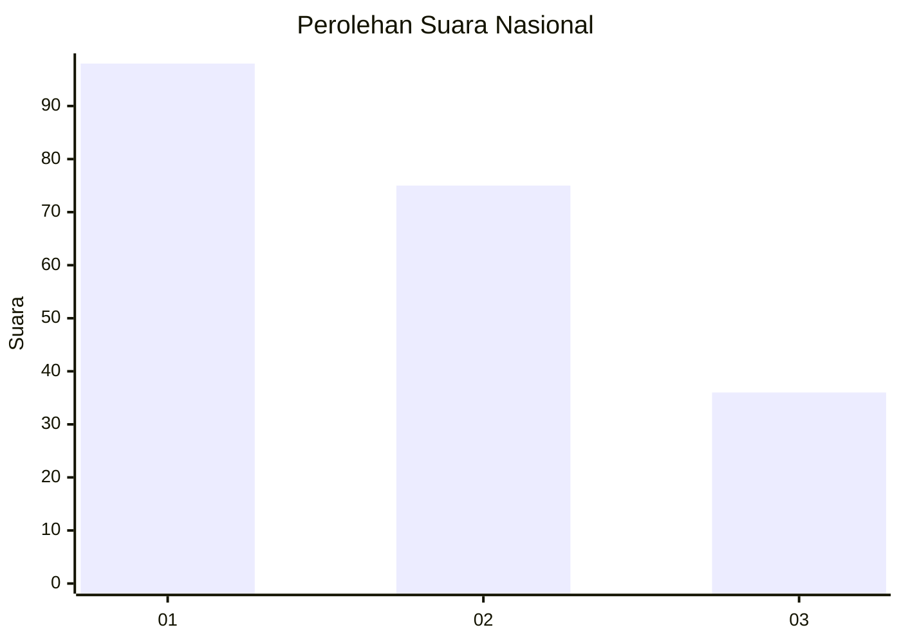
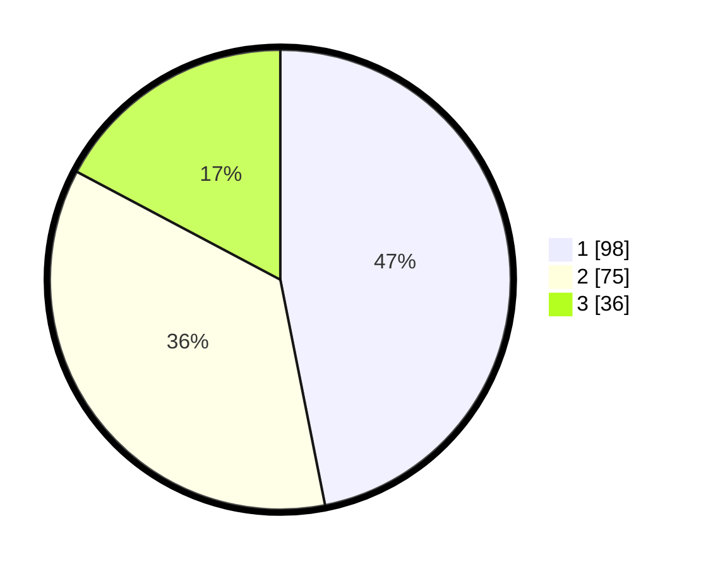

# Hasil

## Grafik

## Tabel

| No.    | Nama Paslon    | Suara | Suara (raw) | Persentase |
|:------ |:-------------- | -----:| -----------:| ----------:|
| 100025 | ANIES MUHAIMIN | 98    | [98][p-1]   | 46,89      |
| 100026 | PRABOWO GIBRAN | 75    | [75][p-2]   | 35,89      |
| 100027 | GANJAR MAHFUD  | 36    | [36][p-3]   | 17,22      |

[p-1]: https://github.com/gigit-pemilu/pemilu-2024/blob/main/pilpres/hitung-suara/sub/31-dki-jakarta/sub/71-jakarta-pusat/sub/03-kemayoran/sub/1006-cempaka-baru/sub/025-tps/sub/paslon-1.txt
[p-2]: https://github.com/gigit-pemilu/pemilu-2024/blob/main/pilpres/hitung-suara/sub/31-dki-jakarta/sub/71-jakarta-pusat/sub/03-kemayoran/sub/1006-cempaka-baru/sub/025-tps/sub/paslon-2.txt
[p-3]: https://github.com/gigit-pemilu/pemilu-2024/blob/main/pilpres/hitung-suara/sub/31-dki-jakarta/sub/71-jakarta-pusat/sub/03-kemayoran/sub/1006-cempaka-baru/sub/025-tps/sub/paslon-3.txt

## Foto C Plano

https://sirekap-obj-formc.kpu.go.id/6311/pemilu/ppwp/31/71/03/10/06/3171031006025-20240214-235005--a328021d-ccd8-4037-bf5b-a222c8296812.jpg

https://sirekap-obj-formc.kpu.go.id/6311/pemilu/ppwp/31/71/03/10/06/3171031006025-20240214-235245--c28a56d8-4b67-47e0-8b84-540ab3b6d046.jpg

https://sirekap-obj-formc.kpu.go.id/6311/pemilu/ppwp/31/71/03/10/06/3171031006025-20240214-235521--674909e0-c593-40d1-b940-083323013a7b.jpg

## Metadata

| Key        | Value               |
| ---------- | ------------------- |
| Time Stamp | 2024-02-15 22:30:27 |

