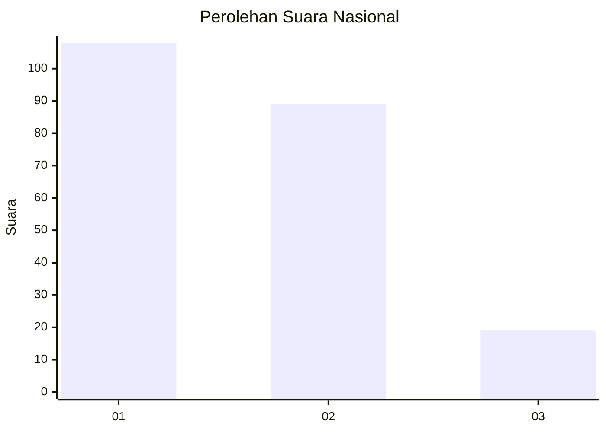
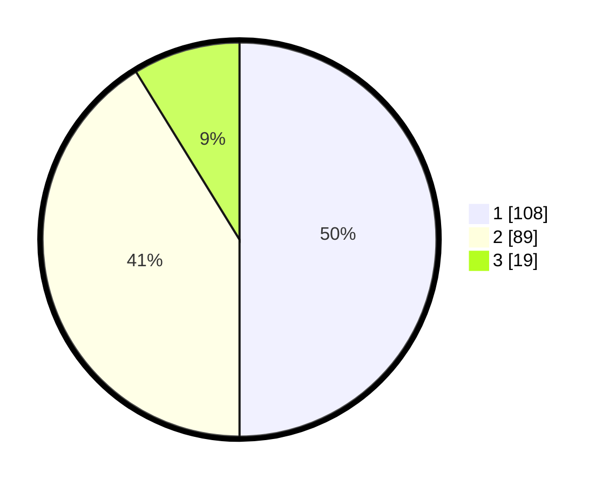

# Hasil

## Grafik

## Tabel

| No.    | Nama Paslon    | Suara | Suara (raw) | Persentase |
|:------ |:-------------- | -----:| -----------:| ----------:|
| 100025 | ANIES MUHAIMIN | 108   | [108][p-1]  | 50,00      |
| 100026 | PRABOWO GIBRAN | 89    | [89][p-2]   | 41,20      |
| 100027 | GANJAR MAHFUD  | 19    | [19][p-3]   | 8,80       |

[p-1]: https://github.com/gigit-pemilu/pemilu-2024/blob/main/pilpres/hitung-suara/sub/31-dki-jakarta/sub/71-jakarta-pusat/sub/03-kemayoran/sub/1006-cempaka-baru/sub/074-tps/sub/paslon-1.txt
[p-2]: https://github.com/gigit-pemilu/pemilu-2024/blob/main/pilpres/hitung-suara/sub/31-dki-jakarta/sub/71-jakarta-pusat/sub/03-kemayoran/sub/1006-cempaka-baru/sub/074-tps/sub/paslon-2.txt
[p-3]: https://github.com/gigit-pemilu/pemilu-2024/blob/main/pilpres/hitung-suara/sub/31-dki-jakarta/sub/71-jakarta-pusat/sub/03-kemayoran/sub/1006-cempaka-baru/sub/074-tps/sub/paslon-3.txt

## Foto C Plano

https://sirekap-obj-formc.kpu.go.id/ce54/pemilu/ppwp/31/71/03/10/06/3171031006074-20240214-192028--b0e05bac-c69f-4044-8f57-c00def37da0d.jpg

https://sirekap-obj-formc.kpu.go.id/ce54/pemilu/ppwp/31/71/03/10/06/3171031006074-20240214-192034--ebc973c0-087d-4f37-b5e4-a95f32142b12.jpg

https://sirekap-obj-formc.kpu.go.id/ce54/pemilu/ppwp/31/71/03/10/06/3171031006074-20240214-204635--d75b568e-3bb1-4134-a4af-8f7fd8372e35.jpg

## Metadata

| Key        | Value               |
| ---------- | ------------------- |
| Time Stamp | 2024-02-15 12:00:28 |

