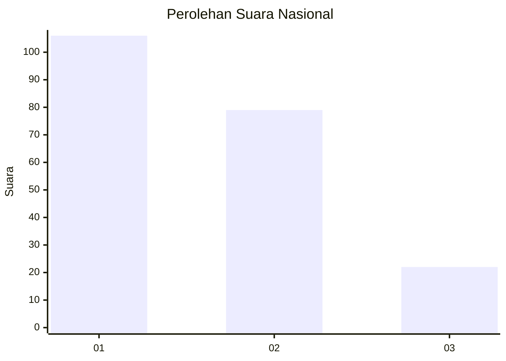
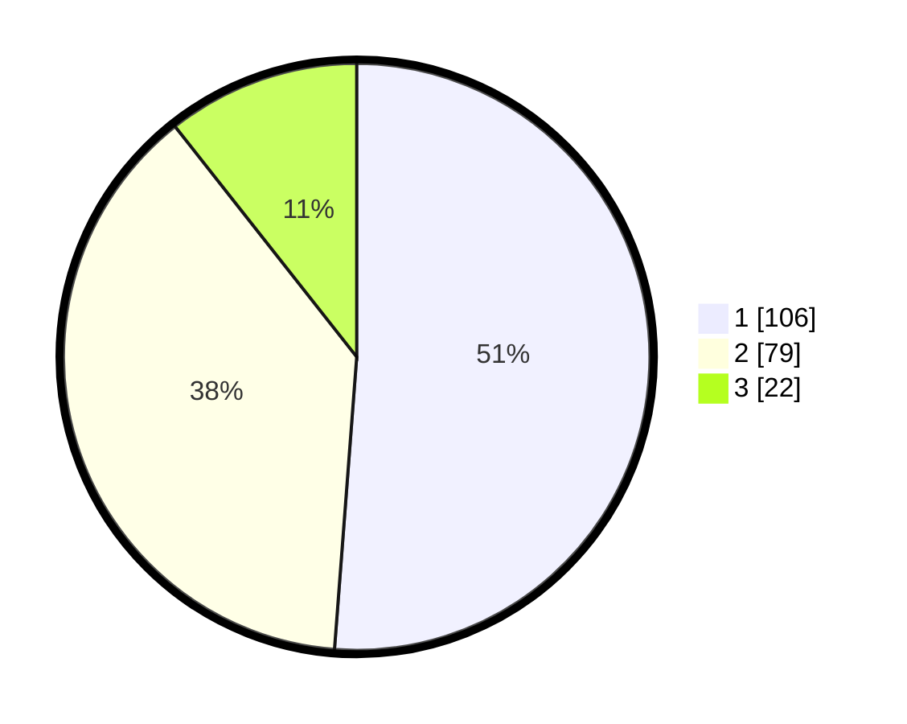

# Hasil

## Grafik

## Tabel

| No.    | Nama Paslon    | Suara | Suara (raw) | Persentase |
|:------ |:-------------- | -----:| -----------:| ----------:|
| 100025 | ANIES MUHAIMIN | 106   | [106][p-1]  | 51,21      |
| 100026 | PRABOWO GIBRAN | 79    | [79][p-2]   | 38,16      |
| 100027 | GANJAR MAHFUD  | 22    | [22][p-3]   | 10,63      |

[p-1]: https://github.com/gigit-pemilu/pemilu-2024/blob/main/pilpres/hitung-suara/sub/31-dki-jakarta/sub/71-jakarta-pusat/sub/03-kemayoran/sub/1006-cempaka-baru/sub/078-tps/sub/paslon-1.txt
[p-2]: https://github.com/gigit-pemilu/pemilu-2024/blob/main/pilpres/hitung-suara/sub/31-dki-jakarta/sub/71-jakarta-pusat/sub/03-kemayoran/sub/1006-cempaka-baru/sub/078-tps/sub/paslon-2.txt
[p-3]: https://github.com/gigit-pemilu/pemilu-2024/blob/main/pilpres/hitung-suara/sub/31-dki-jakarta/sub/71-jakarta-pusat/sub/03-kemayoran/sub/1006-cempaka-baru/sub/078-tps/sub/paslon-3.txt

## Foto C Plano

https://sirekap-obj-formc.kpu.go.id/9b3c/pemilu/ppwp/31/71/03/10/06/3171031006078-20240215-004900--fef202da-3a1e-4b52-addf-d17111bea6ae.jpg

https://sirekap-obj-formc.kpu.go.id/9b3c/pemilu/ppwp/31/71/03/10/06/3171031006078-20240215-004405--bd181bae-d7ee-44e3-9db5-203b4d0c2b08.jpg

https://sirekap-obj-formc.kpu.go.id/9b3c/pemilu/ppwp/31/71/03/10/06/3171031006078-20240215-005244--3ad1622d-5fbb-453a-b2c0-f3a948985b24.jpg

## Metadata

| Key        | Value               |
| ---------- | ------------------- |
| Time Stamp | 2024-02-15 22:00:27 |

