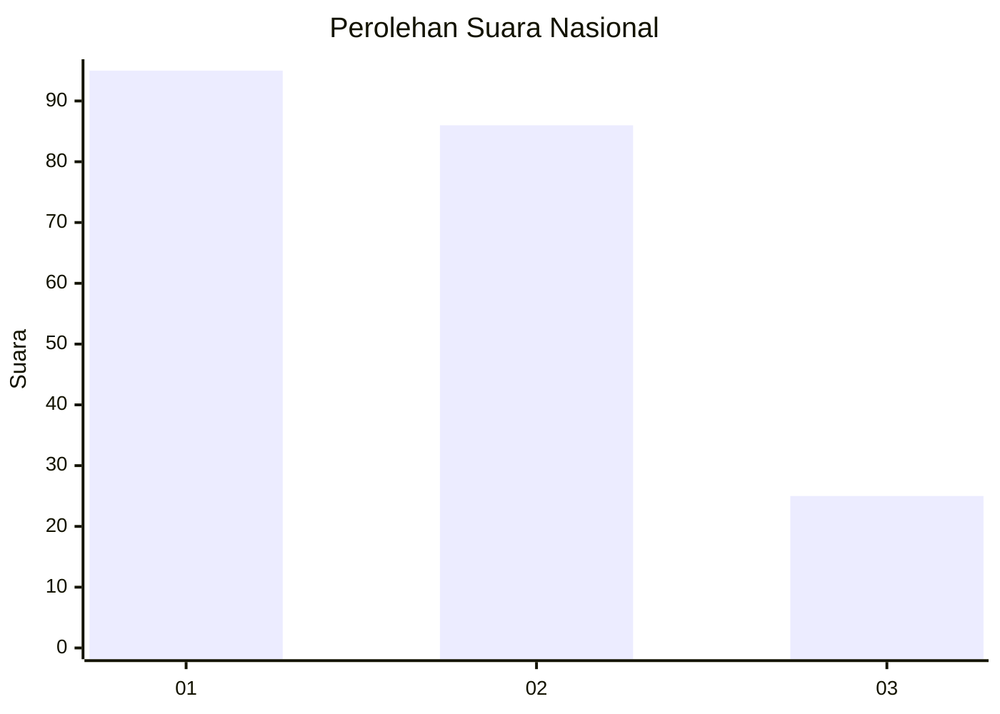
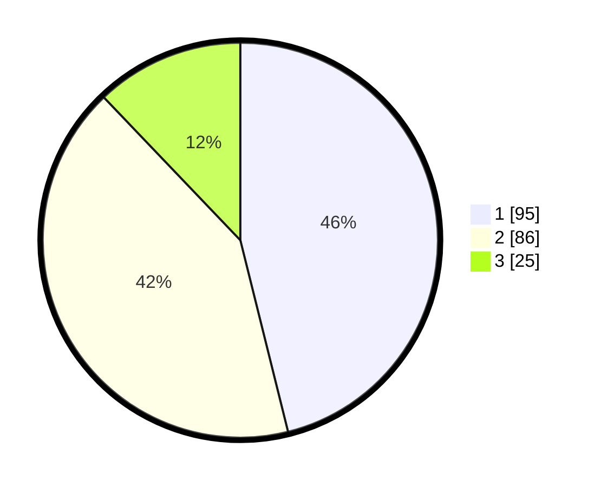

# Hasil

## Grafik

## Tabel

| No.    | Nama Paslon    | Suara | Suara (raw) | Persentase |
|:------ |:-------------- | -----:| -----------:| ----------:|
| 100025 | ANIES MUHAIMIN | 95    | [95][p-1]   | 46,12      |
| 100026 | PRABOWO GIBRAN | 86    | [86][p-2]   | 41,75      |
| 100027 | GANJAR MAHFUD  | 25    | [25][p-3]   | 12,14      |

[p-1]: https://github.com/gigit-pemilu/pemilu-2024/blob/main/pilpres/hitung-suara/sub/31-dki-jakarta/sub/71-jakarta-pusat/sub/03-kemayoran/sub/1006-cempaka-baru/sub/087-tps/sub/paslon-1.txt
[p-2]: https://github.com/gigit-pemilu/pemilu-2024/blob/main/pilpres/hitung-suara/sub/31-dki-jakarta/sub/71-jakarta-pusat/sub/03-kemayoran/sub/1006-cempaka-baru/sub/087-tps/sub/paslon-2.txt
[p-3]: https://github.com/gigit-pemilu/pemilu-2024/blob/main/pilpres/hitung-suara/sub/31-dki-jakarta/sub/71-jakarta-pusat/sub/03-kemayoran/sub/1006-cempaka-baru/sub/087-tps/sub/paslon-3.txt

## Foto C Plano

https://sirekap-obj-formc.kpu.go.id/f825/pemilu/ppwp/31/71/03/10/06/3171031006087-20240215-003346--d1798ecc-3a31-46f3-a025-69f3aedd4765.jpg

https://sirekap-obj-formc.kpu.go.id/f825/pemilu/ppwp/31/71/03/10/06/3171031006087-20240214-224545--c8ddc45b-5a77-4ee0-ab1d-0fbc882224fd.jpg

https://sirekap-obj-formc.kpu.go.id/f825/pemilu/ppwp/31/71/03/10/06/3171031006087-20240214-224523--78637abf-8974-435c-aaba-3e29930af481.jpg

## Metadata

| Key        | Value               |
| ---------- | ------------------- |
| Time Stamp | 2024-02-15 22:30:27 |

