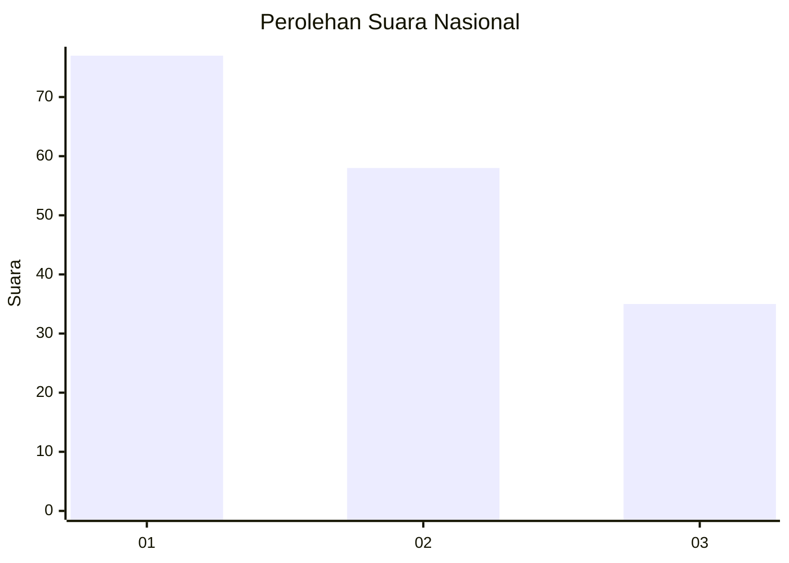
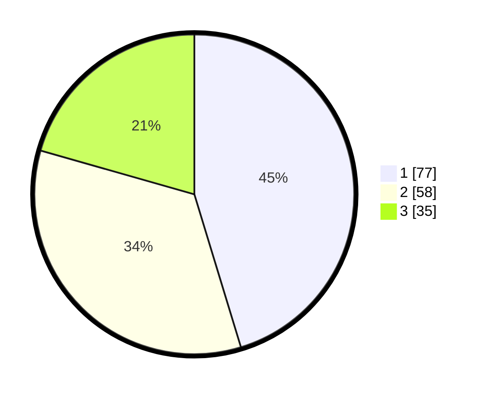

# Hasil

## Grafik

## Tabel

| No.    | Nama Paslon    | Suara | Suara (raw) | Persentase |
|:------ |:-------------- | -----:| -----------:| ----------:|
| 100025 | ANIES MUHAIMIN | 77    | [77][p-1]   | 45,29      |
| 100026 | PRABOWO GIBRAN | 58    | [58][p-2]   | 34,12      |
| 100027 | GANJAR MAHFUD  | 35    | [35][p-3]   | 20,59      |

[p-1]: https://github.com/gigit-pemilu/pemilu-2024/blob/main/pilpres/hitung-suara/sub/31-dki-jakarta/sub/71-jakarta-pusat/sub/03-kemayoran/sub/1006-cempaka-baru/sub/103-tps/sub/paslon-1.txt
[p-2]: https://github.com/gigit-pemilu/pemilu-2024/blob/main/pilpres/hitung-suara/sub/31-dki-jakarta/sub/71-jakarta-pusat/sub/03-kemayoran/sub/1006-cempaka-baru/sub/103-tps/sub/paslon-2.txt
[p-3]: https://github.com/gigit-pemilu/pemilu-2024/blob/main/pilpres/hitung-suara/sub/31-dki-jakarta/sub/71-jakarta-pusat/sub/03-kemayoran/sub/1006-cempaka-baru/sub/103-tps/sub/paslon-3.txt

## Foto C Plano

https://sirekap-obj-formc.kpu.go.id/987e/pemilu/ppwp/31/71/03/10/06/3171031006103-20240215-194602--08d7ec47-f216-4679-af90-65d0509d46ca.jpg

https://sirekap-obj-formc.kpu.go.id/987e/pemilu/ppwp/31/71/03/10/06/3171031006103-20240216-150732--a0783334-778f-49a6-a840-1c9366e1b047.jpg

https://sirekap-obj-formc.kpu.go.id/987e/pemilu/ppwp/31/71/03/10/06/3171031006103-20240215-200257--e9b59696-e564-4345-82d4-63be47974f6e.jpg

## Metadata

| Key        | Value               |
| ---------- | ------------------- |
| Time Stamp | 2024-02-16 16:25:10 |

