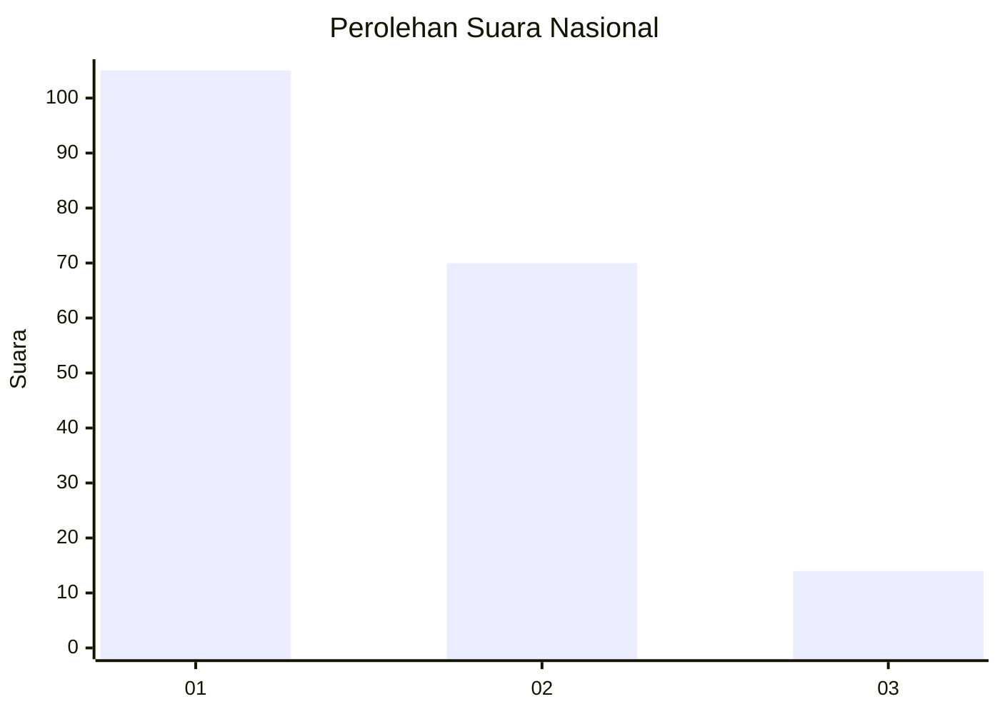
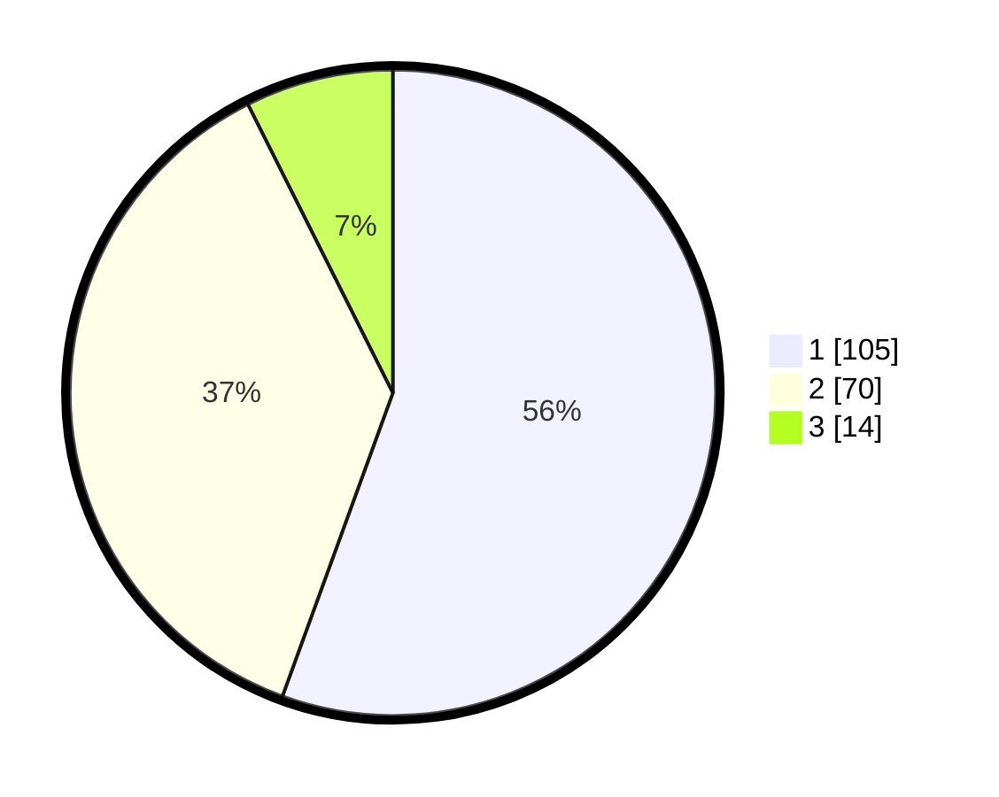

# Hasil

## Grafik

## Tabel

| No.    | Nama Paslon    | Suara | Suara (raw) | Persentase |
|:------ |:-------------- | -----:| -----------:| ----------:|
| 100025 | ANIES MUHAIMIN | 105   | [105][p-1]  | 55,56      |
| 100026 | PRABOWO GIBRAN | 70    | [70][p-2]   | 37,04      |
| 100027 | GANJAR MAHFUD  | 14    | [14][p-3]   | 7,41       |

[p-1]: https://github.com/gigit-pemilu/pemilu-2024/blob/main/pilpres/hitung-suara/sub/31-dki-jakarta/sub/71-jakarta-pusat/sub/03-kemayoran/sub/1008-utan-panjang/sub/050-tps/sub/paslon-1.txt
[p-2]: https://github.com/gigit-pemilu/pemilu-2024/blob/main/pilpres/hitung-suara/sub/31-dki-jakarta/sub/71-jakarta-pusat/sub/03-kemayoran/sub/1008-utan-panjang/sub/050-tps/sub/paslon-2.txt
[p-3]: https://github.com/gigit-pemilu/pemilu-2024/blob/main/pilpres/hitung-suara/sub/31-dki-jakarta/sub/71-jakarta-pusat/sub/03-kemayoran/sub/1008-utan-panjang/sub/050-tps/sub/paslon-3.txt

## Foto C Plano

https://sirekap-obj-formc.kpu.go.id/1ce6/pemilu/ppwp/31/71/03/10/08/3171031008050-20240215-093321--2d9e38b8-aaaa-43fd-a0da-99f36a04abc4.jpg

https://sirekap-obj-formc.kpu.go.id/1ce6/pemilu/ppwp/31/71/03/10/08/3171031008050-20240215-093327--b01b2e9d-010d-487a-b77a-d0c14e21533e.jpg

https://sirekap-obj-formc.kpu.go.id/1ce6/pemilu/ppwp/31/71/03/10/08/3171031008050-20240215-093330--6049dbb9-848d-43e5-a602-2dc125e94713.jpg

## Metadata

| Key        | Value               |
| ---------- | ------------------- |
| Time Stamp | 2024-02-17 12:00:00 |

